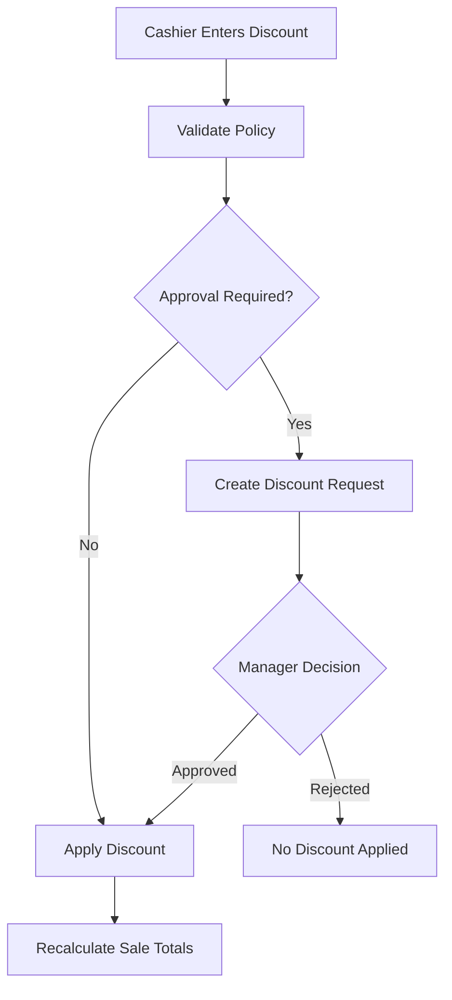

# Discount Request Flow

## Purpose

This flow documents how a cashier requests or applies a line-level or sale-level discount during POS billing.
The system supports manual discounts, discount policies, approval thresholds, coupons, and discount application history.

Discount must never be a hidden cart-only calculation. It must be validated, traceable, and included in totals, refunds, reports, and audit where required.

## Actors

| Actor | Responsibility |
|---|---|
| Cashier | Requests discount and provides reason when required. |
| Manager | Approves or rejects discounts above policy threshold. |
| Backend service | Validates discount policy, scope, limits, and approval state. |
| POS frontend | Shows discount state and recalculated totals clearly. |

## Preconditions

- Active POS sale/cart exists.
- Cashier has permission to request discount or apply within allowed limit.
- Discount policies exist for tenant/channel/outlet where configured.
- Product/sale line and totals are available.

## Related Entities

| Entity | Use |
|---|---|
| `discount_types` | Percentage, fixed amount, price override. |
| `discount_scopes` | Line, sale, order. |
| `discount_policies` | Thresholds and stacking rules. |
| `discount_requests` | Approval workflow request. |
| `discount_applications` | Actual applied discount. |
| `coupons` | Coupon definition where coupon is used. |
| `coupon_redemptions` | Coupon usage history. |
| `sales`, `sale_lines` | Discount target. |

## Main Flow

1. Cashier selects item line or sale-level discount action.
2. POS shows discount type and allowed input fields.
3. Cashier enters discount value and reason where required.
4. Backend/frontend checks whether cashier can apply directly under policy.
5. If within allowed limit, discount is applied.
6. If approval is required, backend creates `discount_requests` with status `pending`.
7. Manager approves or rejects request.
8. If approved, backend creates `discount_applications`.
9. POS recalculates subtotal, discount total, tax total, and grand total.
10. Sale continues to payment.

## Alternative Flows

### Coupon Entry

- Cashier enters coupon code where POS channel is allowed.
- Backend validates status, channel, dates, usage limits, and stacking rule.
- If valid, coupon creates discount application and redemption.

### Rejected Discount

- Request remains rejected.
- Sale totals remain unchanged.
- Cashier may continue without discount or request different value.

### Offline Discount

- Only cached safe discount rules can be used offline.
- Approval-required discounts may be blocked offline unless system supports local manager approval.
- Server validates after sync.

## Validation Rules

| Rule | Expected behavior |
|---|---|
| Discount target must exist | Line/sale target required. |
| Discount type must be valid | Use seeded type. |
| Value must be valid for type | Percent and amount validated. |
| Policy limit enforced | Approval required above threshold. |
| Coupon must be active and valid | Expired/overused coupon rejected. |
| Stacking rule enforced | Manual + coupon stacking follows policy. |

## Frontend Notes

- Discount action must be near cart/totals but not easy to tap accidentally.
- Show discount reason input only when required.
- Pending approval state must be visible.
- Approved/rejected result must update cart clearly.
- Totals must show discount amount separately.

## Backend Notes

- Backend recalculates final totals.
- Store discount application with type, scope, value, amount applied, actor, approval if any.
- Do not trust frontend discount amount.
- Refund calculations must consider original discount allocation.

## Error Cases

| Error | Handling |
|---|---|
| Above threshold without approval | Create pending request or reject. |
| Manager rejects | Show rejected state and keep totals unchanged. |
| Coupon expired | Show coupon unavailable. |
| Stacking not allowed | Reject second discount/coupon. |
| Offline approval unavailable | Block approval-required discount. |

## Audit Behavior

Approved/rejected discount requests and price overrides are sensitive and must be traceable.
Store requested_by, approved_by, timestamps, reason, and final application.

## QA Checklist

- [ ] Cashier-level allowed discount applies directly.
- [ ] Above-threshold discount requires approval.
- [ ] Rejected discount does not affect totals.
- [ ] Coupon channel/date/usage validation works.
- [ ] Discount appears on receipt and report totals.
- [ ] Refund calculation respects original discount.
- [ ] Backend rejects tampered frontend discount value.

## Links

- [[03-data/entities/discounts-coupons-entities]]
- [[04-api/feature-access-api-rules]]
- [[05-backend/validation-rules]]
- [[09-security-and-compliance/sensitive-actions]]
