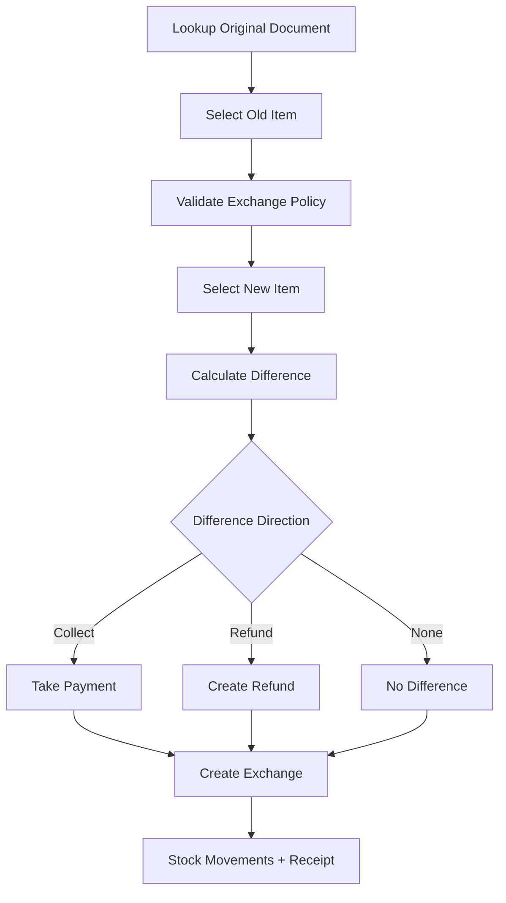

# Cashier Exchange Flow

## Purpose

This flow documents how a cashier exchanges previously sold item(s) for new item(s).
Exchange is built on return + new item issue logic and must record old value, new value, difference direction, payment/refund allocation, and stock movement.

## Actors

| Actor | Responsibility |
|---|---|
| Cashier | Selects original item to return and new item to issue. |
| Manager | Approves policy exceptions or refund/collection overrides. |
| Backend service | Validates return eligibility, exchange lines, difference, payment/refund. |
| Inventory service | Records returned item and issued item movements. |

## Preconditions

- Original sale/order is found.
- Item is eligible for return/exchange according to return policy.
- Cashier has exchange permission.
- New variant is POS sellable and available according to stock rules.
- Active session exists if exchange is processed at POS terminal.

## Related Entities

| Entity | Use |
|---|---|
| `returns` | Return document created for old item. |
| `return_lines` | Returned item lines. |
| `exchanges` | Exchange header. |
| `exchange_lines` | New items issued. |
| `exchange_payment_allocations` | Additional payment collected. |
| `exchange_refund_allocations` | Refund paid for exchange difference. |
| `payments` | Payment for collect difference. |
| `refunds` | Refund for refund difference. |
| `stock_movements` | Exchange-in and exchange-out movements. |

## Main Flow

1. Cashier opens Exchange flow.
2. Cashier searches original sale/order using receipt barcode or reference.
3. System displays eligible items.
4. Cashier selects old item(s) and quantity to exchange.
5. System validates return/exchange policy.
6. Cashier scans/selects new item(s) to issue.
7. System calculates old value, new value, and difference total.
8. If new value is higher, cashier collects difference payment.
9. If old value is higher, system creates refund difference according to refund rules.
10. Backend creates return document and exchange document.
11. Backend creates exchange lines, payment/refund allocations, and stock movements.
12. Receipt/exchange document is generated.

## Difference Rules

| Difference direction | Meaning | Action |
|---|---|---|
| `collect` | New item value is higher | Collect extra payment. |
| `refund` | Old item value is higher | Create refund allocation. |
| `none` | Values match | No extra payment/refund. |

## Alternative Flows

### Same-Value Exchange

- Difference total is zero.
- Exchange completes without payment/refund allocation.

### Exchange With Extra Payment

- Cashier takes payment for difference.
- Payment purpose is exchange difference.
- Allocation links payment to exchange.

### Exchange With Refund

- Refund is created for difference.
- Refund follows payment/refund rules.

### Damaged Old Item

- Returned item stock action follows condition/restock rule.
- It should not automatically become available stock.

## Validation Rules

| Rule | Expected behavior |
|---|---|
| Exchange must start from return/source return | Exchange linked to return document. |
| Old item eligibility checked | Non-returnable/expired policy enforced. |
| New item must be sellable POS variant | Inactive/non-POS item blocked. |
| Difference direction must match totals | Backend calculates. |
| Payment/refund allocation must match difference | No mismatch allowed. |

## Frontend Notes

- Show old item value and new item value side by side.
- Display difference direction in large text: Collect, Refund, or No Difference.
- Keep scan/search focused when adding new exchange item.
- Do not mix normal cart payment with exchange difference without clear labeling.

## Backend Notes

- Exchange is separate from sale.
- Use `exchanges` and `exchange_lines` for new item issue.
- Use `exchange_payment_allocations` or `exchange_refund_allocations` for difference handling.
- Create stock movements for returned item and issued item.

## Error Cases

| Error | Handling |
|---|---|
| Original item not eligible | Block or require approval. |
| New item unavailable | Show stock/policy message. |
| Difference payment failed | Exchange cannot complete. |
| Refund failed | Exchange status must reflect unresolved refund if applicable. |
| Duplicate exchange for same return | Backend enforces core one-exchange-per-return rule. |

## Audit Behavior

Policy override, refund difference, damaged return, and manager approval must be traceable.

## QA Checklist

- [ ] Same-value exchange completes without payment/refund.
- [ ] Higher new item value requires payment.
- [ ] Lower new item value creates refund path.
- [ ] Stock movement records exchange-in and exchange-out.
- [ ] Duplicate exchange for same return is blocked.
- [ ] Receipt shows exchange details and difference clearly.
- [ ] Backend recalculates all totals.

## Links

- [[08-user-flows/cashier/return-flow]]
- [[08-user-flows/cashier/cash-payment]]
- [[08-user-flows/cashier/non-cash-payment]]
- [[03-data/entities/returns-exchanges-entities]]
