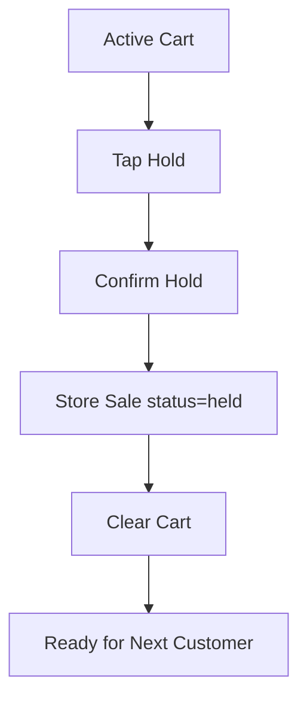

# Hold Sale Flow

## Purpose

This flow documents how a cashier temporarily holds an incomplete POS sale so that another customer can be served without losing the current cart.

Hold sale is used before payment. It must not be treated as completed sale, stock deduction, or payment capture.

## Actors

| Actor | Responsibility |
|---|---|
| Cashier | Holds the current cart and optionally adds note/customer. |
| POS frontend | Saves cart state and clears screen for next sale. |
| Backend service | Stores held sale where server-backed hold is used. |
| Manager | May recall held sale depending on tenant/outlet rules. |

## Preconditions

- Active till session exists.
- Cart has at least one item.
- Sale is not completed.
- Cashier has permission to hold sale if permission is enforced.

## Related Entities

| Entity | Use |
|---|---|
| `sales` | Held sale header with status `held`. |
| `sale_lines` | Held cart line items. |
| `customers` | Optional customer association. |
| `users` | Cashier who held sale. |
| `till_sessions` | Session context. |
| `pos_devices` | Device/source context. |

## Main Flow

1. Cashier has active cart.
2. Cashier taps Hold.
3. POS prompts for optional customer/note if supported by current POS UI.
4. Cashier confirms hold.
5. Backend validates active session and cart state.
6. Backend stores sale with status `held` and related sale lines.
7. POS clears current cart.
8. POS returns focus to scan/search field for next sale.

## Alternative Flows

### Empty Cart

- Hold action is disabled or backend rejects.
- Cashier remains on POS screen.

### Offline Hold

- Cart may be held locally if offline mode supports local cart persistence.
- Local held sale must have local transaction/cart id.
- Sync behavior depends on whether held sale becomes completed later.

### Hold Cancelled

- Cashier cancels confirmation.
- Cart remains active.

## Validation Rules

| Rule | Expected behavior |
|---|---|
| Cart must contain item | Cannot hold empty sale. |
| Sale must not be completed | Completed sale cannot become held. |
| Active session required | Cannot hold sale outside session. |
| Held sale tenant/outlet context required | Prevent cross-outlet recall errors. |

## Frontend Notes

- Hold button must not be near Pay in a way that causes mis-tap.
- Confirmation should be quick, not form-heavy.
- After hold, cart clears immediately and scan field refocuses.
- Held sale count/badge can help cashier recall later.

## Backend Notes

- Use `sales.status = held` if persisted server-side.
- Store lines as sale lines only if design supports draft/held sales in same table.
- Do not create payment, stock movement, or receipt for held sale.
- Keep source device/session/cashier context.

## Error Cases

| Error | Handling |
|---|---|
| Cart empty | Show nothing to hold. |
| Session expired | Lock POS screen. |
| Product line invalid | Ask cashier to remove invalid line before hold. |
| Duplicate hold tap | Use client transaction id/idempotency if persisted. |

## Audit Behavior

Normal hold action may be traceable through `sales.status` and timestamps.
Audit is required only if tenant rules classify hold/recall as sensitive or manager overrides ownership.

## QA Checklist

- [ ] Hold disabled for empty cart.
- [ ] Held sale stores correct lines.
- [ ] Payment is not created for held sale.
- [ ] Stock is not deducted for held sale.
- [ ] Cart clears after hold.
- [ ] Held sale can later be recalled.
- [ ] Offline held sale behavior is clearly visible.

## Links

- [[08-user-flows/cashier/recall-sale]]
- [[08-user-flows/cashier/scan-add-pay]]
- [[03-data/entities/pos-sales-entities]]
- [[06-frontend/state-management-rules]]
