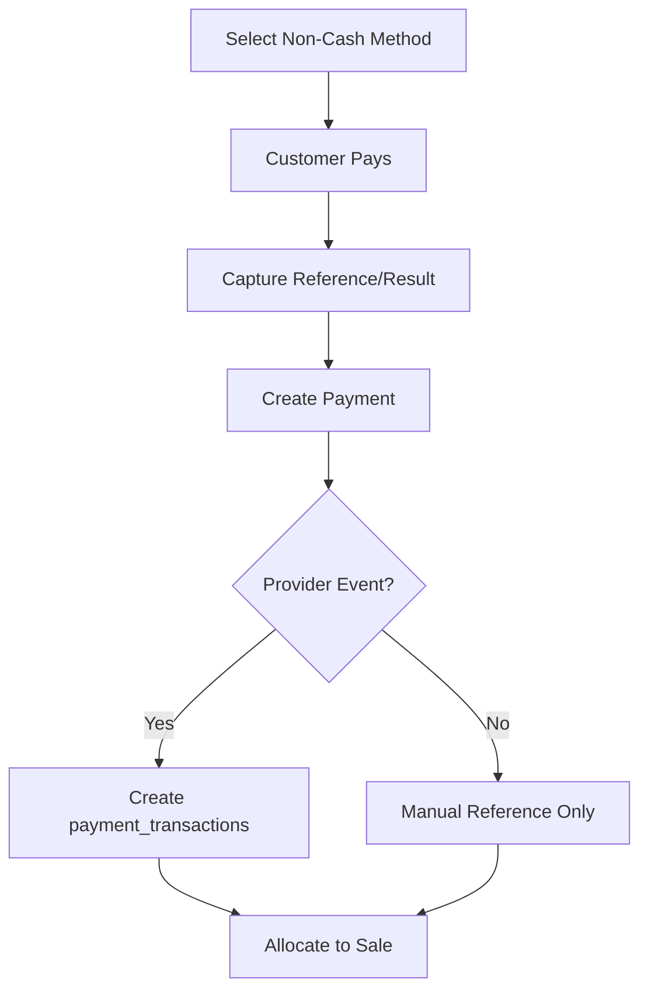

# Non-Cash Payment Flow

## Purpose

This flow documents how a cashier records non-cash payments such as card, QR, wallet, bank transfer, or other tenant-enabled non-cash methods.

The uploaded scope separates payment recording from real payment processing. Therefore, this flow supports manual reference capture and gateway readiness without assuming a specific provider integration.

## Actors

| Actor | Responsibility |
|---|---|
| Cashier | Selects payment method and records/reference confirms payment. |
| Customer | Completes payment outside or through configured method. |
| Backend service | Validates method, amount, status, reference, and allocation. |
| Payment provider | Optional external gateway/terminal integration where configured. |

## Preconditions

- Active POS session exists.
- Sale payable amount exists.
- Tenant has enabled the chosen non-cash payment method.
- Required provider config exists for gateway-backed methods.
- Cashier has permission to record payment.

## Related Entities

| Entity | Use |
|---|---|
| `payment_method_types` | Includes card, QR, wallet, bank transfer, gift card. |
| `tenant_payment_methods` | Tenant-enabled method configuration. |
| `payment_provider_configs` | Provider setup with secret references, not plain secrets. |
| `payments` | Unified payment record. |
| `payment_transactions` | Provider/gateway event log when applicable. |
| `sale_payment_allocations` | Payment allocation to sale. |

## Main Flow

1. Cashier taps Pay from POS sale.
2. Cashier chooses non-cash payment method.
3. POS shows amount to be paid.
4. Customer completes payment through card machine, QR, wallet, or configured process.
5. Cashier enters external reference number where applicable.
6. Cashier confirms payment result.
7. Backend validates payment method is enabled.
8. Backend records `payments` row with method type, provider code/reference where applicable, amount, status, and direction.
9. If provider event exists, backend records `payment_transactions`.
10. Backend allocates payment to sale.
11. Sale completes when paid total covers payable amount.
12. Receipt shows payment method and reference where allowed.

## Alternative Flows

### Manual Card/QR Reference

- Cashier records approval/reference number from external terminal or QR confirmation.
- System stores reference in `payments.reference_no`.
- No gateway transaction is invented.

### Gateway-Backed Method

- Gateway response can create `payment_transactions`.
- Payment status follows gateway result.
- Secrets must be referenced through secret manager, not stored in JSON config.

### Payment Failed

- Payment status remains failed or not captured.
- Sale cannot complete using failed payment.
- Cashier chooses retry or another method.

### Offline Non-Cash

- Offline card/QR must depend on external terminal confirmation or be blocked by offline payment rule.
- If allowed, local payment must store offline client id and reference.
- Server validates during sync.

## Validation Rules

| Rule | Expected behavior |
|---|---|
| Method must be tenant-enabled | Disabled method is not shown or backend rejects. |
| Gateway-backed method needs valid provider config | Reject if config missing/inactive. |
| Payment amount must be positive | Reject invalid amount. |
| Failed payment cannot complete sale | Payment not allocated as captured amount. |
| Reference required when method policy requires it | Backend validates required reference. |

## Frontend Notes

- Method tiles must be large and clear.
- Show method status: pending, success, failed, cancelled where relevant.
- Do not imply gateway integration if only manual reference is configured.
- For QR/manual methods, show reference input or confirmation state.
- Offline UI must clearly state whether non-cash is allowed offline.

## Backend Notes

- Store `method_type` and `provider_code` as frozen values on payment.
- Use `payment_transactions` for gateway/provider event log only.
- Use idempotency for duplicate payment submissions.
- Do not store card data or provider private keys in JSON config.

## Error Cases

| Error | Handling |
|---|---|
| Method disabled | Show unavailable method. |
| Provider inactive | Ask cashier to choose another method. |
| Gateway failure | Record failed result where applicable; do not complete sale. |
| Missing reference | Prompt cashier for reference. |
| Offline not allowed | Block non-cash offline payment. |

## Audit Behavior

Payment records and transaction logs provide traceability.
Audit is required for manual override, refund, void, or correction of payment outcome.

## QA Checklist

- [ ] Enabled card method appears on payment screen.
- [ ] Disabled method does not complete payment.
- [ ] Manual reference stores correctly.
- [ ] Failed gateway/manual payment does not complete sale.
- [ ] Split payment works with non-cash component.
- [ ] Receipt shows method/reference correctly.
- [ ] Offline blocked/allowed behavior follows configured rule.

## Links

- [[08-user-flows/cashier/split-payment]]
- [[08-user-flows/cashier/cash-payment]]
- [[03-data/entities/payments-entities]]
- [[04-api/payment-refund-api-rules]]
- [[09-security-and-compliance/payment-security-rules]]
