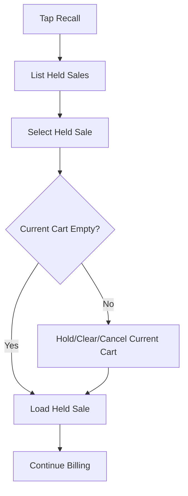

# Recall Sale Flow

## Purpose

This flow documents how a cashier retrieves a previously held sale and continues billing.
Recall must restore the correct cart context without creating duplicate sales, payments, stock movements, or receipts.

## Actors

| Actor | Responsibility |
|---|---|
| Cashier | Selects held sale to continue. |
| POS frontend | Displays held sales and restores selected cart. |
| Backend service | Validates access and loads held sale. |
| Manager | May recall sales held by another cashier if permitted. |

## Preconditions

- Active till session exists.
- At least one held sale exists for tenant/outlet/session or allowed recall scope.
- Cashier has recall access.
- Current cart is empty or cashier confirms replacing/holding current cart.

## Related Entities

| Entity | Use |
|---|---|
| `sales` | Held sale header. |
| `sale_lines` | Held sale line items. |
| `users` | Cashier who held or recalls sale. |
| `till_sessions` | Current session context. |
| `customers` | Optional held sale customer. |

## Main Flow

1. Cashier taps Recall.
2. POS shows list of held sales for allowed scope.
3. Cashier selects a held sale.
4. If current cart has items, POS asks cashier to hold/clear/cancel recall.
5. Backend validates held sale status and access.
6. POS loads held sale lines into active cart.
7. Sale status remains draft/active for continued billing according to implementation design.
8. Cashier continues scan/add/pay flow.

## Alternative Flows

### Held Sale Not Found

- POS shows no held sales.
- Cashier returns to billing screen.

### Held Sale Already Completed or Cancelled

- Backend rejects recall.
- POS refreshes held sale list.

### Manager Recall

- If sale was held by another cashier, manager permission may be required.
- Action must be audit-visible if treated as sensitive.

## Validation Rules

| Rule | Expected behavior |
|---|---|
| Only held sales can be recalled | Completed/voided/cancelled cannot be recalled. |
| Tenant/outlet context must match | Prevent wrong outlet sale recall. |
| Current cart conflict must be resolved | Do not overwrite active cart silently. |
| Sale lines must still reference valid variants | Inactive items may require backend validation before completion. |

## Frontend Notes

- Held sale list should be simple: time, cashier, total, item count, customer/note.
- Recall must be reachable but not visually dominant over Pay.
- If active cart exists, show clear confirmation choices.
- After recall, scan field refocuses.

## Backend Notes

- Do not create new sale record if recalling existing held sale unless design explicitly converts draft to new transaction with traceability.
- Revalidate sale before completion.
- Keep original held sale context visible for audit/support.

## Error Cases

| Error | Handling |
|---|---|
| Held sale locked by another operation | Show sale currently unavailable. |
| Current cart not empty | Ask cashier to resolve current cart first. |
| Held sale status changed | Refresh list and explain. |
| Access denied | Show permission/outlet access error. |

## Offline Behavior

- Locally held sales can be recalled on the same device if offline storage supports it.
- Server-held sales may not be available while offline unless previously cached.
- Offline recall must not create duplicate final sync records.

## Audit Behavior

Manager recall or cross-cashier recall should be audit-visible.
Normal cashier recall of own held sale may be traceable through sale status/history if implemented.

## QA Checklist

- [ ] Held sale list shows correct held sales.
- [ ] Recall restores line items and totals.
- [ ] Current cart is not overwritten silently.
- [ ] Completed sale cannot be recalled.
- [ ] Wrong outlet held sale is not visible.
- [ ] Recalled sale can proceed to payment.
- [ ] Offline recall does not duplicate sale completion.

## Links

- [[08-user-flows/cashier/hold-sale]]
- [[08-user-flows/cashier/scan-add-pay]]
- [[03-data/entities/pos-sales-entities]]
