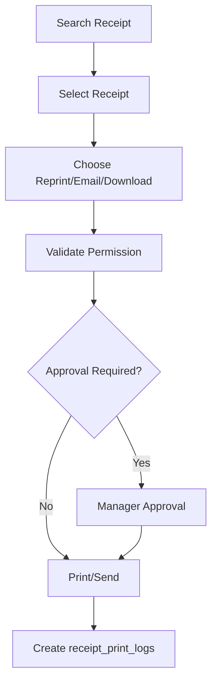

# Receipt Reprint Flow

## Purpose

This flow documents how a cashier reprints, emails, downloads, or otherwise resends an existing receipt when allowed.
Receipt reprint is sensitive because it can be misused; it must be permission-controlled and audited.

## Actors

| Actor | Responsibility |
|---|---|
| Cashier | Searches receipt and requests reprint where allowed. |
| Manager | Approves reprint where policy requires. |
| Backend service | Validates permission and records print log. |
| POS frontend | Shows receipt lookup and printer status. |

## Preconditions

- Receipt already exists.
- Cashier has receipt lookup/reprint access.
- POS device/printer is configured where physical print is required.
- Original sale/order/return/exchange document exists.

## Related Entities

| Entity | Use |
|---|---|
| `receipts` | Stored receipt output and frozen payload. |
| `receipt_print_logs` | Print/reprint/email/download history. |
| `receipt_templates` | Template used for rendering. |
| `sales`, `orders`, `returns`, `exchanges` | Source document. |
| `pos_devices` | Device used for print action. |
| `tills` | Till context where applicable. |
| `audit_logs` | Sensitive action audit. |

## Main Flow

1. Cashier opens receipt lookup/reprint screen.
2. Cashier searches by receipt number, barcode value, sale/order number, or customer reference if supported.
3. System displays matching receipt summary.
4. Cashier selects print action: reprint, email, or download where allowed.
5. Backend validates permission and receipt source.
6. If approval required, manager approves.
7. Backend records `receipt_print_logs` with print action and status.
8. Printer/email/download action runs.
9. Receipt reprint count is updated where applicable.

## Alternative Flows

### Printer Failure

- Receipt source remains valid.
- Print log records failed status and error message.
- Cashier can retry if allowed.

### Duplicate Receipt Label

- Reprint output should show reprint/duplicate label where receipt template supports it.
- Reprint count helps identify repeated prints.

### Email/Download

- Use same receipt payload but different print action.
- Log action as `email` or `download`.

## Validation Rules

| Rule | Expected behavior |
|---|---|
| Receipt must exist | Otherwise show not found. |
| Reprint permission required | Backend rejects unauthorized reprint. |
| Exactly one source document on receipt | Receipt links to sale/order/return/exchange only one. |
| Printer status checked where possible | Failure logged, not silent. |
| Reprint count tracked | Update/record repeat action. |

## Frontend Notes

- Receipt lookup should be fast and barcode-friendly.
- Show original document type, amount, date, cashier/outlet.
- Confirm before reprint if tenant rules require.
- Show printer status and print result.

## Backend Notes

- Use stored receipt payload; do not recalculate historical receipt totals.
- Reprint creates log entry.
- Reprint must not modify original sale/payment/stock records.
- Reprint action should be permission-controlled.

## Error Cases

| Error | Handling |
|---|---|
| Receipt not found | Show no matching receipt. |
| Permission denied | Show action not allowed. |
| Printer unavailable | Log failed print attempt. |
| Source document mismatch | Reject as data integrity issue. |

## Audit Behavior

Receipt reprint is listed as sensitive action in the current security model.
Store actor, device, action, result, and timestamp through print logs and audit where required.

## QA Checklist

- [ ] Receipt can be found by receipt number/barcode.
- [ ] Unauthorized user cannot reprint.
- [ ] Reprint creates receipt print log.
- [ ] Printer failure creates failed log entry.
- [ ] Reprinted receipt does not recalculate totals.
- [ ] Reprint count increments where implemented.
- [ ] Duplicate/reprint label appears where template supports it.

## Links

- [[03-data/entities/tax-receipt-audit-configuration-entities]]
- [[09-security-and-compliance/sensitive-actions]]
- [[06-frontend/scanner-printer-integration]]
