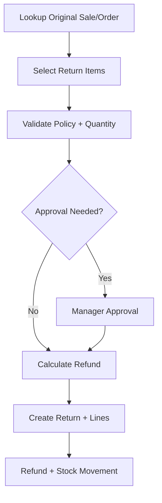

# Cashier Return Flow

## Purpose

This flow documents how a cashier processes a return against an original POS sale or e-commerce order.
Returns are separate business documents, not negative sale lines.

The flow supports original sale/order lookup, partial returns, policy validation, refund calculation, inventory action, and audit.

## Actors

| Actor | Responsibility |
|---|---|
| Cashier | Searches original transaction and selects return items. |
| Manager | Approves policy exceptions, refund overrides, or sensitive returns. |
| Backend service | Validates eligibility, refund, stock action, and references. |
| Inventory service | Records return-in or damaged stock action. |

## Preconditions

- Cashier is authenticated and active session exists where POS return requires session context.
- Original sale/order can be identified by receipt barcode, sale/order number, or transaction reference.
- Return feature is enabled and cashier has access.
- Return policy data exists for returned product.

## Related Entities

| Entity | Use |
|---|---|
| `returns` | Return document header. |
| `return_lines` | Returned items and condition/action. |
| `return_reason_codes` | Return reason. |
| `sales`, `sale_lines` | Original POS source. |
| `orders`, `order_items` | Original e-commerce source. |
| `refunds` | Business refund record. |
| `return_refund_allocations` | Refund allocation to return. |
| `stock_movements` | Return-in or damage-related stock movement. |
| `return_policies` | Product return rules. |

## Main Flow

1. Cashier opens Return screen.
2. Cashier scans receipt barcode or searches original sale/order.
3. System displays eligible items and prior returned quantities.
4. Cashier selects item, quantity, reason, and condition.
5. System validates return policy, window, non-returnable rule, and eligible quantity.
6. Manager approval is requested if policy exception is required.
7. System calculates refund amount and tax reversal based on original sale/order.
8. Cashier confirms return.
9. Backend creates `returns` and `return_lines`.
10. Backend creates refund record/allocation where refund is due.
11. Inventory is restored, quarantined, or discarded based on restock action.
12. Receipt/return document is generated where configured.

## Alternative Flows

### Partial Return

- Cashier selects only part of sold quantity.
- System ensures returned quantity does not exceed eligible remaining quantity.

### Damaged Return

- Returned item condition is damaged/opened/expired.
- Stock should not automatically become sellable.
- Restock action may be quarantine or discard.

### Cross-Channel Return

- Online order may be returned in store only if configured rule allows it.
- Return document stores original outlet and return outlet where applicable.

### Refund Not Immediate

- Return can be approved/received before refund is completed if status rules allow.
- Refund status tracks pending/approved/paid/failed/cancelled.

## Validation Rules

| Rule | Expected behavior |
|---|---|
| Exactly one source sale/order | Return references POS sale or e-commerce order, not both. |
| Returned quantity <= eligible quantity | Prevent over-return. |
| Non-returnable policy enforced | Block or require manager override. |
| Return window enforced | Block or require manager override. |
| Refund total follows original payment/tax/discount | Backend calculates final refund. |
| Restock action controls inventory | Sellable return vs damaged stock handled separately. |

## Frontend Notes

- Search/scan original receipt must be fast.
- Display original items with sold, returned, and eligible quantity.
- Show refund amount before confirm.
- Make condition/restock action clear for cashier.
- Highlight manager approval state.

## Backend Notes

- Return is separate from sale.
- Use transaction boundary for return, refund allocation, stock movement, and receipt where applicable.
- Refund must not exceed original captured payment/eligible amount.
- Inventory movement type must reference return document.

## Error Cases

| Error | Handling |
|---|---|
| Original document not found | Show not found and allow retry. |
| Return window expired | Request approval or block. |
| Quantity already returned | Show no eligible quantity. |
| Refund exceeds captured payment | Backend rejects. |
| Cross-channel return not allowed | Show policy message. |

## Audit Behavior

Return approval, policy override, refund approval, damaged-stock decision, and cross-channel return are sensitive and must be traceable.

## QA Checklist

- [ ] Receipt barcode lookup finds original sale.
- [ ] Partial return updates eligible quantity.
- [ ] Over-return is blocked.
- [ ] Damaged return does not restore sellable stock automatically.
- [ ] Refund calculation includes original discount/tax effect.
- [ ] Cross-channel return follows configured rule.
- [ ] Return document and refund allocation are created correctly.

## Links

- [[08-user-flows/cashier/exchange-flow]]
- [[03-data/entities/returns-exchanges-entities]]
- [[03-data/entities/payments-entities]]
- [[04-api/payment-refund-api-rules]]
