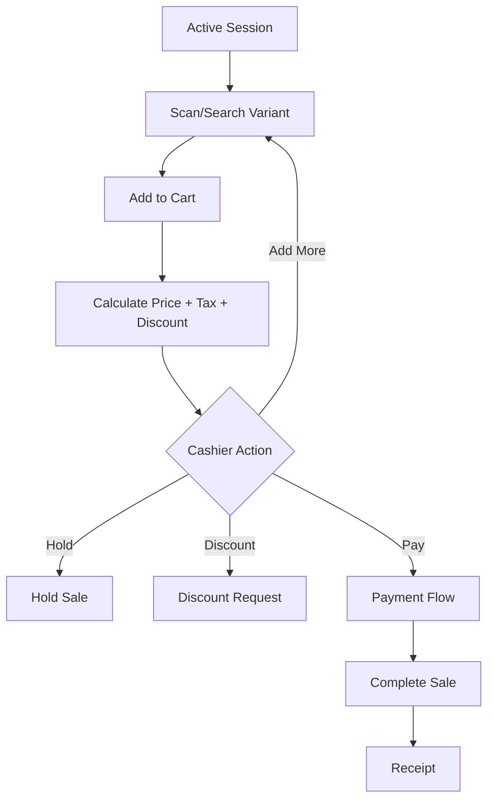

# Cashier Scan Add Pay Flow

## Purpose

This is the primary cashier billing workflow: scan or search product, add item to cart, adjust quantity if needed, apply allowed actions, take payment, complete sale, update stock, and generate receipt.

The flow must feel like a real POS terminal, not a normal website product browsing page.
Speed, always-visible totals, large touch targets, and barcode-first operation are mandatory design principles from the product scope.

## Actors

| Actor | Responsibility |
|---|---|
| Cashier | Scans items, confirms cart, triggers payment. |
| POS frontend | Keeps scan field focused, cart visible, and payment amount clear. |
| Backend service | Validates sale, stock, price, tax, discount, payment, and session. |
| Inventory service | Records stock deduction for completed sale. |

## Preconditions

- Cashier is authenticated.
- Active till session exists.
- POS device has valid tenant, outlet, till context.
- Product/variant exists and is sellable in POS channel.
- Product price, tax, and return policy are available.
- If offline, required product/pricing/tax cache exists locally.

## Related Entities

| Entity | Use |
|---|---|
| `products` | Product master and POS sellable flag. |
| `product_variants` | Sellable SKU/barcode unit. |
| `price_lists`, `price_list_items` | Variant price resolution. |
| `tax_classes`, `tax_rates`, `tax_class_rates` | Tax calculation. |
| `inventory_balances` | Stock availability. |
| `sales` | POS sale header. |
| `sale_lines` | POS sale item rows. |
| `stock_movements` | Sale-out movement after completion. |
| `receipts` | Receipt record after completion. |

## Main Flow

1. Cashier lands on POS screen after opening session.
2. Search/scan field is focused automatically.
3. Cashier scans barcode or types product/SKU/name.
4. System resolves matching active product variant.
5. Item is added to cart with frozen description, quantity, unit price, tax, and pricing snapshot.
6. Cashier repeats scan/add until cart is complete.
7. Cashier may update quantity, remove item, hold sale, recall sale, request discount, or proceed to payment.
8. POS always shows subtotal, discount total, tax total, and grand total.
9. Cashier taps Pay.
10. Payment flow records one or more payments.
11. Backend completes sale if payable balance is covered.
12. Backend creates sale, sale lines, payments, payment allocations, stock movement, receipt, and reportable records.
13. POS shows receipt print/complete state.

## Alternative Flows

### Product Not Found

- POS shows product-not-found message.
- Scan field remains focused.
- Cashier can retry or search manually.

### Out of Stock

- If negative stock is blocked, sale cannot continue for unavailable quantity.
- If tenant policy allows negative stock, backend still records sale-out movement.
- Offline sale may be queued but server can later create stock conflict.

### Price Changed

- Online mode: backend validates latest price before completion.
- Offline mode: local cached price is used, but server may validate during sync according to offline rules.

### Held Sale

- Cart can be held before payment.
- Held sale must preserve tenant, outlet, session/cashier context.

## Validation Rules

| Rule | Expected behavior |
|---|---|
| Active session required | POS billing blocked without open session. |
| Product must be active and POS sellable | Non-sellable item cannot be added. |
| Variant barcode/SKU tenant uniqueness | Scanner lookup must resolve within tenant. |
| Quantity must be greater than zero | Zero/negative quantity rejected. |
| Completed sale requires valid payment | Sale cannot complete unpaid unless allowed by payment status rules. |
| Sale stock movement references sale | `stock_movements.sale_id` required for sale-out. |

## Frontend Notes

- Keep scan field always visible and focused.
- Basket/cart panel must remain visible during billing.
- Pay button must be dominant.
- Product grid is secondary to scan/search.
- Show offline indicator if internet is lost.
- Use Zustand for cart/session/offline workflow state.
- Use TanStack Query for product/search/server data.

## Backend Notes

- Backend validates final totals; frontend preview is not authority.
- Completion should use transaction boundary for sale, payments, allocations, stock movement, and receipt creation.
- Use idempotency where duplicate completion request is possible.
- Record `source_device_id`, `client_transaction_id`, and sync fields for offline-ready operation.

## Error Cases

| Error | Handling |
|---|---|
| Product inactive | Show item unavailable. |
| Barcode duplicate impossible by DB rule | If lookup conflict occurs, block and log. |
| Payment insufficient | Return to payment screen with remaining balance. |
| Session closed | Lock POS screen and prevent completion. |
| Offline sync conflict | Queue locally, then resolve after reconnect. |

## Audit Behavior

Normal completed sale is recorded through transaction tables.
Audit is required for sensitive actions such as void, price override, discount approval, refund, reprint, or manager override.

## QA Checklist

- [ ] Scanner adds correct variant by barcode.
- [ ] Search adds correct variant by SKU/name.
- [ ] Totals update after quantity change.
- [ ] Pay button disabled for empty cart.
- [ ] Held sale can be created before payment.
- [ ] Offline mode queues sale with local transaction id.
- [ ] Completed sale creates sale lines, payment allocation, stock movement, and receipt.
- [ ] Backend rejects stale/invalid session completion.

## Links

- [[08-user-flows/cashier/cash-payment]]
- [[08-user-flows/cashier/non-cash-payment]]
- [[08-user-flows/cashier/split-payment]]
- [[08-user-flows/cashier/hold-sale]]
- [[08-user-flows/cashier/discount-request]]
- [[06-frontend/pos-ui-rules]]
