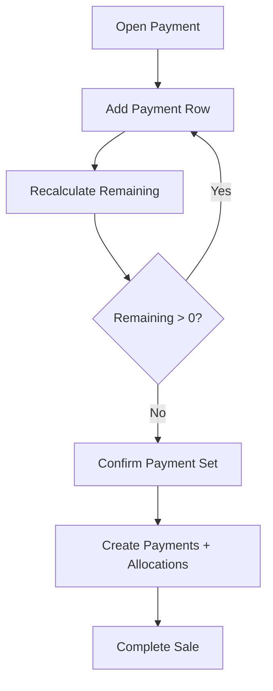

# Split Payment Flow

## Purpose

This flow documents completing a POS sale using more than one payment method or payment row.
Split payment is required when a customer pays part cash and part card/QR/wallet, or when multiple payment methods are used for the same sale.

## Actors

| Actor | Responsibility |
|---|---|
| Cashier | Adds payment rows until balance is fully paid. |
| POS frontend | Shows paid amount, remaining balance, and payment list. |
| Backend service | Validates payment rows and allocates them to the sale. |

## Preconditions

- Sale cart has payable amount.
- Active till session exists.
- Tenant-enabled payment methods are available.
- Cashier has permission to record payments.

## Related Entities

| Entity | Use |
|---|---|
| `sales` | Sale header with grand total and paid total. |
| `payments` | One row per payment component. |
| `sale_payment_allocations` | Links each payment to sale. |
| `payment_method_types` | Cash/card/QR/etc. |
| `tenant_payment_methods` | Enabled methods for tenant. |

## Main Flow

1. Cashier taps Pay.
2. POS shows total due and remaining balance.
3. Cashier selects first payment method.
4. Cashier enters amount for first payment.
5. Backend/frontend validation ensures amount is positive and method allowed.
6. POS adds payment row and recalculates remaining balance.
7. Cashier selects next payment method if balance remains.
8. Process repeats until remaining balance is zero.
9. Cashier confirms final payment set.
10. Backend creates payment records and sale allocations.
11. Backend completes sale when captured/accepted payment total covers grand total.
12. Receipt shows split payment breakdown.

## Alternative Flows

### Cash + Card

- Cash row records tendered amount and change where applicable.
- Card row records reference/provider result where applicable.
- Sale completes after combined accepted amount covers total.

### Partial Payment Cancelled

- Cashier can remove a payment row before final completion.
- Backend should not persist removed draft rows unless payment was already recorded.

### Payment Failure During Split

- Failed payment row cannot count toward paid total.
- Cashier may retry or choose another method.

### Refund Later

- Refund calculation must respect original payment allocation rules.
- Refund should follow original payment method unless manager override is allowed by policy.

## Validation Rules

| Rule | Expected behavior |
|---|---|
| Each payment amount > 0 | Reject zero/negative row. |
| Sum accepted payments >= grand total | Sale can complete. |
| Failed payments excluded | Do not count failed row as paid. |
| Allocation cannot exceed captured amount | Backend enforces. |
| Duplicate payment row prevented | Use idempotency/client payment ids. |

## Frontend Notes

- Show remaining balance in large text.
- Display payment rows as removable before final confirm.
- Keep method selection touch-friendly.
- Show payment status per row.
- Prevent final confirm until remaining balance is covered.

## Backend Notes

- Use transaction boundary for all payment rows, allocations, sale completion, stock movement, and receipt.
- Store each payment as separate `payments` row.
- Use `sale_payment_allocations` for each payment component.
- Do not collapse split payment into one generic total.

## Error Cases

| Error | Handling |
|---|---|
| Payment row fails | Show failed row and keep remaining balance. |
| Overpayment by non-cash | Follow configured method behavior; do not assume change. |
| Duplicate submit | Idempotency prevents duplicate rows. |
| Session closed before final confirm | Block completion. |

## Offline Behavior

- Cash split rows can be stored offline if offline POS is enabled.
- Non-cash offline behavior follows non-cash payment flow rules.
- Every local payment row needs local client payment id.
- Server validates rows during sync.

## Audit Behavior

Split payment is traceable through payment and allocation rows.
Audit is required for later refund override, correction, void, or manager intervention.

## QA Checklist

- [ ] Cash + card split completes sale.
- [ ] Payment rows show remaining balance correctly.
- [ ] Failed row does not count as paid.
- [ ] Removed draft row is not persisted.
- [ ] Receipt shows payment breakdown.
- [ ] Refund flow can identify original payment allocation.
- [ ] Duplicate final confirm does not duplicate payments.

## Links

- [[08-user-flows/cashier/cash-payment]]
- [[08-user-flows/cashier/non-cash-payment]]
- [[08-user-flows/cashier/return-flow]]
- [[03-data/entities/payments-entities]]
