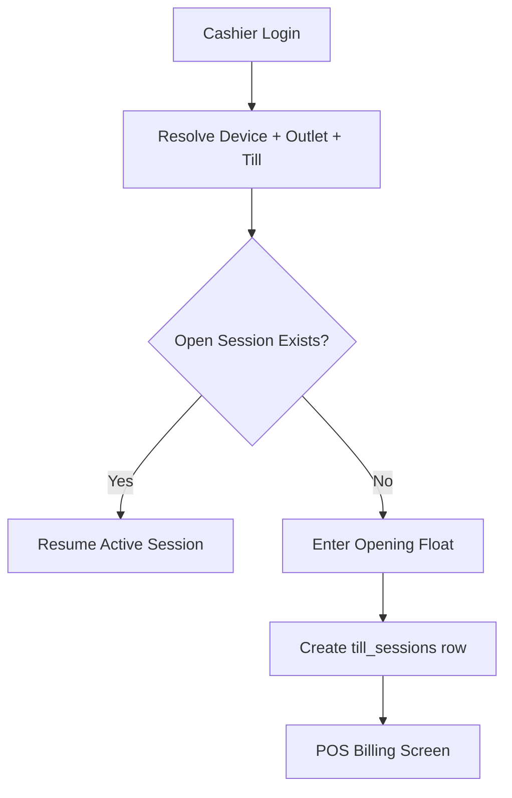

# Cashier Start Session Flow

## Purpose

This flow explains how a cashier opens a POS till session before performing counter sales.
The session creates the operational boundary for sales, payments, cash movements, receipt printing, and end-of-day cash reconciliation.

A cashier session is not only a frontend login state. It is a business record linked to tenant, outlet, till, POS device, cashier, business date, opening float, and later closing totals.

## Actors

| Actor | Responsibility |
|---|---|
| Cashier | Opens the assigned till/session and enters opening cash where required. |
| Outlet manager | May supervise or correct session issues. |
| Backend service | Validates tenant, outlet, till, device, and role access. |
| POS frontend | Guides cashier through low-typing touchscreen flow. |

## Preconditions

- Cashier is authenticated.
- Cashier has access to the tenant and outlet.
- POS device is registered and assigned to the correct outlet/till.
- Till exists and is active.
- No active open session already exists for the same tenant and till.
- Required feature access and permission checks pass.

## Related Entities

| Entity | Use |
|---|---|
| `users` | Cashier identity. |
| `outlet_user_roles` | Outlet-level cashier assignment. |
| `tills` | Cash register/till master. |
| `pos_devices` | Registered POS terminal/browser/device. |
| `till_sessions` | Open/close cashier session record. |
| `cash_count_denominations` | Used later during close, not required at open. |
| `audit_logs` | Used for sensitive or exceptional actions. |

## Main Flow

1. Cashier logs in from POS terminal.
2. System resolves tenant, outlet, device, and till context.
3. POS checks whether a session is already open for the assigned till.
4. If no session is open, cashier is shown the Till Open screen.
5. Cashier enters opening float when cash reconciliation is enabled.
6. Cashier confirms start session.
7. Backend validates cashier access, device assignment, till status, and open-session uniqueness.
8. Backend creates `till_sessions` with status `open`.
9. POS stores active session context in frontend session state.
10. Cashier is redirected to the main POS billing screen.

## Alternative Flows

### Existing Open Session

If the same till already has an open session:

- Same cashier may resume the session if allowed by session rules.
- Different cashier requires manager handling according to tenant policy.
- Backend must not create a second open session for the same till.

### Device Not Assigned

If the POS device is not assigned to outlet/till:

- POS must show a locked state.
- Cashier must not start billing.
- Admin or manager must fix device assignment.

### Offline at Login

If the device is offline before session creation:

- The system should use the last valid cached context only if offline POS rules allow it.
- If no valid cached session exists, cashier cannot start a new server-backed session.

## Validation Rules

| Rule | Expected behavior |
|---|---|
| One open session per till | Backend blocks duplicate open session. |
| Opening float cannot be negative | Validation error shown before create. |
| Device outlet must match till outlet | Backend rejects mismatched device/till context. |
| Cashier must be assigned to outlet | Access denied if no valid outlet role. |
| Tenant must be active | Suspended/inactive tenant cannot start normal POS operation. |

## Frontend Notes

- Use `TillSessionGuard` before POS billing route.
- Display outlet, till, cashier, and device context clearly.
- Opening float input must be large and touch-friendly.
- Avoid unnecessary fields during session open.
- Do not let cashier reach POS screen without active session context.

## Backend Notes

- Service layer owns session open workflow.
- Repository checks for existing open session using tenant and till.
- Use transaction boundary to prevent duplicate open sessions.
- Store `opened_by`, `opened_device_id`, `opened_at`, `business_date`, and `opening_float`.
- Do not put this logic directly inside the controller.

## Error Cases

| Error | Cashier message |
|---|---|
| Till already open | This till already has an active session. |
| Device inactive/blocked | This POS device is not active. Contact manager. |
| No outlet assignment | You are not assigned to this outlet. |
| Invalid opening float | Opening cash cannot be negative. |
| Tenant inactive | POS is unavailable for this tenant. |

## Audit Behavior

Normal session open is stored in `till_sessions`.
Additional audit is required when a manager overrides device/session mismatch or reassigns a device.

## QA Checklist

- [ ] Cashier can open a session with valid till/device assignment.
- [ ] Duplicate open session is blocked.
- [ ] Negative opening float is rejected.
- [ ] Cashier without outlet role cannot open session.
- [ ] Blocked POS device cannot open session.
- [ ] POS screen is locked until session exists.
- [ ] Active session state survives page refresh where session token remains valid.

## Links

- [[08-user-flows/cashier/scan-add-pay]]
- [[08-user-flows/cashier/close-session]]
- [[03-data/entities/pos-sales-entities]]
- [[06-frontend/routing-and-guards]]
- [[05-backend/transaction-boundary-rules]]
