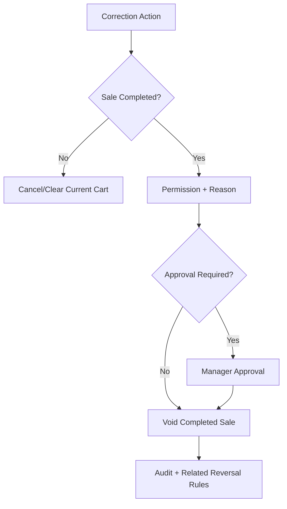

# Void and Cancel Sale Flow

## Purpose

This flow documents cashier correction actions for current cart cancellation and completed sale void where allowed.
The system distinguishes between cancelling an uncompleted cart and voiding a completed sale.

Completed sale void is sensitive and must be permission-controlled and audited.

## Terms

| Term | Meaning |
|---|---|
| Cancel current cart | Clear an unpaid draft/cart before completion. |
| Void completed sale | Mark a completed sale as voided according to permission/business rules. |
| Cancel sale | Database status available for sales where sale is cancelled before completion or by rule. |

## Actors

| Actor | Responsibility |
|---|---|
| Cashier | Cancels current unpaid cart if allowed. |
| Manager | Approves void completed sale where required. |
| Backend service | Validates status and applies allowed transition. |
| POS frontend | Prevents accidental destructive actions. |

## Preconditions

- Active POS screen/session exists.
- Sale/cart exists.
- For completed sale void, sale must be eligible by status and permission.
- Reason is captured where required.

## Related Entities

| Entity | Use |
|---|---|
| `sales` | Status changes: draft, held, completed, voided, cancelled. |
| `sale_lines` | Existing sale/cart lines. |
| `payments` | Payment impact if completed sale is voided/refunded. |
| `stock_movements` | Stock correction if completed sale is reversed. |
| `audit_logs` | Sensitive action trace. |

## Main Flow: Cancel Current Cart

1. Cashier taps Clear/Cancel on current unpaid cart.
2. POS asks for confirmation.
3. Cashier confirms.
4. POS clears cart if no persisted sale exists.
5. If persisted as draft/held sale, backend updates status according to sale status rules.
6. POS returns to empty billing screen.

## Main Flow: Void Completed Sale

1. Cashier/manager searches completed sale.
2. User selects void action.
3. System checks permission and sale status.
4. User enters void reason.
5. Manager approval is requested if required.
6. Backend validates whether payment/stock reversal/refund flow is required.
7. Backend updates sale status to `voided` where valid.
8. Related reversal/refund/stock actions follow payment and inventory rules.
9. Audit record is created.

## Validation Rules

| Rule | Expected behavior |
|---|---|
| Empty cart cannot be cancelled meaningfully | No-op or disabled. |
| Completed sale needs void permission | Backend rejects unauthorized user. |
| Void requires reason | Reason stored for audit. |
| Invalid status transition blocked | Delivered/refunded/etc. follows domain rules. |
| Payment/stock impact not ignored | Use refund/reversal rules where needed. |

## Frontend Notes

- Clear cart button must not be confused with Pay.
- Completed sale void must require confirmation and reason.
- Use strong warning for irreversible/sensitive actions.
- Show whether action is cancel cart or void completed sale.

## Backend Notes

- Do not delete sale rows.
- Use status update and audit trace.
- Do not directly edit financial totals without reversal/refund rules.
- Do not let frontend decide whether void is allowed.

## Error Cases

| Error | Handling |
|---|---|
| User lacks permission | Show access denied. |
| Sale not eligible | Show status not allowed. |
| Missing reason | Prompt for reason. |
| Payment already refunded | Follow refund/status rules; do not double-refund. |
| Stock already adjusted | Prevent duplicate stock reversal. |

## Offline Behavior

- Cancel local unpaid cart can happen offline.
- Voiding completed server sale offline is risky and should follow offline rules; if allowed, it must sync as explicit action with idempotency and conflict handling.

## Audit Behavior

Void completed sale is sensitive and must record actor, reason, timestamp, entity, and before/after status.

## QA Checklist

- [ ] Empty cart clear is disabled or safe.
- [ ] Unpaid cart cancellation does not create payment/stock records.
- [ ] Completed sale void requires permission.
- [ ] Void reason is required.
- [ ] Voided sale cannot be paid/printed as normal sale.
- [ ] Related payment/refund/stock rules are not skipped.
- [ ] Audit log captures void action.

## Links

- [[08-user-flows/cashier/scan-add-pay]]
- [[08-user-flows/cashier/receipt-reprint]]
- [[09-security-and-compliance/sensitive-actions]]
- [[04-api/order-workflow-api-rules]]
