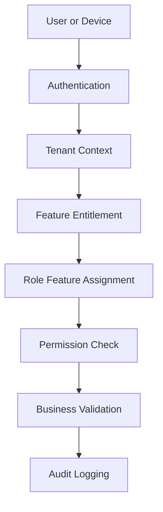

# Security and Compliance Index

## Purpose

This folder defines the security and compliance rules for the production-ready Unified Commerce platform.
The system is a multi-tenant E-POS + E-Commerce SaaS product with offline POS, payments, refunds,
receipts, stock movement, customer accounts, OTP verification, device assignment, feature access,
and audit logging.

This folder must be read before implementing authentication, authorization, payments, offline sync,
device registration, customer access, audit logging, tenant configuration, and any sensitive workflow.

## Source alignment

| Source area | Used here for |
|---|---|
| Uploaded scope document | Production modules, security expectations, access control, audit, offline rules |
| Uploaded database design | Security-related entities, PK/FK ownership, OTP, RBAC, audit, payment, sync tables |
| Backend architecture document | Clean Architecture placement, middleware, service orchestration, validation |
| Frontend architecture document | Guards, session provider, token/session handling, offline/peripheral boundaries |
| Current 2nd Brain | Internal documentation links and implementation gates |

## Important boundary

This folder does not create legal compliance obligations that were not present in the uploaded documents.
It documents technical and operational controls required by the uploaded production scope and database design.
Where a legal framework is not named in the uploaded files, this folder avoids naming one as a requirement.

## Folder map

| File | Purpose |
|---|---|
| [[authentication-model]] | Platform user, tenant staff, customer account, and auth identity rules |
| [[authorization-model]] | RBAC, permission, feature entitlement, and role feature access rules |
| [[session-rules]] | Session, login context, POS till/session, and route guard expectations |
| [[password-and-otp-rules]] | Password hash and OTP verification rules from schema |
| [[customer-account-security]] | Customer auth, guest customer, address, account, OTP, and tenant boundary rules |
| [[data-isolation-controls]] | Tenant, outlet, channel, device, customer, and offline data isolation rules |
| [[device-security-rules]] | POS device, till, outlet, scanner, printer, and peripheral security rules |
| [[payment-security-rules]] | Payment, refund, provider config, idempotency, and payment data protection |
| [[offline-data-protection]] | Offline IndexedDB, sync queue, conflicts, duplicate prevention, and device risk |
| [[audit-requirements]] | Business audit, sync audit, receipt reprint audit, and sensitive action tracking |
| [[sensitive-actions]] | Actions requiring permission, approval, reason, status validation, and audit |
| [[security-review-checklist]] | Review checklist for developers, QA, architects, DevOps, and AI IDE tools |

## Security model summary

## Main security principles

| Principle | Meaning for this system |
|---|---|
| Backend is final authority | Frontend guards and hidden buttons are not security controls by themselves |
| Tenant isolation is mandatory | Tenant-owned business records must not leak across tenants |
| Feature access is layered | Feature entitlement, feature flag, role assignment, and permission all matter |
| Sensitive actions are auditable | Refunds, voids, stock adjustments, approvals, reprints, and sync conflicts need traceability |
| Secrets are not stored in JSON | Provider secrets use `secret_ref`, not plain config JSON |
| OTP values are not stored plain | OTP table stores `otp_code_hash`, attempt count, resend count, and block fields |
| Offline sync is validated server-side | Offline POS data is staging until accepted by backend validation |

## Security-related database ownership

| Concern | Main tables |
|---|---|
| Platform access | `platform_users` |
| Tenant staff access | `users`, `roles`, `permissions`, `role_permissions` |
| Role assignment | `tenant_user_roles`, `outlet_user_roles` |
| Feature availability | `platform_features`, `tenant_feature_entitlements`, `role_feature_assignments`, `feature_flags` |
| Customer auth | `customers`, `customer_auth_accounts`, `customer_auth_identities` |
| OTP verification | `otp_channels`, `otp_purposes`, `otp_verifications` |
| Device context | `tills`, `pos_devices`, `till_sessions` |
| Payments and refunds | `payments`, `payment_transactions`, `payment_provider_configs`, `refunds` |
| Receipts | `receipt_templates`, `receipts`, `receipt_print_logs` |
| Offline sync | `offline_sync_batches`, `offline_sync_items`, typed sync queues, conflicts, sync audit logs |
| Audit | `audit_logs`, `offline_sync_audit_logs` |

## Required reading order

1. Start with [[authentication-model]].
2. Then read [[authorization-model]].
3. Read [[data-isolation-controls]] before any tenant-owned feature.
4. Read [[payment-security-rules]] before payment, refund, or provider work.
5. Read [[offline-data-protection]] before offline POS or sync work.
6. Read [[audit-requirements]] and [[sensitive-actions]] before any high-risk workflow.
7. Use [[security-review-checklist]] before merge or release.

## Related foundation documents

- [[00-start-here/README|2nd Brain Entry Point]]
- [[00-start-here/source-document-alignment|Source Document Alignment]]
- [[01-product/project-scope|Production Project Scope]]
- [[01-product/user-roles-and-actors|User Roles and Actors]]
- [[02-architecture/security-architecture|Security Architecture]]
- [[02-architecture/tenancy-architecture|Tenancy Architecture]]
- [[02-architecture/role-permission-capability-model|Role Permission Capability Model]]
- [[03-data/tenant-consistency-rules|Tenant Consistency Rules]]
- [[03-data/offline-sync-data-model|Offline Sync Data Model]]
- [[04-api/auth-and-authorization|API Authentication and Authorization]]
- [[05-backend/authentication-authorization|Backend Authentication and Authorization]]
- [[06-frontend/routing-and-guards|Frontend Routing and Guards]]

## Documentation rules for this folder

- Do not add security claims without a source from the uploaded documents or current 2nd Brain.
- Do not introduce a named legal framework unless it is explicitly accepted in a future source document.
- Do not store credentials, API keys, provider secrets, or sample private keys in this folder.
- Do not make frontend-only checks sound like sufficient security.
- Do not document a bypass for tenant isolation, RBAC, feature access, payment validation, or audit.
- When a rule affects implementation, link to the API, backend, frontend, data, and testing documents.

## Security implementation checklist

| Check | Required |
|---|---|
| Tenant context validated server-side | Yes |
| Permission validated server-side | Yes |
| Feature access validated server-side | Yes |
| Sensitive action audited | Yes |
| Payment/refund idempotency considered | Yes |
| Offline sync duplicate prevention considered | Yes |
| Customer data remains tenant-scoped | Yes |
| Provider secrets stored by reference only | Yes |
| OTP stored as hash only | Yes |
| Invalid status transitions blocked | Yes |

## Final note

Security for this product is not one feature. It is a cross-cutting rule across POS, E-Commerce,
customers, payments, refunds, devices, offline sync, inventory, reporting, and configuration.
Every module must reference this folder when it handles tenant data, user identity, customer identity,
payment data, offline data, or sensitive operational actions.
