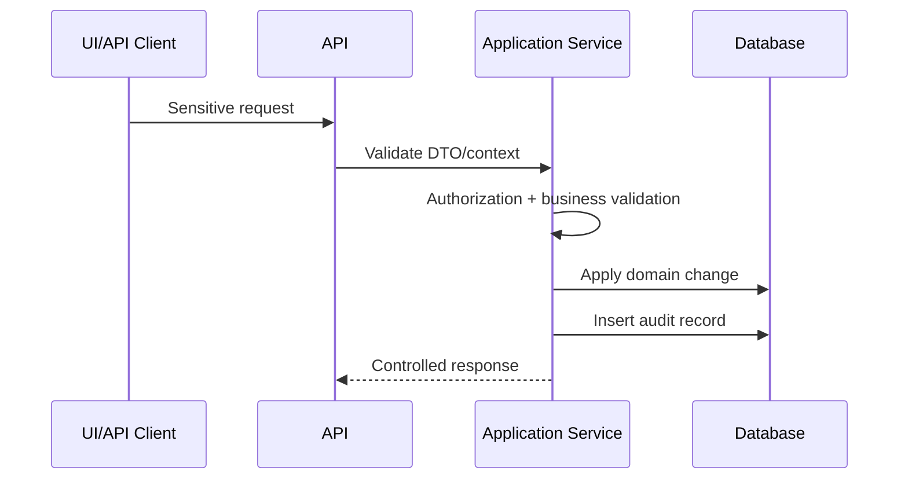

# Audit Requirements

## Purpose

This document defines audit logging requirements for the Unified Commerce system.
The platform handles tenant configuration, POS transactions, refunds, discounts, stock movements,
customer accounts, payment references, offline sync, receipts, and sensitive operational approvals.
Auditability is part of production readiness.

## Audit tables

| Table | Purpose |
|---|---|
| `audit_logs` | Immutable business audit trail for platform and tenant actions |
| `offline_sync_audit_logs` | Technical audit trail for offline sync lifecycle events |
| `receipt_print_logs` | Print/reprint/email/download history for receipts |
| `order_status_history` | Order/payment/fulfillment status change history |
| `payment_transactions` | Gateway/provider payment event log |
| `loyalty_transactions` | Immutable loyalty points ledger |
| `stock_movements` | Immutable inventory ledger |

## Main business audit table

`audit_logs` includes:

- `tenant_id`,
- `actor_platform_user_id`,
- `actor_user_id`,
- `actor_device_id`,
- `actor_type`,
- `entity_type`,
- `entity_id`,
- `action`,
- `old_values`,
- `new_values`,
- `ip`,
- `user_agent`,
- `created_at`.

Tenant ID is required for tenant business actions.
Platform actions may have null tenant ID.

## Actor types

| Actor type | Meaning |
|---|---|
| platform_user | Platform admin or support actor |
| tenant_user | Tenant staff such as admin, manager, cashier |
| system | Automated system process |
| device | POS device-driven technical actor |
| api | API integration actor where applicable |

## Sensitive actions requiring audit

| Area | Actions |
|---|---|
| Tenant/platform | tenant creation, suspension, entitlement changes |
| Access | role assignment, permission mapping, feature assignment |
| Configuration | feature flags, tenant settings, payment provider config, themes |
| POS | void, completed sale cancellation, price override, hold/recall where sensitive |
| Cash | cash in/out, safe drop, paid out, variance approval |
| Payments | refund approval, outbound refund, payment failure correction |
| Discounts | approval/rejection, threshold override |
| Inventory | stock adjustment, stocktake posting, damaged stock handling, transfer approval |
| Returns/exchanges | approval, rejection, refund allocation, exchange difference handling |
| Receipts | reprint, duplicate receipt output, failed print trace |
| Offline sync | conflict creation, conflict resolution, rejected sync item |

See [[sensitive-actions]].

## Audit flow

## Before/after values

`old_values` and `new_values` should be used when the action changes configuration or important entity state.
Examples:

- feature flag changed from false to true,
- user role added or removed,
- tenant status changed,
- return status approved,
- stock adjustment status posted.

Do not store secrets in audit JSON.

## Audit versus ledger

Some tables are already ledgers and should not be replaced by `audit_logs`.

| Ledger table | What it records |
|---|---|
| `stock_movements` | Inventory movement history |
| `payment_transactions` | Provider/payment event trace |
| `loyalty_transactions` | Loyalty points movements |
| `order_status_history` | Status transitions |
| `receipt_print_logs` | Receipt output history |

`audit_logs` supplements these records for actor/action traceability.

## Offline sync audit

Use `offline_sync_audit_logs` for technical events:

- batch_started,
- item_accepted,
- item_rejected,
- conflict_created,
- retry,
- batch_completed.

Business effects created from sync must still produce normal business records and audit where required.

## Receipt print audit

Receipt output is tracked by `receipt_print_logs`.
Reprint must be permission-controlled and auditable.
Fields include:

- receipt,
- outlet,
- till,
- device,
- printed_by,
- print_action,
- status,
- error message,
- printed_at.

## Audit immutability

Audit logs must not be updated by normal application users.
Correction should be represented by a new audit entry, not editing old audit history.

## API and backend requirements

Backend must:

- insert audit records inside the same transaction where appropriate,
- capture actor identity and tenant context,
- validate no secret values are included,
- use clear action names,
- preserve failure details where safe,
- avoid logging excessive sensitive personal or credential data.

## Frontend requirements

Frontend must:

- collect reason fields where required,
- show approval dialogs for sensitive actions,
- not expose secret/audit internals to unauthorized users,
- make reprint/void/refund/stock actions visibly intentional.

## QA audit checklist

| Test | Expected result |
|---|---|
| Role assignment changed | Audit log exists |
| Feature flag changed | Audit log old/new values exist |
| Refund approved | Refund record and audit trace exist |
| Receipt reprinted | Receipt print log exists |
| Offline conflict resolved | Sync audit and business audit where required |
| Stock adjustment posted | Stock movement and audit trace exist |

## Do not do

- Do not store passwords, OTPs, provider secrets, or card data in audit JSON.
- Do not allow normal users to edit audit rows.
- Do not use audit logs as stock/payment source of truth.
- Do not omit tenant ID for tenant business action.
- Do not hide sensitive state changes from audit.

## Related documents

- [[sensitive-actions]]
- [[payment-security-rules]]
- [[offline-data-protection]]
- [[device-security-rules]]
- [[03-data/entities/tax-receipt-audit-configuration-entities]]
- [[03-data/offline-sync-data-model]]
- [[04-api/error-contract]]
- [[05-backend/transaction-boundary-rules]]
- [[10-testing-quality/regression-checklist]]
