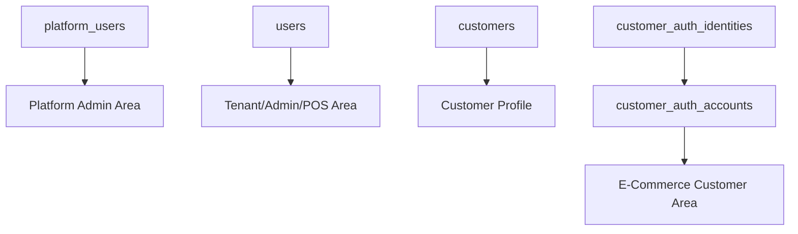
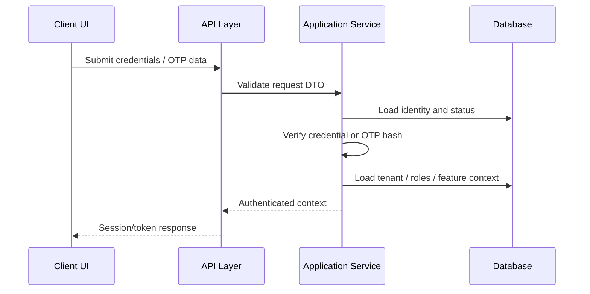

# Authentication Model

## Purpose

This document defines how identities authenticate into the Unified Commerce platform.
The production system has separate identity types for platform administrators, tenant staff, POS users,
and e-commerce customers. Authentication must preserve tenant boundaries and must not merge identities
across tenants unless the database design explicitly supports it.

## Identity types

| Identity type | Main table | Usage |
|---|---|---|
| Platform user | `platform_users` | Platform-side administrators who create tenants and manage entitlements |
| Tenant staff user | `users` | Tenant administrators, outlet managers, cashiers, inventory staff, e-commerce operators |
| Customer profile | `customers` | Tenant-scoped customer profile shared by POS and e-commerce |
| Customer auth account | `customer_auth_accounts` | Online login wrapper for customer access |
| Customer auth identity | `customer_auth_identities` | Local, Google, or Apple login identity for a customer auth account |

## Authentication boundary

Platform users are not tenant staff.
Tenant users are not platform users.
Customer auth accounts are not staff users.
A customer profile is tenant-scoped and must not become a global customer identity.

## Platform user authentication

| Field | Security meaning |
|---|---|
| `email` | Unique platform login email |
| `password_hash` | Password hash only; plain password must not be stored |
| `status` | Controls active, inactive, suspended access |
| `last_login_at` | Last successful login timestamp |

### Platform user rules

- Platform users authenticate separately from tenant staff users.
- Platform users manage tenant lifecycle and tenant feature entitlements.
- Platform user access must not be stored as a role inside tenant staff tables.
- Suspended or inactive platform users must not access platform administration.
- Platform actions may create `audit_logs` with `actor_platform_user_id`.

## Tenant staff authentication

| Field | Security meaning |
|---|---|
| `tenant_id` | Mandatory tenant boundary for staff users |
| `normalized_email` | Tenant-scoped unique email when email exists |
| `normalized_phone` | Tenant-scoped unique phone when phone exists |
| `password_hash` | Required only when password login is used |
| `status` | Active, inactive, or suspended staff state |

### Tenant staff rules

- Tenant staff users must be attached to exactly one tenant through `users.tenant_id`.
- The same email may exist under different tenants as separate tenant users if allowed by unique tenant scope.
- A staff user must not access another tenant's data through guessed IDs.
- Staff authentication only proves identity; authorization still requires roles, permissions, and feature access.
- Staff actions may create `audit_logs` with `actor_user_id`.

## Customer authentication

Customer login is represented by `customer_auth_accounts` and `customer_auth_identities`.
The customer profile remains in `customers`.
Guest customers can exist without a customer auth account.

| Table | Purpose |
|---|---|
| `customers` | Tenant-scoped profile, contact data, status, source |
| `customer_auth_accounts` | Online account status and last login |
| `customer_auth_identities` | Provider identity, username, password hash, email/phone verification flags |

### Customer auth rules

- Customer authentication is tenant-scoped through `tenant_id`.
- Guest checkout does not require an auth account.
- Customer identities can use local, Google, or Apple provider according to schema.
- Local customer passwords must be stored as password hashes only.
- External provider subjects must be unique by tenant and provider when present.
- Customer authentication must never allow access to another tenant's order history or addresses.

## OTP-supported authentication

The database design includes OTP reference and verification tables:

| Table | Security role |
|---|---|
| `otp_channels` | Seeded channels such as email, sms, whatsapp |
| `otp_purposes` | Seeded purposes such as login, signup, reset password, verify phone, verify email, mfa |
| `otp_verifications` | OTP issuance, attempt, resend, verification, blocking, and audit data |

OTP may apply to tenant users or customer auth accounts.
The table rule requires exactly one of `user_id` or `customer_auth_account_id` to be populated.

## Login flow

## Authentication is not authorization

Authentication answers: who is this actor?
Authorization answers: what can this actor do?

After authentication, the system must still evaluate:

- tenant context,
- outlet context where applicable,
- role assignment,
- permission,
- tenant feature entitlement,
- role feature assignment,
- runtime feature flag,
- business status validation.

See [[authorization-model]] for the complete access model.

## Frontend authentication responsibilities

The frontend architecture includes `AuthGuard`, `TillSessionGuard`, `RoleGuard`, token/session managers,
and session providers.

Frontend responsibilities:

- route unauthenticated users away from protected pages,
- keep session state consistent,
- display locked screens when till/session is inactive,
- show user and outlet context clearly,
- never treat hidden buttons as final security,
- send required tenant/outlet/device context to backend APIs.

Backend remains the final authority.

## Backend authentication responsibilities

Backend responsibilities:

- validate login credentials or OTP data,
- load identity state from the correct table,
- reject inactive/suspended identities,
- create authenticated context,
- enforce tenant boundary on all tenant-owned operations,
- log relevant sensitive authentication events where required,
- avoid placing authentication business rules inside controllers.

Backend placement should follow Clean Architecture:

| Layer | Responsibility |
|---|---|
| API | Request/response, middleware, filters |
| Application | Authentication workflow orchestration |
| Domain | Pure business rules where applicable |
| Infrastructure | Persistence and external provider integration |

## Do not do

- Do not use one global `users` table for platform, tenant, and customer identities.
- Do not store plain passwords.
- Do not store plain OTP values.
- Do not assume authenticated means authorized.
- Do not allow customer login to read staff/admin endpoints.
- Do not let tenant users authenticate into another tenant without explicit tenant context.
- Do not document platform admin as a tenant role.

## Related documents

- [[authorization-model]]
- [[password-and-otp-rules]]
- [[customer-account-security]]
- [[session-rules]]
- [[data-isolation-controls]]
- [[02-architecture/role-permission-capability-model]]
- [[03-data/entities/identity-access-entities]]
- [[03-data/entities/customer-entities]]
- [[04-api/auth-and-authorization]]
- [[05-backend/authentication-authorization]]
- [[06-frontend/routing-and-guards]]
