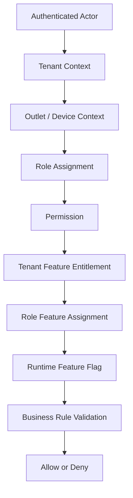

# Authorization Model

## Purpose

This document defines how authorization works in the Unified Commerce platform.
Authorization must combine tenant isolation, role-based access control, feature entitlement,
role feature assignment, runtime feature flags, and business validation.

Authentication alone is not enough.

## Access decision layers



## Authorization tables

| Table | Ownership | Purpose |
|---|---|---|
| `roles` | Tenant-owned | Tenant role definitions |
| `permissions` | Platform-owned | Global permission catalog |
| `role_permissions` | Tenant-owned mapping | Maps tenant roles to platform permissions |
| `tenant_user_roles` | Tenant-owned | Tenant-scope role assignment |
| `outlet_user_roles` | Tenant-owned | Outlet-scope role assignment |
| `platform_features` | Platform-owned | Global feature catalog |
| `tenant_feature_entitlements` | Platform/tenant mapping | Platform admin enables features for a tenant |
| `role_feature_assignments` | Tenant role mapping | Assigns tenant-enabled features to roles |
| `feature_flags` | Tenant runtime config | Tenant/outlet/user feature runtime enablement |

## Role scope

The database distinguishes role scope:

| Role scope | Assignment table | Example usage |
|---|---|---|
| tenant | `tenant_user_roles` | Tenant admin, reporting user, e-commerce operator |
| outlet | `outlet_user_roles` | Cashier, outlet manager, inventory staff |

### Role scope rules

- `tenant_user_roles` must only assign roles with tenant scope.
- `outlet_user_roles` must only assign roles with outlet scope.
- Outlet role assignment must include `outlet_id`.
- Active outlet role assignment is controlled by `relieved_at` and uniqueness rules.
- A user may have multiple roles when configured, but every access check must still be explicit.

## Permission model

Permissions are platform catalog values.
The database design intentionally keeps `permissions` without `tenant_id` because permission codes are global.
Tenant-specific permission granting happens through `role_permissions`.

Example permission style from source context:

```text
pos.sale.create
```

The actual permission catalog must be defined by the product and implementation team in seed data.
Do not invent final permission codes inside feature docs without aligning the permission catalog.

## Feature access model

Feature access is not a single flag.
The platform uses multiple layers:

| Layer | Table | Meaning |
|---|---|---|
| Feature catalog | `platform_features` | Feature exists in platform |
| Tenant entitlement | `tenant_feature_entitlements` | Platform admin enables feature for tenant |
| Role assignment | `role_feature_assignments` | Tenant role is allowed to use feature |
| Runtime config | `feature_flags` | Feature enabled at tenant/outlet/user scope |

## Required access check

For feature-based operations, backend must validate:

1. actor is authenticated,
2. actor belongs to tenant context,
3. actor has required tenant or outlet role,
4. role has required permission,
5. platform feature is enabled for tenant,
6. role is assigned to feature,
7. runtime feature flag allows action for scope,
8. business state allows the action.

## Backend authority

The uploaded scope explicitly requires backend to be final authority for tenant, role, permission,
feature access, validation, and operational controls.
Frontend hiding is not security.

Backend must reject unauthorized operations even if frontend sends a request manually.

## Frontend authorization responsibilities

Frontend can:

- hide unavailable menu items,
- route users away from unauthorized screens,
- display feature-disabled states,
- show permission-required messages,
- prevent accidental actions,
- ask for manager approval when required.

Frontend cannot:

- be the final permission authority,
- trust local role data for sensitive actions,
- perform payment/refund/stock/security decisions without backend validation,
- allow offline queued data to bypass server validation.

## Sensitive permission areas

| Area | Examples of sensitive actions |
|---|---|
| POS | completed sale cancellation, void, price override, drawer open where controlled |
| Payments | refund, payment reversal, exchange difference refund |
| Discounts | manager discount approval, approval threshold override |
| Inventory | stock adjustment, stocktake posting, damaged stock handling |
| Receipts | receipt reprint, duplicate receipt output |
| Offline sync | conflict resolution, rejected item override |
| Configuration | feature flags, tenant settings, payment provider configs, themes |
| Users/Roles | role changes, permission changes, outlet assignment |

See [[sensitive-actions]] for operational rules.

## Tenant admin versus platform admin

| Actor | Allowed ownership |
|---|---|
| Platform admin | Creates tenants, manages platform features, enables tenant entitlements |
| Tenant admin | Configures enabled tenant features, staff, roles, settings, themes, outlets |
| Outlet manager | Manages outlet-scoped workflows where assigned |
| Cashier | Uses POS workflows allowed by outlet role and session |
| Customer | Uses tenant-scoped e-commerce customer account and order access |

Platform admin is not implemented as a tenant staff role.

## Authorization examples

### POS sale create

A cashier must have:

- authenticated tenant user identity,
- outlet role assignment for the active outlet,
- permission to create POS sales,
- POS billing feature entitlement for tenant,
- POS billing role feature assignment,
- active runtime feature flag if configured,
- active till/session where required.

### Refund approval

A manager must have:

- authenticated tenant user identity,
- correct tenant/outlet context,
- refund approval permission,
- payment/refund feature access,
- business rule validation that refund amount does not exceed allowed captured amount,
- audit reason where required.

### E-Commerce customer order view

A customer must:

- authenticate through customer auth account when not guest,
- access only orders linked to same tenant customer identity,
- never access another tenant's customer records.

## Do not do

- Do not hard-code fixed role behavior globally.
- Do not assume default roles cannot be changed.
- Do not skip tenant entitlement checks when permission exists.
- Do not skip permission checks when feature flag is enabled.
- Do not trust frontend role guards as backend authorization.
- Do not use tenant settings as a substitute for relational access control.

## Related documents

- [[authentication-model]]
- [[data-isolation-controls]]
- [[sensitive-actions]]
- [[02-architecture/role-permission-capability-model]]
- [[03-data/entities/identity-access-entities]]
- [[04-api/feature-access-api-rules]]
- [[04-api/auth-and-authorization]]
- [[05-backend/feature-access-handling]]
- [[06-frontend/feature-access-ui-rules]]
- [[10-testing-quality/rbac-feature-access-test-cases]]
