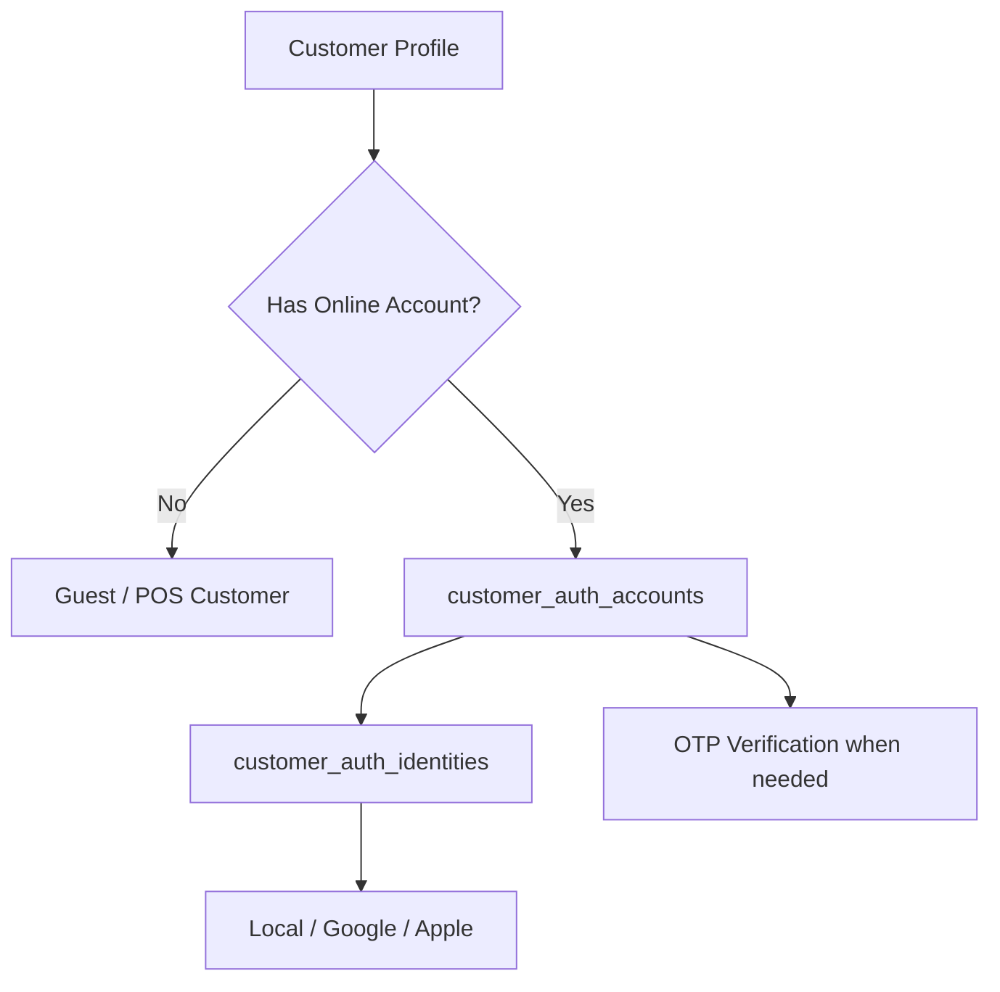

# Customer Account Security

## Purpose

This document defines security rules for tenant-scoped customer profiles, online customer accounts,
guest checkout, customer addresses, OTP verification, order history, wishlist, reviews, and loyalty.
The system must not create a global customer identity across tenants.

## Customer data model

| Table | Purpose |
|---|---|
| `customers` | Tenant-scoped customer profile shared by POS and e-commerce |
| `customer_auth_accounts` | Customer online login wrapper |
| `customer_auth_identities` | Local/social identity provider mapping |
| `customer_addresses` | Reusable tenant-scoped customer addresses |
| `otp_verifications` | OTP issuance and verification for customer account flows |
| `wishlists` / `wishlist_items` | Customer saved e-commerce items |
| `product_reviews` | Customer product reviews with moderation status |
| `customer_memberships` | Customer loyalty membership projection |
| `loyalty_transactions` | Immutable loyalty points ledger |

## Core customer rule

Customers are tenant-scoped.
The same email may exist under different tenants as separate customer identities.
Do not merge customer identities globally.

## Customer profile security

| Field | Rule |
|---|---|
| `tenant_id` | Mandatory tenant boundary |
| `normalized_email` | Unique only within tenant when present |
| `normalized_phone` | Unique only within tenant when present |
| `status` | Controls active, inactive, blocked, guest states |
| `source` | Records source such as POS, e-commerce, guest, import, API |

## Guest customer rule

The scope supports guest checkout readiness.
Database rules say guest checkout creates a tenant-scoped guest customer row.
Guest customers do not require customer auth accounts.

### Guest rules

- Guest customer must belong to one tenant.
- Guest order history must not be visible through unrelated authenticated accounts.
- Guest checkout must not automatically create a full account unless configured by future product decision.
- Guest customer identity must not be merged across tenants.

## Customer auth account rule

`customer_auth_accounts` wraps online login for a `customers` row.
The table has unique `(tenant_id, customer_id)`.
This means one customer profile can have one auth account per tenant.

## Customer auth identity rule

`customer_auth_identities` supports provider identities:

- local,
- Google,
- Apple.

Provider subject is unique by tenant and provider when present.
Local username is unique by tenant and provider when present.

## Customer account flow

## Address security

Customer addresses are tenant-scoped and linked to one customer.
Order addresses are stored separately as immutable order snapshots.

| Address type | Table | Security note |
|---|---|---|
| Reusable customer address | `customer_addresses` | Can be changed by authorized customer/staff workflow |
| Order snapshot address | `order_addresses` | Should preserve historical order address |

Do not overwrite order address history when a customer edits their profile address.

## Customer order access

A customer may view only orders linked to their tenant-scoped customer identity.
Staff access to customer orders must be permission-controlled and tenant-scoped.

Order access must validate:

- tenant ID,
- customer ID,
- auth account where applicable,
- order ownership,
- staff permission if accessed by tenant user.

## Wishlist security

`wishlists` and `wishlist_items` are linked to customer and tenant.
Wishlist operations must validate:

- tenant ownership,
- customer ownership,
- variant belongs to same tenant,
- wishlist belongs to same customer.

## Product review security

`product_reviews` require moderation before public display.
Review uniqueness rules exist for customer/product/order combinations.

Review operations must validate:

- tenant ownership,
- customer identity,
- product belongs to tenant,
- optional order belongs to same tenant/customer,
- moderation permission for approval/rejection.

## Loyalty security

Loyalty tables include:

- `loyalty_programs`,
- `membership_tiers`,
- `customer_memberships`,
- `loyalty_transactions`.

`loyalty_transactions` are immutable ledger rows.
Point balance in `customer_memberships` must be updated only from loyalty transactions.
Do not manually edit points balance without ledger history.

## OTP in customer account flows

OTP can support:

- signup,
- login,
- reset password,
- verify phone,
- verify email,
- MFA.

Customer OTP rows should use `customer_auth_account_id` and not `user_id`.
See [[password-and-otp-rules]].

## Staff access to customer data

Tenant staff may need customer lookup for POS billing, returns, exchanges, support, or reporting.
Staff access must be:

- tenant-scoped,
- permission-controlled,
- feature-aware where applicable,
- audited if sensitive action occurs.

## Do not do

- Do not create global customer identity across tenants.
- Do not expose customer addresses across tenants.
- Do not let customers view another customer's orders.
- Do not publish product reviews without moderation when status is pending/rejected/hidden.
- Do not mutate loyalty points without ledger transactions.
- Do not treat guest checkout as authenticated customer access.
- Do not store customer password plain.

## Test expectations

QA must test:

- same email under two tenants remains separate,
- customer cannot access another tenant order,
- guest customer cannot see authenticated account data,
- customer address update does not change order address snapshot,
- product review moderation blocks public display before approval,
- loyalty transaction reversals do not edit original ledger rows.

## Related documents

- [[authentication-model]]
- [[password-and-otp-rules]]
- [[data-isolation-controls]]
- [[authorization-model]]
- [[03-data/entities/customer-entities]]
- [[03-data/entities/ecommerce-entities]]
- [[03-data/entities/payments-entities]]
- [[04-api/auth-and-authorization]]
- [[06-frontend/ecommerce-storefront-rules]]
- [[10-testing-quality/ecommerce-order-workflow-test-cases]]
