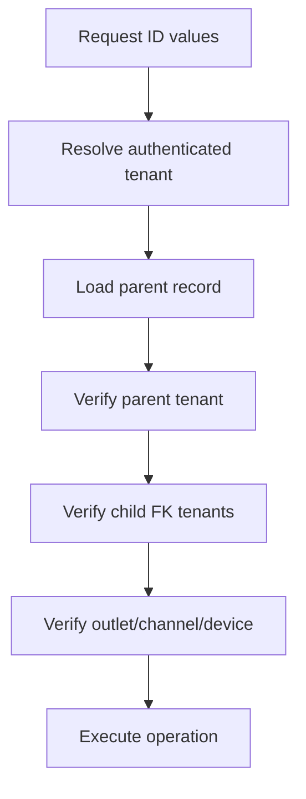

# Data Isolation Controls

## Purpose

This document defines tenant, outlet, channel, user, customer, device, and offline data isolation rules.
The platform is multi-tenant. Tenant data must not leak across tenants through API requests, joins,
frontend state, offline cache, reports, receipts, or sync processing.

## Isolation levels

| Level | Used for |
|---|---|
| Platform | `platform_users`, `platform_features`, global reference data |
| Tenant | Most business records: users, products, customers, orders, payments, reports |
| Outlet | POS stock, tills, devices, sessions, cash, outlet-specific operations |
| Channel | POS, e-commerce, or both where configured |
| User | Staff/user-specific feature flags or access context |
| Device | POS terminal, offline sync, receipts, cash movements |

## Tenant-owned data rule

Every tenant-owned business record must either:

- carry `tenant_id` directly, or
- be reachable only through a tenant-scoped parent while still validated consistently.

The uploaded database design uses direct `tenant_id` across most business tables.
This must be preserved in implementation.

## Platform-owned data

Some data is platform-owned and intentionally has no `tenant_id`.

| Table | Reason |
|---|---|
| `platform_users` | Platform admin identity, not tenant staff |
| `permissions` | Platform permission catalog |
| `platform_features` | Platform feature catalog |
| `stock_movement_types` | Seeded reference values |
| `payment_method_types` | Seeded global payment method reference |
| `discount_types` / `discount_scopes` | Seeded discount references |
| `otp_channels` / `otp_purposes` | Seeded OTP references |
| `attribute_templates` / `attribute_presets` | Platform-level setup accelerators |

Platform-owned data must not be confused with tenant-owned transaction data.

## Outlet isolation

Outlet context applies to:

- `outlets`,
- `outlet_addresses`,
- `outlet_user_roles`,
- `inventory_balances`,
- `inventory_channel_allocations`,
- `tills`,
- `pos_devices`,
- `till_sessions`,
- POS sales,
- stock movements,
- cash movements,
- receipt print logs,
- offline sync batches.

Outlet IDs must belong to the same tenant ID used by the operation.

## Channel isolation

The platform supports POS, e-commerce, and hybrid operating modes.
Channel appears in:

- tenant operating mode,
- tenant settings,
- price lists,
- inventory allocations,
- discount policies,
- coupons,
- sales/order/reporting summaries.

Channel rules must be explicit. POS-only features should not affect e-commerce where separated, and vice versa.

## Device isolation

POS device context is security-sensitive because it determines:

- outlet stock context,
- till assignment,
- receipt printer behavior,
- offline sync ownership,
- source device in sales and payments,
- cash movement source,
- device audit.

A device must not sync or post records for another tenant or outlet.

## Customer isolation

Customer records are tenant-scoped.
The same email can exist under multiple tenants as separate customer identities.
Do not build a shared global customer profile unless a future approved schema introduces one.

## Offline data isolation

Offline POS stores locally cached data and queued transactions.
Offline mode must preserve:

- tenant context,
- outlet context,
- device context,
- till/session context,
- unique local transaction identifiers.

When sync occurs, backend must validate tenant/outlet/device/session consistency before accepting data.

## Report isolation

Reports must filter by tenant and allowed outlet/channel.
Reporting read models are not source of truth and must not bypass tenant restrictions.

| Report type | Isolation required |
|---|---|
| Sales summaries | tenant, scope, outlet, channel, date |
| Payment summaries | tenant, scope, outlet, method, date |
| Inventory summaries | tenant, outlet, variant, date |
| Discount/return summaries | tenant, scope, outlet, channel, date |

## API isolation rules

Every tenant-owned API request must validate:

1. authenticated actor,
2. tenant context,
3. outlet context where applicable,
4. record belongs to tenant,
5. FK IDs belong to same tenant,
6. feature access and permission,
7. business state.

Do not trust route IDs alone.

## Database join risk

FK-heavy workflows can accidentally join records from different tenants if service code only validates the parent entity.
The service layer must validate tenant consistency for all critical IDs, especially:

- product/variant IDs,
- outlet IDs,
- user IDs,
- customer IDs,
- sale/order IDs,
- payment/refund IDs,
- return/exchange IDs,
- delivery IDs,
- offline sync IDs.

## Isolation flow

## Do not do

- Do not load data by ID without tenant filter.
- Do not trust frontend tenant ID.
- Do not allow POS device to change outlet silently.
- Do not allow offline sync to create records for another device/outlet.
- Do not merge customers globally across tenants.
- Do not let reporting queries omit tenant filters.
- Do not use tenant settings JSON as transactional data storage.

## Review checklist

| Question | Required answer |
|---|---|
| Does this table have tenant ownership? | Yes or platform-owned reason documented |
| Are all FK IDs validated for same tenant? | Yes |
| Is outlet context validated where required? | Yes |
| Does frontend state include stale tenant data risk? | Considered |
| Does offline cache contain only current tenant/outlet data? | Yes |
| Are reports filtered by tenant and allowed scope? | Yes |

## Related documents

- [[02-architecture/tenancy-architecture]]
- [[03-data/tenant-consistency-rules]]
- [[03-data/schema-principles]]
- [[04-api/tenant-context-api-rules]]
- [[05-backend/validation-rules]]
- [[06-frontend/state-management-rules]]
- [[offline-data-protection]]
- [[device-security-rules]]
- [[customer-account-security]]
