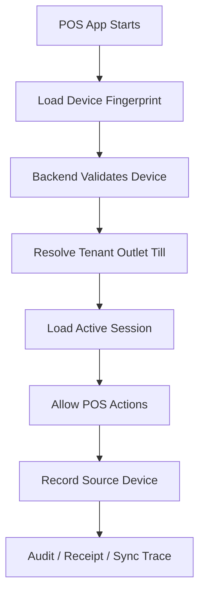

# Device Security Rules

## Purpose

This document defines security rules for POS devices, tills, scanners, printers, cash drawer behavior,
and offline device context. Device security matters because a POS terminal determines outlet stock,
receipt output, cash session context, offline sync ownership, and audit traceability.

## Device-related tables

| Table | Purpose |
|---|---|
| `tills` | Cash register / till master assigned to tenant and outlet |
| `pos_devices` | Registered POS terminal/browser/device for online/offline POS |
| `till_sessions` | Open/close session per till |
| `cash_movements` | Non-sale cash movement with optional source device and offline fields |
| `receipts` | Receipt output with source device and offline fields |
| `receipt_print_logs` | Print/reprint/email/download history by device/till/user |
| `offline_sync_batches` | Sync attempt from a POS device |
| `offline_sync_items` | Offline-created item queue by device |

## POS device identity

`pos_devices` includes:

- `tenant_id`,
- `outlet_id`,
- `till_id`,
- `device_code`,
- `device_name`,
- `device_fingerprint`,
- `app_version`,
- `last_seen_at`,
- `status`.

The database rules require device outlet to match till outlet.

## Device status rules

| Status | Meaning |
|---|---|
| active | Device can be used if other context is valid |
| inactive | Device should not perform POS operations |
| blocked | Device must be denied sensitive operations and sync acceptance |

Backend must check device status for POS operations and sync processing.

## Till assignment rules

A till belongs to one tenant and one outlet.
A POS device belongs to one till.
Therefore a POS device must inherit correct tenant/outlet/till context.

Do not allow a POS device to silently post sales for a different outlet.

## Hardware scope from product requirements

The uploaded scope includes:

- POS device registration,
- terminal assignment to outlet,
- till assignment to terminal,
- default receipt printer per terminal,
- scanner configuration and test mode,
- USB/Bluetooth scanner support,
- USB/Bluetooth/LAN receipt printer support,
- 80mm ESC/POS thermal receipt format,
- printer test print,
- printer connection status,
- optional cash drawer kick support.

The current uploaded database design has `pos_devices` but does not define dedicated printer/scanner/peripheral tables.
Therefore this document describes security behavior only, not new tables.
If dedicated peripheral tables are added later, update [[03-data/required-schema-extensions]].

## Scanner security

The frontend architecture includes `scannerListener.ts`.
The scope says barcode scanners can behave as keyboard input into the POS search/scan field unless advanced integration is required.

Scanner rules:

- Scanner input must add products only through normal POS product lookup.
- Scanned barcode must be tenant-scoped.
- Scanning must not bypass product status, price, stock, or feature access checks.
- Scanner failure must not corrupt cart state.
- Manual search and scanner input must share validation rules.

## Printer security

The frontend architecture includes `printerBridge.ts`.
Receipts are stored in `receipts`; print actions are logged in `receipt_print_logs`.

Printer rules:

- Printer failure must not corrupt completed sale transaction.
- Receipt generation and sale completion must remain traceable.
- Reprint must be permission-controlled and audited.
- Receipt print log should capture action, status, device/till/user, and error when failed.
- Duplicate receipt label behavior is product scope and should be applied in receipt output.

## Cash drawer security

The frontend architecture includes `cashDrawer.ts`.
The uploaded scope includes optional cash drawer kick support.

Cash drawer actions must be controlled by POS session and cash movement rules.
Do not allow cash drawer operations to bypass:

- active till/session checks,
- role/permission checks,
- cash movement reason requirements where applicable,
- audit for sensitive actions.

## Offline device sync

A device that records offline transactions must sync using:

- `offline_sync_batches`,
- `offline_sync_items`,
- typed sale/payment queues,
- conflict records,
- sync audit logs.

Backend must validate:

- device belongs to tenant,
- device belongs to outlet,
- device is active,
- sync batch outlet matches device outlet,
- client entity IDs are unique per tenant/device/entity type,
- blocked devices cannot create accepted sync records.

## Device security flow

## Frontend responsibilities

Frontend must:

- show device/outlet/till status,
- prevent accidental use when device is unregistered or blocked,
- show printer/scanner connection status,
- support test print where configured,
- store offline queue with correct device context,
- never assign device authority by local state alone.

## Backend responsibilities

Backend must:

- validate device on every POS-sensitive action,
- prevent outlet/till mismatch,
- reject blocked devices,
- record `source_device_id` where schema supports it,
- validate device during offline sync,
- write audit/sync audit for device-related sensitive events.

## Do not do

- Do not let device choose arbitrary outlet from frontend.
- Do not accept sync data from blocked device.
- Do not complete POS sale using unregistered device when registration is required.
- Do not treat printer success as sale completion source of truth.
- Do not bypass reprint permission.
- Do not let scanner input bypass product validation.

## Test checklist

| Scenario | Expected result |
|---|---|
| Active device assigned to correct outlet | POS can load after auth/session checks |
| Blocked device tries sale | Backend rejects |
| Device outlet does not match till outlet | Backend rejects |
| Printer fails after completed sale | Sale remains complete; print failure logged |
| Reprint attempted without permission | Rejected and/or not shown |
| Offline sync from wrong device | Rejected or conflict created |

## Related documents

- [[session-rules]]
- [[offline-data-protection]]
- [[audit-requirements]]
- [[03-data/entities/pos-sales-entities]]
- [[03-data/offline-sync-data-model]]
- [[04-api/device-session-api-rules]]
- [[06-frontend/scanner-printer-integration]]
- [[07-modules/pos-devices-hardware/README]]
- [[10-testing-quality/pos-ux-test-cases]]
