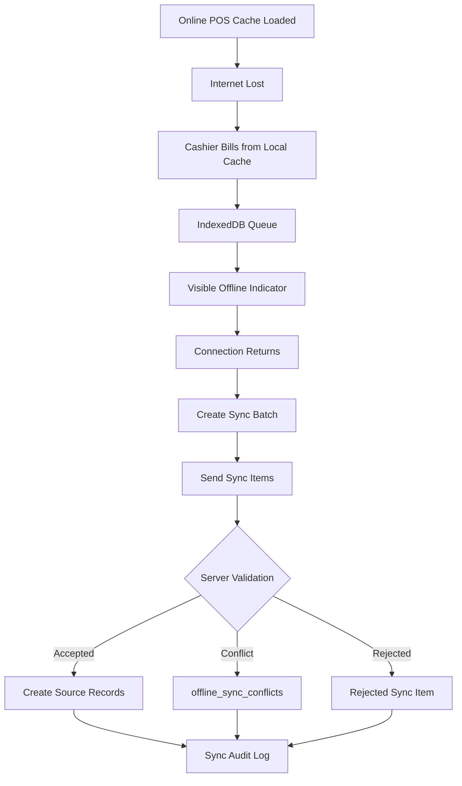

# Offline Data Protection

## Purpose

This document defines security and data protection rules for offline-first POS.
The uploaded scope requires offline billing, local cache, IndexedDB local transaction storage,
offline receipt printing, visible offline state, sync retry queue, duplicate prevention, and conflict handling.

## Offline data model

| Table | Purpose |
|---|---|
| `offline_sync_batches` | One reconnect/sync attempt from a POS device |
| `offline_sync_items` | Generic sync item queue for offline-created records |
| `offline_sale_sync_queue` | Typed offline sale staging queue |
| `offline_payment_sync_queue` | Typed offline payment staging queue |
| `offline_sync_conflicts` | Conflict record when sync cannot be accepted cleanly |
| `offline_sync_audit_logs` | Technical audit trail for sync lifecycle events |

## Offline source-of-truth rule

Offline queues are not source of truth.
They are staging records.
Accepted business data must land in source tables such as:

- `sales`,
- `sale_lines`,
- `payments`,
- payment allocation tables,
- `stock_movements`,
- `receipts`,
- `cash_movements` where applicable.

## Cached data boundary

Offline POS may cache essential data needed for billing:

- product/variant lookup,
- barcode/SKU data,
- pricing data,
- tax data where safe,
- discount rules where safe,
- tenant/outlet/device/session context.

Do not cache unrelated tenant data or full admin datasets into POS offline storage.

## Frontend offline components

The frontend architecture includes:

- `syncQueue.ts`,
- `connectivityMonitor.ts`,
- `offline.store.ts`,
- POS shell/page state,
- printer/scanner bridge.

Frontend must clearly show online/offline state and queued transaction state.

## Offline transaction identifiers

Offline records must use unique local IDs for dedupe.
The database includes fields such as:

- `client_transaction_id`,
- `client_sale_id`,
- `client_payment_id`,
- `client_entity_id`,
- `client_cash_movement_id`,
- `client_receipt_id`,
- `client_movement_id`.

Server must enforce uniqueness where schema defines it.

## Offline sync flow

## Server-side sync validation

Backend must validate:

- tenant ID,
- outlet ID,
- device ID,
- till/session ID,
- user/cashier identity where present,
- duplicate local IDs,
- product/variant existence,
- price/tax/discount rules,
- stock state and reservation conflicts,
- payment method validity,
- status transition validity,
- receipt generation rules.

## Conflict handling

`offline_sync_conflicts` supports conflict types:

- duplicate,
- stock_mismatch,
- price_changed,
- closed_session,
- validation_failed.

Conflicts must not silently corrupt business records.
They must be visible to authorized staff and resolved explicitly.

## Offline payment rules

The uploaded scope states:

- cash payment can be allowed offline,
- card/QR offline must depend on external terminal confirmation or be blocked,
- server must validate offline transactions after sync.

Do not assume all non-cash payments are safe offline.

## Offline data risk controls

| Risk | Control |
|---|---|
| Stolen/shared device exposes data | Cache only needed tenant/outlet data; session controls |
| Duplicate sync creates duplicate sale | Client IDs + unique constraints + idempotency |
| Offline stock conflict | Conflict record, no silent corruption |
| Wrong outlet/device sync | Device/outlet/till validation |
| Payment mismatch | Server payment validation and allocation checks |
| Old cache prices | Price/tax validation at sync and conflict handling |

## Browser storage note

The uploaded frontend architecture uses offline storage through `core/offline` and the project context uses IndexedDB for offline POS.
This document does not claim browser storage is equivalent to secure server storage.
Offline browser data must be treated as local operational cache and queued transaction storage.

## Audit rules

Use:

- `offline_sync_audit_logs` for technical sync lifecycle,
- `audit_logs` for business-sensitive actions.

Examples:

- conflict created,
- sync item rejected,
- sync item accepted,
- conflict resolved,
- refund/void/stock action created from synced data.

## Do not do

- Do not treat IndexedDB as trusted source of truth.
- Do not accept offline records without server validation.
- Do not silently adjust stock to make offline sync pass.
- Do not bypass payment validation for offline records.
- Do not allow blocked devices to sync accepted transactions.
- Do not omit client transaction IDs.
- Do not cache other tenants' data offline.

## QA checklist

| Test | Expected result |
|---|---|
| Offline sale sync after reconnect | Accepted only after backend validation |
| Duplicate offline sale sent twice | No duplicate source sale |
| Stock changed online during offline sale | Conflict or controlled validation result |
| Blocked device attempts sync | Rejected |
| Offline payment duplicate | Rejected/deduped |
| Closed session conflict | Conflict created or rejected |

## Related documents

- [[device-security-rules]]
- [[session-rules]]
- [[payment-security-rules]]
- [[audit-requirements]]
- [[03-data/offline-sync-data-model]]
- [[04-api/offline-sync-api-rules]]
- [[05-backend/offline-sync-backend-rules]]
- [[06-frontend/offline-frontend-rules]]
- [[10-testing-quality/offline-sync-test-cases]]
