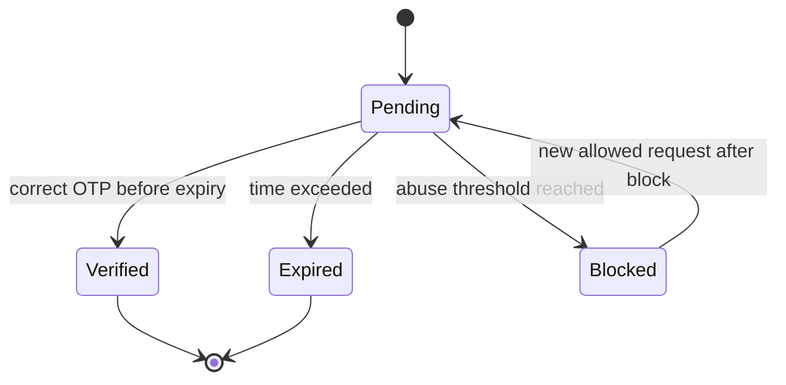

# Password and OTP Rules

## Purpose

This document defines password and OTP storage rules for platform users, tenant staff users,
and customer auth identities. The uploaded database design clearly requires password hashes and OTP hashes only.
Plain passwords and plain OTP values must not be stored.

## Password-bearing tables

| Table | Password field | Notes |
|---|---|---|
| `platform_users` | `password_hash` | Required for platform login |
| `users` | `password_hash` | Required only for password login |
| `customer_auth_identities` | `password_hash` | Used for local customer provider |

## Password storage rule

All password fields store hashes only.
The database design explicitly says never to store plain passwords.

### Required behavior

- Accept password only in request payload during login, registration, or reset.
- Hash before persistence.
- Never write plain password into logs, audit JSON, error responses, or debug payloads.
- Never return password hash in API responses.
- Never expose password hash to frontend state.

## OTP tables

| Table | Purpose |
|---|---|
| `otp_channels` | Reference values: email, sms, whatsapp |
| `otp_purposes` | Reference values: login, signup, reset password, verify phone, verify email, mfa |
| `otp_verifications` | OTP issuance, attempt, resend, verification, block, and request metadata |

## OTP verification fields

| Field | Security meaning |
|---|---|
| `otp_code_hash` | Hashed OTP value only |
| `expires_at` | OTP expiry time |
| `verified_at` | Successful verification timestamp |
| `attempt_count` | Verification attempt counter |
| `resend_count` | OTP resend counter |
| `last_attempt_at` | Last attempt time |
| `blocked_until` | Temporary block period after abuse threshold |
| `ip` | Request IP for monitoring |
| `user_agent` | Request user agent |
| `status` | pending, verified, expired, blocked |

## OTP ownership rule

`otp_verifications` can be linked to either:

- a tenant staff user through `user_id`, or
- a customer auth account through `customer_auth_account_id`.

Exactly one of these must be populated.
This prevents ambiguous OTP ownership.

## OTP lifecycle

## OTP issue flow

1. User or customer requests OTP.
2. Backend validates identity context and purpose.
3. Backend creates OTP code transiently.
4. Backend stores only `otp_code_hash`.
5. Backend sends OTP through selected seeded channel.
6. Backend records `expires_at`, destination, IP, user agent, status.
7. Plain OTP is never persisted.

## OTP verify flow

1. Client submits OTP.
2. Backend loads active pending OTP row.
3. Backend checks expiry and blocked state.
4. Backend compares submitted OTP against stored hash.
5. Backend increments attempt data when incorrect.
6. Backend sets `verified_at` and status when correct.
7. Backend blocks or expires rows according to stored counters and timestamps.

## Abuse control rules

The database design includes fields for attempt count, resend count, last attempt time, and blocked until.
Implementation must use these fields to support:

- rate limiting,
- resend limits,
- temporary blocking,
- retention cleanup for old OTP rows.

Exact numeric thresholds are not defined in the uploaded documents.
Do not invent exact thresholds in this document.
Define thresholds later in tenant/platform security configuration or implementation decision docs.

## Reset password behavior

The OTP purpose table includes `reset_password`.
A reset password flow must:

- validate OTP purpose,
- use the correct identity owner,
- reject expired or blocked OTP rows,
- update password hash only after successful verification,
- not expose whether unrelated tenant/customer identities exist across tenants.

## Email and phone verification

OTP purpose includes `verify_phone` and `verify_email`.
Customer auth identities include:

- `is_email_verified`,
- `is_phone_verified`.

Verification status must be updated only after successful OTP or accepted provider verification workflow.

## Logging rules

Do not log:

- plain password,
- plain OTP,
- password hash,
- OTP hash,
- full credential payload,
- token-like values.

Audit may log that a reset or verification action occurred, but not the secret value.

## API response rules

Responses may include:

- verification status,
- masked destination if needed,
- retry allowed or blocked state,
- expiry message where appropriate.

Responses must not include:

- password hash,
- OTP hash,
- original OTP,
- internal abuse-control strategy details that help attackers.

## AI IDE rules

When implementing password or OTP work, AI IDE tools must read:

- this file,
- [[authentication-model]],
- [[customer-account-security]],
- [[authorization-model]],
- [[03-data/entities/customer-entities]],
- [[04-api/auth-and-authorization]],
- [[05-backend/authentication-authorization]].

## Do not do

- Do not store plain OTP values.
- Do not store plain passwords.
- Do not return hashes in API responses.
- Do not use OTP without expiry.
- Do not allow unlimited attempts.
- Do not use one OTP row for both staff and customer at the same time.
- Do not ignore tenant context for customer OTP.

## Related documents

- [[authentication-model]]
- [[customer-account-security]]
- [[data-isolation-controls]]
- [[audit-requirements]]
- [[03-data/entities/customer-entities]]
- [[04-api/auth-and-authorization]]
- [[10-testing-quality/rbac-feature-access-test-cases]]
