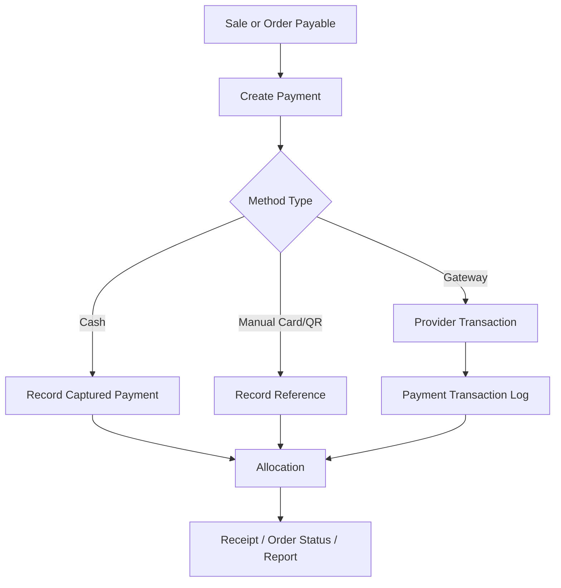

# Payment Security Rules

## Purpose

This document defines security rules for payment recording, provider configuration, payment transactions,
refunds, allocations, split payments, exchange differences, and receipt-related payment traceability.

The uploaded database design separates payment business records, provider event logs, allocations,
and refunds. This separation must remain intact.

## Payment-related tables

| Table | Purpose |
|---|---|
| `payment_method_types` | Global payment method reference values |
| `tenant_payment_methods` | Tenant-enabled payment methods and non-secret config |
| `payment_provider_configs` | Provider config with secret reference |
| `payments` | Unified payment and payout record |
| `payment_transactions` | Gateway/provider event log per payment |
| `sale_payment_allocations` | Allocates payments to POS sales |
| `order_payment_allocations` | Allocates payments to e-commerce orders |
| `refunds` | Business refund header linked to original and outbound payment |

## Provider secret rule

`payment_provider_configs` includes:

- `config` for non-secret config only,
- `secret_ref` for reference to vault/secret manager.

Do not store card data, gateway private keys, or provider secrets directly in JSON.

## Payment method separation

The uploaded scope requires payment recording and real payment processing to be clearly separated.

| Concern | Rule |
|---|---|
| Cash payment | Can be recorded directly by POS |
| Manual card/QR | Store reference where applicable |
| Gateway payment | Use provider config and transaction log |
| Offline card/QR | Must depend on external terminal confirmation or be blocked by business rule |
| Refund | Must follow refund rules and original payment constraints |

## Payment record security

`payments` includes:

- payment direction: inbound or outbound,
- payment purpose: sale, order, refund, exchange difference,
- payment status,
- method type,
- provider code,
- currency,
- amount,
- captured amount,
- reference number,
- idempotency key,
- client/offline fields.

Payment amount must be positive.
Captured amount must not exceed amount.

## Idempotency rule

The database design includes tenant-scoped idempotency on `payments.idempotency_key`.
API and backend workflows must use idempotency for operations that can be retried:

- payment creation,
- capture callback handling,
- refund creation,
- offline payment sync,
- order payment posting,
- POS payment completion.

Do not allow duplicate payments from network retries.

## Allocation rule

Payments are allocated through explicit allocation tables:

- `sale_payment_allocations`,
- `order_payment_allocations`,
- exchange allocation tables for exchange differences.

Allocated totals must not exceed captured payment amount.
Payment allocation must belong to the same tenant and correct source document.

## Refund rule

`refunds` links to original captured payment and optional outbound refund payment.
Refund total against original payment must not exceed original captured amount.
Refund payment must be outbound and have purpose `refund`.

Refunds should follow original payment method unless manager override is allowed by product rule.
The uploaded scope includes manager override as possible where configured.

## Split payment security

Split payment means multiple payment records and allocation rows can support one sale/order.
Security rules:

- Each payment must be validated separately.
- Total allocated amount must satisfy payable balance.
- Refunds must consider original payment allocation.
- Reports must reconcile by payment method.
- Duplicate client payment IDs must be blocked for offline POS.

## Payment status rule

Payment status values include:

- pending,
- authorized,
- captured,
- failed,
- cancelled,
- voided,
- partially_refunded,
- refunded,
- expired.

Do not use random status strings outside schema rules.
Status transitions should be validated by service logic.

## Provider transaction log

`payment_transactions` is for integration trace only.
Business totals come from `payments` and allocation tables.
Do not calculate financial reports from raw provider payloads.

## Payment flow

## Offline payment security

Offline payment fields include:

- `source_device_id`,
- `client_payment_id`,
- `client_transaction_id`,
- `offline_created_at`,
- `sync_batch_id`.

Offline payments must be validated server-side before acceptance.
Duplicate client payment IDs must be rejected by unique constraints and service checks.

## Receipt payment security

Receipts should show frozen payment details from accepted records.
Receipt reprint must not create new payment records.
Receipt print logs must capture reprint actions.

## Do not do

- Do not store card data.
- Do not store gateway private keys in JSON config.
- Do not trust frontend payment totals without backend recalculation/validation.
- Do not allocate payment across tenants.
- Do not refund more than captured amount.
- Do not edit original payment ledger to represent refund; use refund/outbound payment records.
- Do not treat provider raw payload as financial source of truth.

## Test checklist

| Scenario | Expected result |
|---|---|
| Duplicate payment request with same idempotency key | No duplicate payment |
| Refund greater than captured amount | Rejected |
| Payment allocation exceeds captured amount | Rejected |
| Manual QR without reference where required | Validation error where configured |
| Gateway secret stored in config JSON | Security review failure |
| Offline duplicate payment sync | Rejected or deduped |

## Related documents

- [[authorization-model]]
- [[sensitive-actions]]
- [[audit-requirements]]
- [[03-data/entities/payments-entities]]
- [[04-api/payment-refund-api-rules]]
- [[04-api/idempotency-rules]]
- [[05-backend/payment-gateway-integration-rules]]
- [[05-backend/transaction-boundary-rules]]
- [[06-frontend/api-client-and-query-rules]]
- [[10-testing-quality/payment-refund-test-cases]]
