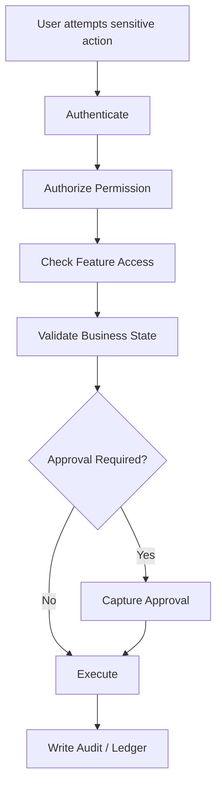

# Sensitive Actions

## Purpose

This document lists actions that require stronger control because they affect money, stock, access,
configuration, audit history, customer data, or offline data integrity.
Sensitive actions require explicit permissions, business validation, reason capture where applicable,
and audit logging.

## Sensitive action rule

A sensitive action must not rely only on UI hiding.
Backend must validate permission, feature access, tenant/outlet/device context, and business state.

## Control levels

| Control | Meaning |
|---|---|
| Permission | Actor has required permission through role |
| Feature access | Feature entitled and assigned to role where applicable |
| Reason | User enters business reason or note |
| Approval | Manager/admin approval required |
| Audit | Business audit or specific ledger/log record created |
| Status validation | Action allowed only from valid workflow state |

## POS sensitive actions

| Action | Required controls |
|---|---|
| Completed sale cancellation | Permission, reason, audit, status validation |
| Void current cart/sale | Permission where configured, audit for completed/posted effects |
| Price override | Permission, reason, audit, recalculation |
| Held sale recall by another user/session | Permission and outlet/session validation |
| Drawer open where controlled | Permission/session validation |
| Sale reprint receipt | Permission, receipt print log, duplicate indicator |

## Cash sensitive actions

| Action | Required controls |
|---|---|
| Cash in | Permission, reason, session, audit/log |
| Cash out | Permission, reason, session, approval where configured |
| Safe drop | Permission, reason, session, audit/log |
| Paid out | Permission, reason, approval where required |
| Cash variance approval | Manager permission, reason, session close record |

## Payment and refund sensitive actions

| Action | Required controls |
|---|---|
| Refund approval | Permission, refund amount validation, audit |
| Outbound refund payment | Payment validation, original payment validation, audit |
| Exchange difference refund | Exchange validation, refund allocation, audit |
| Payment correction | Permission, provider trace, audit |
| Manual card/QR reference entry | Validation and traceability |

## Discount sensitive actions

| Action | Required controls |
|---|---|
| Discount request approval | Manager permission and audit |
| Discount above threshold | Approval required by policy |
| Price override discount | Permission, reason, audit |
| Coupon usage override | Permission and audit if allowed |
| Discount stacking exception | Explicit policy/permission, audit |

## Inventory sensitive actions

| Action | Required controls |
|---|---|
| Stock adjustment approval/posting | Permission, reason, stock movement, audit |
| Stocktake posting | Permission, stocktake movement, audit |
| Damaged stock handling | Reason, restock/discard/quarantine decision, audit |
| Stock transfer approval | Permission, source/destination validation, audit |
| Negative stock allowance | Tenant setting and validation where configured |

## Return and exchange sensitive actions

| Action | Required controls |
|---|---|
| Return approval | Permission, policy validation, audit |
| Manager override for return policy | Permission, reason, audit |
| Non-returnable item override | Permission, reason, audit |
| Expired return window override | Permission, reason, audit |
| Exchange difference handling | Payment/refund validation, audit |
| Cross-channel return | Configured rule, outlet validation, audit |

## Access and configuration sensitive actions

| Action | Required controls |
|---|---|
| Create/suspend tenant | Platform admin permission and audit |
| Enable tenant feature entitlement | Platform admin permission and audit |
| Assign feature to role | Tenant admin permission and audit |
| Add/remove role permissions | Permission and audit |
| Assign outlet role | Tenant/outlet admin permission and audit |
| Change tenant settings | Permission, audit, scope validation |
| Change payment provider config | Permission, secret reference rule, audit |
| Change UI theme | Permission, token validation, audit where required |

## Device and offline sensitive actions

| Action | Required controls |
|---|---|
| Register POS device | Permission, tenant/outlet/till validation |
| Block/unblock POS device | Permission and audit |
| Resolve offline conflict | Permission, reason, audit/sync audit |
| Retry failed sync batch | Permission/system rule, sync audit |
| Accept rejected item manually | Permission, reason, audit, data validation |

## Customer sensitive actions

| Action | Required controls |
|---|---|
| Block customer | Permission and audit |
| Customer account reset | OTP/password rules, audit where required |
| Review moderation | Permission and audit |
| Loyalty point adjustment | Permission, ledger transaction, audit |
| Customer data correction | Permission, tenant isolation, audit where required |

## Decision pattern

## Reason capture

Reason should be captured for actions that change financial, stock, access, or correction state.
Examples:

- refund reason,
- return reason,
- void reason,
- stock adjustment reason,
- discount approval reason,
- offline conflict resolution note,
- cash movement reason.

## Do not do

- Do not allow sensitive action from frontend-only guard.
- Do not skip audit for financial or stock correction.
- Do not approve discount/refund without permission.
- Do not perform stock changes without stock movement record.
- Do not mutate ledger rows to “fix” mistakes.
- Do not silently resolve offline conflicts.

## Related documents

- [[authorization-model]]
- [[audit-requirements]]
- [[payment-security-rules]]
- [[offline-data-protection]]
- [[device-security-rules]]
- [[03-data/entity-relationship-map]]
- [[04-api/auth-and-authorization]]
- [[05-backend/validation-rules]]
- [[10-testing-quality/workflow-test-cases]]
