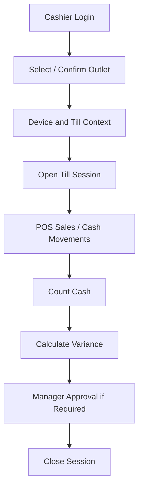

# Session Rules

## Purpose

This document defines authentication sessions, application sessions, and POS till/session rules.
The production system has normal login sessions plus POS-specific operational sessions that control
billing, cash movement, device context, and outlet stock context.

## Session types

| Session type | Source | Purpose |
|---|---|---|
| Auth session | Authentication model | Proves user or customer identity |
| Frontend app session | Frontend `SessionProvider` / stores | Keeps UI state, token state, tenant/outlet context |
| POS till session | `till_sessions` | Controls cashier billing and cash reconciliation |
| Device activity | `pos_devices.last_seen_at` | Tracks POS terminal/browser/device status |
| Offline sync session | `offline_sync_batches` | One reconnect/sync attempt from a POS device |

## Authentication session boundary

An authentication session tells the system who the actor is.
It does not automatically permit POS billing, refunds, stock adjustments, or configuration changes.
Those actions require authorization and business validation.

See [[authentication-model]] and [[authorization-model]].

## POS till session purpose

`till_sessions` records an open or closed cashier/till operating period.
The scope requires cash drawer, shift, and session management for real POS operations.
A cashier may need an active session before billing when session control is enabled.

## POS session entities

| Table | Relevant fields |
|---|---|
| `tills` | tenant, outlet, code, name, status |
| `pos_devices` | tenant, outlet, till, device code, fingerprint, status, last seen |
| `till_sessions` | tenant, outlet, till, business date, opened/closed users, cash totals, status |
| `cash_movements` | session, type, amount, reason, approval, device, offline fields |
| `cash_count_denominations` | denomination-level close count |

## Till session opening rules

- User must be authenticated as tenant staff.
- User must have access to the selected outlet.
- User must have required permission for opening a till/session.
- Till must belong to the same tenant and outlet.
- POS device must belong to the same tenant, outlet, and till.
- Opening float must be recorded where cash control is enabled.
- Only one open session per tenant/till is allowed by database rule.

## Till session closing rules

- Session must be open before it can be closed.
- Counted cash is required where reconciliation is configured.
- Expected cash should reflect opening float, cash payments, cash refunds, and non-sale cash movements.
- Variance must be calculated and stored.
- Variance approval must be recorded where required.
- Close note should be available for operational explanation.

## POS route guard rules

The frontend architecture includes:

- `AuthGuard.tsx`,
- `TillSessionGuard.tsx`,
- `RoleGuard.tsx`,
- `SessionProvider.tsx`,
- `session.store.ts`,
- `till.store.ts`,
- `offline.store.ts`.

Frontend guards should protect user experience, not final security.
Backend must still validate the session and permissions for every sensitive API call.

## Locked session behavior

When no active till/session exists where one is required:

- POS billing screen should show locked state.
- Cashier should not be able to complete sale.
- Product browsing may be restricted depending on product rules.
- Payment trigger must be disabled.
- Offline sale recording must not begin without valid session context if session control is mandatory.

## Device context in session

A POS session can reference:

- `opened_device_id`,
- `closed_device_id`,
- `source_device_id` on sales/payments/cash movements/receipts.

Device context matters because stock, cash, receipt printing, offline sync, and audit depend on the correct terminal assignment.

## Offline session considerations

Offline POS can record sales, payments, receipts, and cash movements locally.
When reconnecting, server validation must check:

- tenant ID,
- outlet ID,
- device ID,
- till/session ID,
- business date,
- duplicate client IDs,
- whether session was valid for the transaction time,
- whether conflicts must be created.

Offline records remain staging until accepted by backend sync processing.

## Session and cash reconciliation flow

## Backend responsibilities

Backend must:

- validate session state before completing POS sale,
- enforce one open session per till,
- validate cash movement approval rules,
- calculate or verify expected cash where implemented,
- record audit for sensitive actions,
- reject actions from blocked devices,
- prevent device/outlet/till mismatch.

## Frontend responsibilities

Frontend must:

- show current cashier, outlet, till, session, and online/offline state,
- prevent accidental billing before session open,
- guide cashier through open/close flow,
- clearly display variance at close,
- keep local POS state consistent,
- not bypass backend session rules.

## Session risk checklist

| Risk | Control |
|---|---|
| Cashier bills under wrong outlet | Device/outlet/till validation |
| Cashier bills without open session | Till session guard + backend validation |
| Duplicate open sessions | DB unique rule for open till session |
| Offline sale synced to wrong session | Sync payload validation by device/session context |
| Cash variance hidden | Counted cash, expected cash, variance, approval fields |
| Blocked device still used | `pos_devices.status` checked server-side |

## Related documents

- [[authentication-model]]
- [[authorization-model]]
- [[device-security-rules]]
- [[offline-data-protection]]
- [[audit-requirements]]
- [[03-data/entities/pos-sales-entities]]
- [[04-api/device-session-api-rules]]
- [[05-backend/transaction-boundary-rules]]
- [[06-frontend/pos-terminal-state-rules]]
- [[08-user-flows/cashier/start-session]]
- [[08-user-flows/cashier/close-session]]
