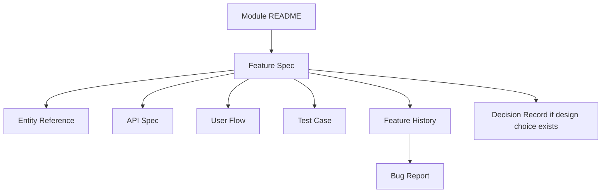

# Templates Index

This folder contains reusable Markdown templates for the production-ready Unified Commerce 2nd Brain.
Use these templates when creating or updating documentation for the multi-tenant E-POS + E-Commerce SaaS system.

These templates are not generic project templates. They are tailored for this platform's documented scope, database design, backend architecture and frontend architecture.

## Required reading before using templates

Before creating a new document from any template, read these files:

| Read first | Why it matters |
|---|---|
| [[00-start-here/README]] | Explains how the 2nd Brain is organized. |
| [[00-start-here/documentation-rules]] | Defines documentation quality rules. |
| [[00-start-here/source-document-alignment]] | Explains how uploaded source documents control the 2nd Brain. |
| [[01-product/project-scope]] | Defines the production system scope. |
| [[03-data/database-overview]] | Defines production database ownership and table groups. |
| [[02-architecture/system-overview]] | Defines system-wide module relationships. |

## Template usage order

Use templates in this order when documenting a new production feature:



## Template files

| Template | Use when |
|---|---|
| [[12-templates/metadata-template]] | Starting any new Markdown file. |
| [[12-templates/module-readme-template]] | Creating a new module folder under `07-modules`. |
| [[12-templates/feature-spec-template]] | Defining a production feature before implementation. |
| [[12-templates/feature-history-template]] | Tracking changes, bug fixes and implementation notes for a feature. |
| [[12-templates/entity-reference-template]] | Documenting database entities, columns, rules and relationships. |
| [[12-templates/api-spec-template]] | Defining module endpoints and API behavior. |
| [[12-templates/user-flow-template]] | Documenting actor workflows and operational flows. |
| [[12-templates/test-case-template]] | Creating QA-ready functional, integration and regression tests. |
| [[12-templates/decision-record-template]] | Recording architecture or product decisions. |
| [[12-templates/bug-report-template]] | Reporting and fixing defects in production features. |

## Template principles

Every template must support the following system realities:

- The product is a production-ready multi-tenant Unified Commerce SaaS platform.
- The system contains E-POS, E-Commerce, offline POS, inventory, payments, refunds, fulfillment, reporting and configuration.
- Tenant isolation is mandatory for tenant-owned business data.
- Backend authorization is the final authority.
- Frontend feature hiding is not security.
- POS must support device, outlet, till and session context.
- Offline POS data must sync through controlled queue and conflict workflows.
- Inventory must be ledger-driven, not manually overwritten.
- Payments, refunds, discounts, returns and exchanges must be auditable.

## Required sections by document type

| Document type | Minimum sections |
|---|---|
| Module README | Purpose, ownership, tables, APIs, screens, flows, permissions, exclusions. |
| Feature spec | Purpose, actors, rules, data impact, API impact, backend, frontend, offline, audit, tests. |
| Entity reference | Table purpose, columns, keys, relationships, rules, indexes, usage. |
| API spec | Endpoint, permissions, tenant context, request, response, errors, idempotency. |
| User flow | Actor, trigger, preconditions, happy path, alternate paths, failure handling. |
| Test case | Scenario, setup, data, steps, expected result, regression risk. |
| Decision record | Context, options, decision, consequences, affected files. |
| Bug report | Environment, reproduction, expected, actual, root cause, fix, tests. |

## Production module names

When writing documents, use these production module names consistently:

| Module group | Accepted module names |
|---|---|
| Platform | Platform Administration, Tenant Management, Settings Configuration |
| Access | Identity Access, OTP Auth Security, Feature Access |
| Commerce foundation | Catalog, Tax, Pricing, Inventory |
| POS | POS Devices Hardware, Sales POS, Payments, Receipts, Offline Sync |
| E-Commerce | E-Commerce Orders, Order Workflow, Fulfillment Logistics, Wishlist Reviews |
| Customer | Customers, Loyalty, Memberships |
| Control | Discounts Promotions, Returns Exchanges, Reporting, Audit Compliance |

## Naming rules

Use lowercase kebab-case for files and folders.

Correct:

```text
feature-spec.md
order-status-transitions.md
pos-device-registration.md
```

Wrong:

```text
Feature Spec.md
OrderStatusTransitions.md
POS device registration.md
```

## Link rules

Use Obsidian-style wiki links for internal references.

Correct:

```markdown
See [[03-data/database-overview]] and [[04-api/api-overview]].
```

Avoid raw relative links unless a GitHub-only link is required.

## Metadata rules

Every Markdown file should begin with front matter.
Use [[12-templates/metadata-template]] when unsure.

Minimum metadata:

```yaml
title: <Document title>
owner: <Role or team>
status: draft | in-review | production-ready | deprecated
last_reviewed: YYYY-MM-DD
tags: [unified-commerce]
```

## Status model

| Status | Meaning |
|---|---|
| `draft` | Work started but not approved. |
| `in-review` | Ready for review by engineering/product/QA. |
| `production-ready` | Accepted as implementation baseline. |
| `deprecated` | Replaced or no longer used. |

## Required traceability

For production features, every feature spec should trace to:

- One or more modules in [[01-product/production-module-catalog]].
- One or more entities in [[03-data/data-dictionary-index]].
- One or more API areas in [[04-api/module-endpoint-map]].
- One or more backend services in [[05-backend/backend-folder-structure]].
- One or more frontend features/pages in [[06-frontend/frontend-folder-structure]].
- One or more QA files in [[10-testing-quality/test-strategy]].

## AI IDE usage rules

AI IDE tools must not implement code directly from a short request.
They must first read the related template-filled documents.

Required AI IDE reading chain:

1. [[00-start-here/README]]
2. [[01-product/project-scope]]
3. Relevant module README under `07-modules`
4. Relevant `feature-spec.md`
5. Relevant API/data/backend/frontend/user-flow/test docs
6. [[14-ai-ide-rules/production-scope-alignment-rule]]

## Quality checklist before accepting a document

- [ ] Uses correct production module name.
- [ ] Does not call this system basic or MVP.
- [ ] Includes tenant isolation where tenant data is affected.
- [ ] Includes RBAC/feature access where protected behavior exists.
- [ ] Includes database impact where data changes.
- [ ] Includes API impact where client-server behavior exists.
- [ ] Includes backend ownership.
- [ ] Includes frontend ownership if UI is affected.
- [ ] Includes offline behavior for POS-sensitive workflows.
- [ ] Includes audit behavior for sensitive workflows.
- [ ] Includes QA acceptance criteria.
- [ ] Uses internal wiki links.

## When to create a decision record

Create a decision record when the team chooses between meaningful alternatives, such as:

- Single role vs multiple roles per user.
- Payment gateway integration vs manual payment reference.
- Tax-inclusive vs tax-exclusive pricing behavior.
- Offline stock conflict handling strategy.
- Returning online orders through POS outlets.
- Splitting loyalty, membership and customer modules.

Use [[12-templates/decision-record-template]].

## When to create a bug report

Create a bug report when a defect affects:

- Payment or refund amount.
- Stock quantity or reservation.
- Tenant data isolation.
- Role, permission or feature access.
- POS sale completion.
- Offline sync acceptance or conflict handling.
- Receipt generation or reprint audit.
- Tax, discount or report totals.

Use [[12-templates/bug-report-template]].

## Folder output rule

Template-based documents should be saved inside their correct module or topic folder.
Do not create random loose Markdown files at the root.

## Final rule

A template is complete only if a developer, architect, QA engineer, product owner and AI IDE can each use it without guessing hidden requirements.
