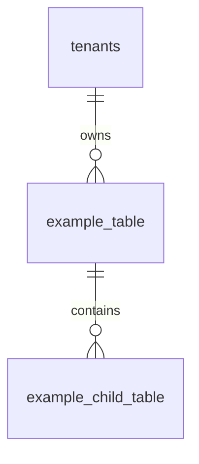

# Entity Reference Template

Use this template for database entity reference files under `03-data/entities/` or module-specific data notes.
Entity references must align with the production database design.

## File location examples

```text
03-data/entities/payments-entities.md
03-data/entities/offline-sync-entities.md
03-data/entities/product-catalog-entities.md
```

## Copy template

```markdown
---
title: <Entity Group> Entity Reference
owner: Backend Team
status: draft
last_reviewed: <YYYY-MM-DD>
tags: [unified-commerce, database, <module>]
module: <module>
source_database: Unified_Commerce_Database_Design_final V2.docx
related_docs:
  - [[03-data/database-overview]]
  - [[03-data/entity-relationship-map]]
---

# <Entity Group> Entity Reference

## Purpose

<Explain what business data this entity group owns in the production Unified Commerce system.>

## Source table group

| Database group | Tables covered |
|---|---|
| <group name from database design> | `<table_1>`, `<table_2>` |

## Ownership rules

- <Rule 1>
- <Rule 2>
- <Rule 3>

## Entity relationship diagram



## Table inventory

| Table | Purpose | Tenant scoped | Source of truth |
|---|---|---:|---:|
| `<table_name>` | <purpose> | Yes/No | Yes/No |

## `<table_name>`

### Purpose

<Explain why this table exists.>

### Columns

| Column | Type | Key / constraint | Reference / note |
|---|---|---|---|
| `id` | uuid | PK | Primary key. |
| `tenant_id` | uuid | FK | References `tenants(id)` where tenant scoped. |

### Relationships

| Relationship | Rule |
|---|---|
| `<table> -> <parent>` | <relationship rule> |

### Business rules

1. <Rule 1>
2. <Rule 2>
3. <Rule 3>

### Constraints and indexes

| Constraint/index | Purpose |
|---|---|
| `UNIQUE (...)` | <purpose> |
| `INDEX (...)` | <purpose> |

### Lifecycle

| Status / state | Meaning | Allowed transition |
|---|---|---|
| `<status>` | <meaning> | `<next status>` |

### Create/update/delete rules

| Operation | Rule |
|---|---|
| Create | <rule> |
| Update | <rule> |
| Delete | <rule> |

### Audit requirements

| Action | Audit required | Notes |
|---|---:|---|
| Create | Yes/No | <notes> |
| Update | Yes/No | <notes> |
| Delete | Yes/No | <notes> |

### API usage

| API area | How this table is used |
|---|---|
| `<endpoint group>` | <usage> |

### Backend usage

| Layer | Usage |
|---|---|
| Domain | <entity/value object/service> |
| Application | <service/validator> |
| Infrastructure | <repository/EF configuration> |

### Frontend usage

| Frontend area | Usage |
|---|---|
| `features/<feature>` | <usage> |

### Reporting usage

<Explain whether this table is source data for reports or a read model.>

## Data quality checklist

- [ ] Tenant consistency rules are defined.
- [ ] FK ownership is clear.
- [ ] Unique rules are clear.
- [ ] Status values are documented.
- [ ] Audit-sensitive changes are documented.
- [ ] Source-of-truth responsibility is clear.
```

## Entity documentation rules

Do not document a table as if it is isolated.
In this system, most tables participate in cross-module workflows.

Example:

- `sales` connects to `sale_lines`, `payments`, `stock_movements`, `receipts`, reporting and offline sync.
- `orders` connects to `order_items`, `payments`, `stock_reservations`, `deliveries`, returns and status history.
- `returns` connects to source sale/order, return lines, refunds, stock movements and exchanges.

## Tenant consistency requirement

For tenant-owned records, document how tenant consistency is enforced.

Example:

```text
sale_id, payment_id and receipt_id must all belong to the same tenant_id.
```

## Source-of-truth rule

Mark whether a table is source of truth.

| Table type | Example | Source of truth? |
|---|---|---:|
| Transaction header | `sales`, `orders`, `payments` | Yes |
| Ledger | `stock_movements`, `loyalty_transactions` | Yes |
| Projection/read model | `inventory_balances`, `daily_sales_summaries` | No, derived/service-maintained |
| Staging queue | `offline_sync_items` | No, staging only |
| Audit | `audit_logs` | Yes for audit trail |

## PostgreSQL/EF Core notes

Document special implementation details:

- `citext` for normalized emails where used.
- `jsonb` for settings, theme tokens, snapshots and provider payloads.
- Partial unique indexes for nullable scoped uniqueness.
- Generated columns where documented, such as available stock.
- Row-level locking for document sequences and coupon usage counts.
- Triggers or service validation for complex movement reference rules.

## Status documentation rule

If status is stored as `varchar CHECK`, list exact allowed values.
Do not invent separate status tables unless the database design includes them.

Correct:

```text
orders.order_status = draft, pending_payment, confirmed, processing, completed, cancelled, partially_refunded, refunded
```

Wrong:

```text
order_statuses table stores all order statuses
```

unless such table exists in the schema.

## Offline sync entity rules

For offline sync entities, document:

- Client entity ID.
- Client transaction ID.
- Device ID.
- Sync batch.
- Sync item status.
- Accepted server entity ID.
- Conflict behavior.
- Dedupe rules.

## Payment/refund entity rules

For payment entities, document:

- Payment direction.
- Payment purpose.
- Payment status.
- Captured amount.
- Allocation tables.
- Refund amount limit.
- Idempotency key.
- Gateway transaction log behavior.

## Inventory entity rules

For inventory entities, document:

- Movement type direction.
- Positive quantity rule.
- Required source reference.
- Balance projection update.
- Reservation hold/release behavior.
- Damaged stock handling.

## Checklist before accepting entity reference

- [ ] Every listed table exists in the database design or is marked as required extension.
- [ ] No fake table is documented as existing.
- [ ] Column names match the database design.
- [ ] Tenant ownership is clear.
- [ ] Source-of-truth vs read model is clear.
- [ ] Indexes/constraints are practical.
- [ ] Cross-module relationships are documented.
- [ ] Backend and API usage are linked.
- [ ] Reports and audit impact are noted.
