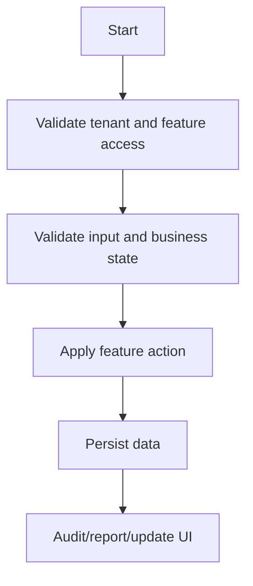

# Feature Spec Template

Use this template for every feature under `07-modules/<module>/features/<feature>/feature-spec.md`.
A feature spec is the main implementation contract for product, backend, frontend, QA and AI IDE tools.

## File location

```text
07-modules/<module>/features/<feature>/feature-spec.md
```

## Copy template

```markdown
---
title: <Feature Name> Feature Spec
owner: Product Owner
status: draft
last_reviewed: <YYYY-MM-DD>
tags: [unified-commerce, <module>, <feature>]
module: <module>
feature: <feature>
source_scope: Unified_Commerce_Scope_V1.docx
source_database: Unified_Commerce_Database_Design_final V2.docx
related_docs:
  - `[[07-modules/<module>/README]]`
  - [[03-data/database-overview]]
  - [[04-api/api-overview]]
---

# <Feature Name> Feature Spec

## 1. Purpose

<Explain what this feature does in the production Unified Commerce system.>

## 2. Production context

| Context | Value |
|---|---|
| Module | `<module>` |
| Channel | POS / E-Commerce / Admin / Platform / Cross-channel |
| Tenant scoped | Yes/No |
| Outlet scoped | Yes/No |
| Offline capable | Yes/No |
| Customer facing | Yes/No |
| Sensitive action | Yes/No |

## 3. Source alignment

| Source document | Used for |
|---|---|
| Scope document | <Business rules / workflow source> |
| Database design | <Tables and relationships> |
| Backend architecture | <Layer/service placement> |
| Frontend architecture | <Feature/page/state placement> |

## 4. Actors

| Actor | Permission / role expectation | Actions |
|---|---|---|
| Platform Admin | <permission> | <actions> |
| Tenant Admin | <permission> | <actions> |
| Outlet Manager | <permission> | <actions> |
| Cashier | <permission> | <actions> |
| Customer | <permission/auth state> | <actions> |
| System Job | internal | <actions> |

## 5. Preconditions

- <Required tenant status>
- <Required feature entitlement>
- <Required role/permission>
- <Required outlet/device/session context>
- <Required data setup>

## 6. In scope

- <Feature capability 1>
- <Feature capability 2>
- <Feature capability 3>

## 7. Out of scope

- <Capability intentionally owned by another feature/module>

## 8. Business rules

1. <Rule 1>
2. <Rule 2>
3. <Rule 3>

## 9. Status rules

| Status | Meaning | Allowed next status |
|---|---|---|
| `<status>` | <meaning> | `<next>` |

## 10. Validation rules

| Field / operation | Rule | Error behavior |
|---|---|---|
| `<field>` | <rule> | <error> |

## 11. Workflow



## 12. Data impact

| Table/entity | Create | Read | Update | Delete | Notes |
|---|---:|---:|---:|---:|---|
| `<table_name>` | No | Yes | No | No | <notes> |

## 13. API impact

| Endpoint | Method | Purpose | Permission | Idempotency |
|---|---|---|---|---|
| `/api/...` | POST | <purpose> | `<permission>` | Required/No |

## 14. Backend implementation

| Layer | Expected implementation |
|---|---|
| API | Controller, request, response. |
| Application | Service, validator, DTO, interface. |
| Domain | Entity/domain service/value object, if business rule belongs in domain. |
| Infrastructure | Repository, EF config, external service, Unit of Work. |

## 15. Frontend implementation

| Area | Expected implementation |
|---|---|
| Route/page | <page> |
| Feature folder | `features/<feature>` |
| Components | <components> |
| TanStack Query | <queries/mutations> |
| Zustand state | <local workflow state only> |
| Shell/page integration | <POS/Admin/E-Commerce shell> |

## 16. Offline behavior

| Scenario | Expected behavior |
|---|---|
| Online | <normal behavior> |
| Offline | <queue/cache/block behavior> |
| Reconnect | <sync/retry/conflict behavior> |

## 17. Security and access

- Tenant isolation required: Yes/No
- Permission check required: Yes/No
- Feature entitlement required: Yes/No
- Role feature assignment required: Yes/No
- Audit required: Yes/No

## 18. Audit events

| Event | Actor | Entity | Required values |
|---|---|---|---|
| `<event>` | <actor> | <entity> | <old/new/reason> |

## 19. Reporting impact

| Report/read model | Impact |
|---|---|
| `<report>` | <impact> |

## 20. Acceptance criteria

- [ ] <Acceptance criterion 1>
- [ ] <Acceptance criterion 2>
- [ ] <Acceptance criterion 3>

## 21. Test coverage

| Test type | Required scenarios |
|---|---|
| Unit | <domain/service validation> |
| Integration | <API/database transaction> |
| Frontend | <UI/state behavior> |
| E2E | <business flow> |
| Regression | <critical no-break area> |

## 22. Open questions

| Question | Owner | Decision needed by |
|---|---|---|
| <question> | <owner> | <date> |
```

## Feature spec writing rules

Do not write a feature spec as a short summary.
This system has payment, tax, inventory, offline sync, RBAC and tenant isolation risks.
Every feature must document the rules that protect those areas.

## Mandatory production checks

Include these checks when relevant:

| Area | Required check |
|---|---|
| Tenant | Does every tenant-owned record use tenant context? |
| Feature access | Is the platform feature enabled for the tenant? |
| RBAC | Does the actor have the required permission? |
| Outlet | Does the outlet belong to the tenant? |
| POS device | Does the device belong to the outlet/till? |
| Session | Is there an active till/session where required? |
| Stock | Is stock affected through ledger and balance rules? |
| Payment | Is the operation idempotent and auditable? |
| Offline | Can it queue safely or must it be blocked? |
| Audit | Does sensitive action include actor, reason and timestamp? |

## Feature examples

### POS checkout

Must include:

- Active till/session requirement.
- Device/outlet context.
- Product variant lookup by barcode/SKU/search.
- Price/tax/discount calculation.
- Payment allocation.
- Stock movement creation.
- Receipt generation.
- Offline queue behavior.

### Refunds

Must include:

- Original payment validation.
- Refund amount cap.
- Refund status.
- Payment method behavior.
- Return/exchange link where applicable.
- Audit and approval.

### Offline sale sync

Must include:

- Client transaction ID.
- Sync batch and sync item.
- Sale/payment queue linkage.
- Duplicate prevention.
- Conflict rules.
- Accepted server entity references.

## Backend architecture alignment

Use the backend architecture source as follows:

| Layer | Rule |
|---|---|
| API | Feature-based controllers, requests and responses. |
| Application | Workflow orchestration, validators, DTOs and interfaces. |
| Domain | Pure business rules, aggregates and domain services. |
| Infrastructure | Repositories, persistence, external integrations and Unit of Work. |

## Frontend architecture alignment

Use the frontend architecture source as follows:

| Area | Rule |
|---|---|
| `bootstrap` | Routes, guards, providers and layouts. |
| `core` | API, auth, offline, peripherals, config and utilities. |
| `features` | Feature-specific UI, hooks, services and types. |
| `shells` | POS layout composition. |
| `state` | Zustand stores for local workflow state. |
| `shared-kernel` | UI-side calculators/builders only; backend remains final authority. |

## AI IDE instruction

An AI IDE must read the feature spec before implementation.
It must not implement from a prompt that only says “create this feature”.

Required read path:

1. [[00-start-here/README]]
2. Module README
3. Feature spec
4. Related entity/API/backend/frontend/user-flow/test docs
5. [[14-ai-ide-rules/fullstack-feature-implementation-rule]]

## Completion checklist

- [ ] Purpose is specific.
- [ ] Actors are listed.
- [ ] Permissions are listed.
- [ ] Business rules are explicit.
- [ ] Tables are mapped.
- [ ] APIs are mapped.
- [ ] Backend layers are mapped.
- [ ] Frontend files are mapped.
- [ ] Offline behavior is defined.
- [ ] Audit behavior is defined.
- [ ] Reporting impact is defined.
- [ ] Acceptance criteria are testable.
- [ ] Open questions are visible.
