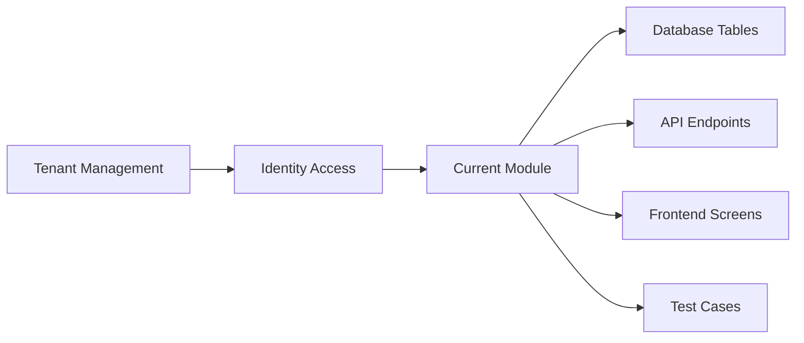

# Module README Template

Use this template for every module folder under `07-modules/`.
A module README is the entry point for developers, architects, QA engineers, product owners and AI IDE tools.

## File location

```text
07-modules/<module-name>/README.md
```

## Copy template

```markdown
---
title: <Module Name> Module
owner: <Product Owner | Backend Team | Frontend Team | Solution Architect>
status: draft
last_reviewed: <YYYY-MM-DD>
tags: [unified-commerce, <module-name>]
module: <module-name>
source_scope: Unified_Commerce_Scope_V1.docx
source_database: Unified_Commerce_Database_Design_final V2.docx
related_docs:
  - [[01-product/project-scope]]
  - [[03-data/database-overview]]
---

# <Module Name> Module

## Purpose

<Explain the exact business and technical purpose of this module in the Unified Commerce platform.>

## Production ownership

| Area | Owned by this module? | Notes |
|---|---:|---|
| Business rules | Yes/No | <Rules this module owns.> |
| Database tables | Yes/No | <Tables this module owns or touches.> |
| API endpoints | Yes/No | <Endpoint group.> |
| Backend services | Yes/No | <Application services/domain services.> |
| Frontend screens | Yes/No | <Pages/components/shells.> |
| Reports | Yes/No | <Reporting outputs.> |
| Audit events | Yes/No | <Sensitive actions.> |

## In scope

- <Production feature 1>
- <Production feature 2>
- <Production feature 3>

## Out of scope

- <Responsibility owned by another module>
- <Future enhancement, if truly outside current production scope>

## Owned features

| Feature folder | Purpose | Status |
|---|---|---|
| `<feature-name>` | <What the feature does.> | draft |

## Primary actors

| Actor | What they do in this module |
|---|---|
| Platform Admin | <Actions> |
| Tenant Admin | <Actions> |
| Outlet Manager | <Actions> |
| Cashier | <Actions> |
| Customer | <Actions> |
| System Job | <Actions> |

## Core business rules

1. <Rule 1>
2. <Rule 2>
3. <Rule 3>

## Data ownership

| Table/entity | Ownership | Notes |
|---|---|---|
| `<table_name>` | Owns/Uses | <Reason> |

## API ownership

| Endpoint group | Purpose | Permission required |
|---|---|---|
| `/api/<module>` | <Purpose> | `<permission.code>` |

## Backend implementation map

| Layer | Expected content |
|---|---|
| API | Controllers, requests, responses. |
| Application | Services, validators, DTOs, interfaces. |
| Domain | Entities, value objects, domain services where needed. |
| Infrastructure | Repositories, EF configurations, external integrations. |

## Frontend implementation map

| Frontend area | Expected content |
|---|---|
| `features/<module>` | API hooks, types, components, services. |
| `pages/` | Route-level screens. |
| `state/` | Zustand state only when local workflow state is needed. |
| `core/` | Shared API/auth/offline/peripheral helpers only. |

## User flows

- `[[08-user-flows/<actor>/<flow-name>]]`

## Security and access

- Tenant isolation required: Yes/No
- Outlet context required: Yes/No
- Feature entitlement required: Yes/No
- Permission required: Yes/No
- Audit required: Yes/No

## Offline behavior

<Explain whether the module supports offline POS, read-only cache, queued writes, or online-only behavior.>

## Reporting impact

<Explain reports or read models affected by this module.>

## Related documentation

- [[01-product/project-scope]]
- [[02-architecture/system-overview]]
- [[03-data/database-overview]]
- [[04-api/api-overview]]
- [[05-backend/backend-overview]]
- [[06-frontend/frontend-overview]]

## Module readiness checklist

- [ ] Scope is clearly defined.
- [ ] Out-of-scope responsibilities are listed.
- [ ] Tables are mapped.
- [ ] APIs are mapped.
- [ ] Backend services are mapped.
- [ ] Frontend screens/components are mapped.
- [ ] User flows are linked.
- [ ] Permissions are defined.
- [ ] Feature access is defined.
- [ ] Offline behavior is defined.
- [ ] Audit behavior is defined.
- [ ] Tests are linked.
```

## Module README rules

A module README must not be a vague index.
It must tell the team what the module owns and what it must not own.

## Ownership boundary examples

### Catalog module

Owns:

- Products
- Variants
- Categories
- Brands
- Suppliers
- Attributes
- Product images
- Return policy assignment

Does not own:

- Stock quantity changes; that belongs to Inventory.
- Payment totals; that belongs to Payments.
- POS cart behavior; that belongs to Sales POS.

### Payments module

Owns:

- Payment records
- Payment allocations
- Payment provider transactions
- Refund records
- Payment status behavior

Does not own:

- Return eligibility; that belongs to Returns Exchanges.
- Cash drawer session control; that belongs to Sales POS or Till Session.
- Receipt layout configuration; that belongs to Receipts.

### Offline Sync module

Owns:

- Sync batches
- Sync items
- Offline sale/payment queues
- Sync conflicts
- Sync audit logs

Does not own:

- The accepted final sale; that belongs to Sales POS.
- The accepted final payment; that belongs to Payments.
- The accepted stock movement; that belongs to Inventory.

## Required module relationships

Every module README should include a simple dependency diagram.

Example:



## Permission documentation

List permissions as stable codes where possible.

Example:

| Permission | Allows |
|---|---|
| `pos.sale.create` | Complete POS sales. |
| `payment.refund.approve` | Approve refund requests. |
| `inventory.adjustment.post` | Post stock adjustments. |

## Feature access rule

For tenant modules, document both permission and feature availability.

Example:

```text
Effective access = tenant feature entitlement + tenant feature configuration + role feature assignment + permission.
```

## Audit documentation

A module README must identify sensitive actions.

Examples:

- Refund approval.
- Discount approval.
- Receipt reprint.
- Stock adjustment posting.
- Offline conflict resolution.
- Tenant feature enablement.

## QA handoff

The README should link to test files under `10-testing-quality/`.

Example:

- [[10-testing-quality/payment-refund-test-cases]]
- [[10-testing-quality/offline-sync-test-cases]]
- [[10-testing-quality/rbac-feature-access-test-cases]]

## AI IDE rule

AI IDE tools must read the module README before editing any file related to that module.
If the README and feature spec disagree, do not implement code until the conflict is resolved with [[12-templates/decision-record-template]].
