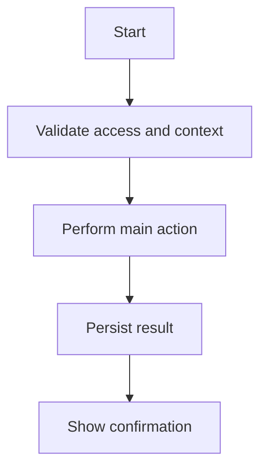
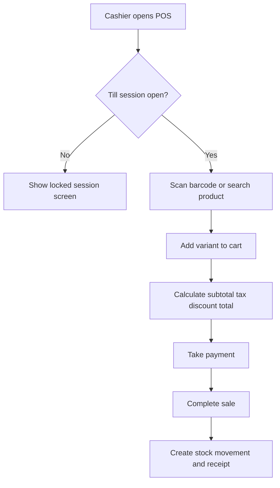

# User Flow Template

Use this template for user and operational workflows under `08-user-flows/` or inside module feature folders.
A user flow must describe what happens in the real business operation, not just UI clicks.

## File location examples

```text
08-user-flows/cashier/scan-add-pay.md
08-user-flows/tenant-admin/pos-device-setup.md
08-user-flows/manager/offline-conflict-resolution.md
```

## Copy template

```markdown
---
title: <Flow Name>
owner: Product Owner
status: draft
last_reviewed: <YYYY-MM-DD>
tags: [unified-commerce, user-flow, <actor>, <module>]
module: <module>
feature: <feature>
source_scope: Unified_Commerce_Scope_V1.docx
related_docs:
  - `[[07-modules/<module>/features/<feature>/feature-spec]]`
---

# <Flow Name>

## 1. Flow purpose

<Explain the business outcome of the flow.>

## 2. Actor

| Actor | Description |
|---|---|
| Primary actor | <Cashier / Tenant Admin / Customer / Manager / Inventory Staff / Platform Admin> |
| Supporting actor | <optional> |
| System actor | <background job or service if any> |

## 3. Trigger

<What starts this flow?>

## 4. Preconditions

- <Tenant status / feature enabled>
- <User authenticated>
- <Permission available>
- <Outlet/device/session context if applicable>
- <Required data exists>

## 5. Flow diagram



## 6. Main success path

| Step | Actor | Action | System response |
|---:|---|---|---|
| 1 | <actor> | <action> | <response> |
| 2 | <actor> | <action> | <response> |

## 7. Alternate paths

| Scenario | Behavior |
|---|---|
| <alternate> | <expected handling> |

## 8. Failure paths

| Failure | Expected system behavior | User message |
|---|---|---|
| <failure> | <behavior> | <message> |

## 9. Data touched

| Entity/table | Purpose in this flow |
|---|---|
| `<table_name>` | <usage> |

## 10. API calls

| API | Purpose |
|---|---|
| `<method> /api/...` | <purpose> |

## 11. Frontend states

| UI state | Expected behavior |
|---|---|
| Loading | <behavior> |
| Empty | <behavior> |
| Error | <behavior> |
| Offline | <behavior> |
| Success | <behavior> |

## 12. Permissions and feature access

| Check | Required value |
|---|---|
| Feature entitlement | <feature key> |
| Permission | `<permission.code>` |
| Outlet role | <yes/no> |

## 13. Audit and reporting

| Event/report | Impact |
|---|---|
| Audit event | <event> |
| Report impact | <report> |

## 14. Acceptance criteria

- [ ] <criterion 1>
- [ ] <criterion 2>
- [ ] <criterion 3>

## 15. Related tests

- [[10-testing-quality/workflow-test-cases]]
```

## User flow writing rules

A flow must include business rules and system state.
Do not write only screen navigation.

Example of weak flow:

```text
Cashier clicks Pay and prints receipt.
```

Production-ready flow must include:

- Active till/session validation.
- Product/stock/price/tax calculation.
- Payment validation.
- Stock movement.
- Receipt generation.
- Audit/report impact.
- Offline behavior if POS flow.

## Actor examples

| Actor | Typical flows |
|---|---|
| Platform Admin | Tenant onboarding, feature entitlement, platform user management. |
| Tenant Admin | Outlet setup, role setup, theme/settings, tax/pricing setup. |
| Outlet Manager | Session review, refunds, discount approval, cash variance approval. |
| Cashier | Scan/add/pay, hold/recall, return/exchange, cash close. |
| Inventory Staff | Receiving, transfer, adjustment, stocktake. |
| E-Commerce Customer | Register, cart, checkout, wishlist, review, order tracking. |
| E-Commerce Operator | Order processing, fulfillment, delivery update, refund handling. |
| System Job | Offline sync, report aggregation, reservation expiry. |

## POS flow special requirements

For POS flows, always document:

- Outlet context.
- POS device context.
- Till/session state.
- Cashier permission.
- Barcode/search behavior.
- Offline behavior.
- Printer/scanner behavior where relevant.
- Receipt behavior.

## E-Commerce flow special requirements

For e-commerce flows, always document:

- Tenant storefront context.
- Logged-in vs guest customer behavior.
- Cart expiry behavior.
- Price/stock revalidation before checkout.
- Payment status behavior.
- Order/payment/fulfillment status updates.
- Address snapshot behavior.

## Offline flow special requirements

For offline flows, always document:

- Cached data used.
- Local IndexedDB record created.
- Client transaction ID.
- Queue behavior.
- Reconnect behavior.
- Server validation.
- Conflict behavior.

## Example flow diagram for POS checkout



## Example failure handling

| Failure | Correct handling |
|---|---|
| Feature disabled | Block action and show feature unavailable message. |
| Permission missing | Block action and show permission required message. |
| Stock unavailable | Prevent completion or create offline conflict if offline flow requires later validation. |
| Payment failed | Keep sale/order unpaid or pending according to flow. |
| Printer failed | Sale remains completed; receipt print can be retried. |
| Offline sync conflict | Create conflict record; do not silently modify stock/payment. |

## Frontend architecture alignment

Map flow screens to frontend areas:

| Area | Use for |
|---|---|
| `pages/` | Route-level page in the flow. |
| `features/` | Feature-specific components/hooks/services. |
| `shells/` | POS layout areas. |
| `state/` | Local workflow state such as cart, till, offline, UI. |
| `core/offline` | Sync queue and connectivity. |
| `core/peripherals` | Printer/scanner/cash drawer behavior. |

## Flow completion checklist

- [ ] Actor is clear.
- [ ] Trigger is clear.
- [ ] Preconditions are clear.
- [ ] Main success path is step-by-step.
- [ ] Alternate paths are documented.
- [ ] Failure paths are documented.
- [ ] Data touched is listed.
- [ ] APIs are listed.
- [ ] UI states are listed.
- [ ] Permission and feature access are listed.
- [ ] Audit/report impact is listed.
- [ ] Acceptance criteria are testable.
