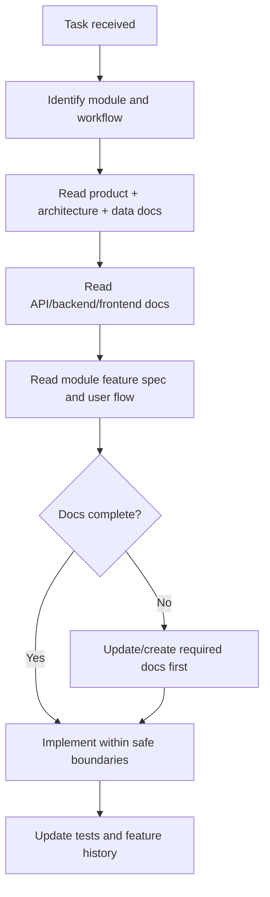

# AI IDE Rules

## Purpose

This folder defines how AI IDE tools must understand, read, update, and implement the Unified Commerce E-POS + E-Commerce SaaS project.

The project is not a basic POS, not a demo, and not an MVP-only system. It is a production-ready multi-tenant Unified Commerce platform with E-POS, E-Commerce, offline POS, tenant isolation, RBAC, feature access, inventory, payments, refunds, returns, exchanges, fulfillment, receipts, reporting, audit, backend Clean Architecture, and React frontend architecture.

AI IDE tools must not start coding from a single prompt alone. They must read the correct product, architecture, data, API, backend, frontend, security, module, and user-flow documents before changing code or documentation.

## Core references

| Area | Required document |
|---|---|
| Project entry | [[00-start-here/README]] |
| Documentation rules | [[00-start-here/documentation-rules]] |
| Product scope | [[01-product/project-scope]] |
| Product modules | [[01-product/production-module-catalog]] |
| System overview | [[02-architecture/system-overview]] |
| Architecture principles | [[02-architecture/architecture-principles]] |
| Data model | [[03-data/database-overview]] |
| Entity relationships | [[03-data/entity-relationship-map]] |
| API rules | [[04-api/README]] |
| Backend rules | [[05-backend/README]] |
| Frontend rules | [[06-frontend/README]] |
| Security rules | [[09-security-and-compliance/README]] |
| Templates | [[12-templates/README]] |

## Folder usage

| File | Use when |
|---|---|
| [[14-ai-ide-rules/ai-ide-project-understanding]] | AI IDE needs to understand the system before any work. |
| [[14-ai-ide-rules/production-scope-alignment-rule]] | Checking whether a change matches the production scope. |
| [[14-ai-ide-rules/database-alignment-rule]] | Checking entities, tables, PK/FK, and data model rules. |
| [[14-ai-ide-rules/safe-edit-boundaries]] | Deciding which files can be edited safely. |
| [[14-ai-ide-rules/documentation-update-rules]] | Updating docs after feature, bug, schema, API, or workflow changes. |
| [[14-ai-ide-rules/ai-ide-new-feature-documentation-rules]] | Creating or updating feature documentation before implementation. |
| [[14-ai-ide-rules/backend-implement]] | Implementing backend work using Clean Architecture, Service Pattern, Repository Pattern. |
| [[14-ai-ide-rules/frontend-implement]] | Implementing frontend work using React, TypeScript, Tailwind, TanStack Query, Zustand. |
| [[14-ai-ide-rules/fullstack-feature-implementation-rule]] | Implementing a full feature across API, backend, frontend, data, tests, and docs. |
| [[14-ai-ide-rules/backend-implementation-documentation-gate-rule]] | Blocking backend implementation until required docs are read. |
| [[14-ai-ide-rules/frontend-implementation-documentation-gate-rule]] | Blocking frontend implementation until required docs are read. |
| [[14-ai-ide-rules/coding-standard-gate-rule]] | Enforcing code quality boundaries before code generation. |
| [[14-ai-ide-rules/frontend-page-ui-ux-gate-rule]] | Checking POS/admin/e-commerce page UI readiness. |
| [[14-ai-ide-rules/ai-ide-frontend-feature-implementation-guide]] | Detailed frontend feature implementation sequence. |
| [[14-ai-ide-rules/offline-pos-implementation-rule]] | Implementing offline POS, sync, local cache, and conflict behavior. |
| [[14-ai-ide-rules/payment-refund-implementation-rule]] | Implementing payment, refund, allocation, receipt, and idempotency behavior. |
| [[14-ai-ide-rules/ai-ide-bug-fix-workflow]] | Fixing a bug without damaging architecture or docs. |

## Non-negotiable project rules

| Rule | Meaning |
|---|---|
| Production scope only | Do not downgrade the system into a basic POS or MVP unless the user explicitly asks. |
| Tenant isolation first | Every tenant-owned action must preserve tenant context. |
| Backend is final authority | Frontend checks are UX support, not security. |
| No invented schema | Do not add entities, attributes, or tables unless the approved docs define them or the task explicitly asks for schema change. |
| No CQRS/Mediator guidance | Backend uses Clean Architecture with Service Pattern and Repository Pattern only. |
| No hidden permissions | Sensitive actions must pass RBAC, feature access, tenant context, validation, and audit rules. |
| Offline is controlled | Offline queues are staging records; accepted server records remain the source of truth. |
| Payments are auditable | Payment, refund, allocation, and receipt behavior must be traceable and idempotent where duplicate requests are possible. |

## Required AI IDE behavior

1. Read the task carefully.
2. Identify affected folder, module, feature, workflow, API, backend, frontend, database, and test areas.
3. Read the minimum required docs from this 2nd Brain.
4. Check whether required feature documentation exists.
5. Check whether the request changes approved scope or schema.
6. Do not create new module behavior without documentation support.
7. Make the smallest safe change that satisfies the task.
8. Update related documentation when implementation changes behavior.
9. Preserve tenant isolation, feature access, audit, and offline rules.
10. Report uncertainties instead of silently inventing logic.

## Read-before-code decision

## What AI IDE must not do

- Do not create a new database table because it seems useful.
- Do not add CQRS, Mediator, event sourcing, or a new architectural style.
- Do not bypass Service Pattern or Repository Pattern.
- Do not implement security only in the frontend.
- Do not hard-code tenant, outlet, device, role, or permission assumptions.
- Do not change financial calculations without checking pricing, tax, discount, payment, and refund docs.
- Do not convert offline sync queues into source-of-truth tables.
- Do not remove existing documentation unless it is clearly incorrect, duplicated, or obsolete.

## Folder completion checklist

- [ ] Every AI IDE rule points to the correct 2nd Brain documents.
- [ ] Backend rules say Clean Architecture, Service Pattern, Repository Pattern only.
- [ ] Frontend rules follow React, TypeScript, Tailwind, TanStack Query, Zustand.
- [ ] Offline POS and payment/refund rules are explicit.
- [ ] Safe edit boundaries are documented.
- [ ] Documentation update rules are documented.
- [ ] No broken references to old folder names such as `16-ai-ide`.
- [ ] No rule tells AI to invent tables, endpoints, workflows, or permissions.
