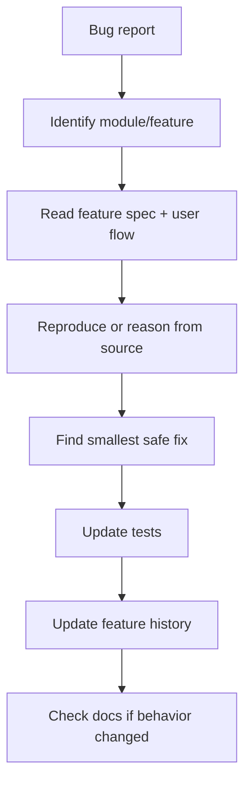

# AI IDE Bug Fix Workflow

## Purpose

This file tells AI IDE tools how to fix bugs without damaging architecture, data integrity, security, or documentation.

Bug fixes must be local, traceable, and aligned with the production 2nd Brain.

## Core references

| Area | Required document |
|---|---|
| Project entry | [[00-start-here/README]] |
| Documentation rules | [[00-start-here/documentation-rules]] |
| Product scope | [[01-product/project-scope]] |
| Product modules | [[01-product/production-module-catalog]] |
| System overview | [[02-architecture/system-overview]] |
| Architecture principles | [[02-architecture/architecture-principles]] |
| Data model | [[03-data/database-overview]] |
| Entity relationships | [[03-data/entity-relationship-map]] |
| API rules | [[04-api/README]] |
| Backend rules | [[05-backend/README]] |
| Frontend rules | [[06-frontend/README]] |
| Security rules | [[09-security-and-compliance/README]] |
| Templates | [[12-templates/README]] |

## Bug fix rule

Do not fix a bug by rewriting unrelated modules.

Do not change schema, API contract, payment logic, tenant isolation, or offline sync behavior unless the bug specifically requires it and the relevant docs are updated.

## Bug triage questions

| Question | Why it matters |
|---|---|
| Which module owns the bug? | Prevents changing the wrong folder. |
| Which feature spec describes expected behavior? | Prevents guessing. |
| Which user flow shows the expected actor steps? | Prevents UI/workflow drift. |
| Which tables are affected? | Prevents data corruption. |
| Which API/backend/frontend files are affected? | Defines edit scope. |
| Is this security/payment/stock/offline related? | Requires stricter review. |
| Is documentation wrong or code wrong? | Determines fix direction. |

## Bug fix workflow

## Required read path

1. Relevant module README.
2. Relevant `feature-spec.md`.
3. Relevant `feature-history.md`.
4. Relevant user flow.
5. Data/API/backend/frontend/security docs affected by the bug.
6. Testing docs if regression test is needed.

## Bug categories

| Category | Required extra checks |
|---|---|
| Tenant leak | Tenant isolation, auth, query filters, API context. |
| Permission bug | RBAC, feature access, backend final authority. |
| POS cart bug | POS UI flow, Zustand state, backend sale validation. |
| Payment bug | Payment/refund AI IDE rule and payment security docs. |
| Stock bug | Inventory entity docs and stock movement rules. |
| Offline sync bug | Offline POS implementation rule. |
| Receipt bug | Receipt entity docs, print log, receipt reprint audit. |
| Order status bug | Order workflow API/data docs. |

## Documentation update after bug fix

Update `feature-history.md` with:

- Date.
- Bug summary.
- Root cause.
- Fix summary.
- Affected files.
- Test coverage.
- Documentation updates.

## Do not do

- Do not hide bug symptoms with UI-only changes if backend data is wrong.
- Do not change status names to make code easier.
- Do not delete audit or validation failures.
- Do not silently accept payment/offline/stock conflicts.
- Do not change unrelated modules.
- Do not invent new entities to fix a small bug.

## Completion checklist

- [ ] Bug owner module identified.
- [ ] Expected behavior verified from docs.
- [ ] Smallest safe fix applied.
- [ ] Regression test added/updated where applicable.
- [ ] Feature history updated.
- [ ] Documentation updated if behavior changed.
- [ ] No unrelated refactor.
