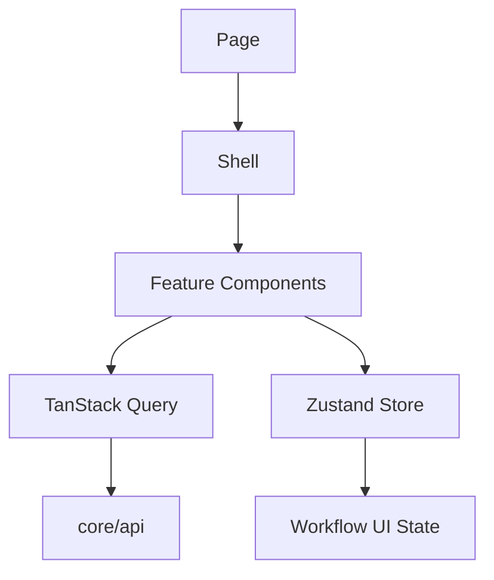

# AI IDE Frontend Feature Implementation Guide

## Purpose

This guide gives AI IDE tools a practical frontend feature implementation sequence for the Unified Commerce project.

It complements [[14-ai-ide-rules/frontend-implement]] and [[14-ai-ide-rules/frontend-implementation-documentation-gate-rule]].

## Core references

| Area | Required document |
|---|---|
| Project entry | [[00-start-here/README]] |
| Documentation rules | [[00-start-here/documentation-rules]] |
| Product scope | [[01-product/project-scope]] |
| Product modules | [[01-product/production-module-catalog]] |
| System overview | [[02-architecture/system-overview]] |
| Architecture principles | [[02-architecture/architecture-principles]] |
| Data model | [[03-data/database-overview]] |
| Entity relationships | [[03-data/entity-relationship-map]] |
| API rules | [[04-api/README]] |
| Backend rules | [[05-backend/README]] |
| Frontend rules | [[06-frontend/README]] |
| Security rules | [[09-security-and-compliance/README]] |
| Templates | [[12-templates/README]] |

## Step 1 — Understand feature ownership

Identify:

- Product module.
- Feature folder.
- User flow.
- API area.
- Frontend route/page/shell.
- Required state store.
- Required server data.
- Feature access/permission rule.

## Step 2 — Read frontend architecture

Use uploaded architecture structure:

| Folder | Purpose |
|---|---|
| `bootstrap` | App entry, router, guards, providers, layouts. |
| `core/api` | HTTP client, endpoints, query client. |
| `core/auth` | Token/session handling. |
| `core/offline` | Sync queue and connectivity monitor. |
| `core/peripherals` | Printer, scanner, cash drawer abstractions. |
| `features` | Feature-specific UI, hooks, API, services, types. |
| `shells` | POS screen composition shells. |
| `pages` | Routed pages. |
| `state` | Zustand stores and orchestrators. |
| `shared-kernel` | Money, tax, pricing, receipt, invoice helpers. |

## Step 3 — Decide data flow

## Step 4 — Implement API boundary

- Use `/api/v1` API rules.
- Use documented request/response/error contract.
- Keep endpoint paths aligned with API docs.
- Use idempotency for duplicate-risk operations where documented.
- Do not invent response fields.

## Step 5 — Implement UI states

Every production frontend feature should consider:

- Initial loading.
- Refreshing.
- Empty state.
- Validation error.
- API error.
- Permission denied.
- Feature disabled.
- Offline mode.
- Success confirmation.

## Step 6 — POS-specific additions

For POS features, include:

- Active till/session guard where required.
- Device/outlet context.
- Offline indicator where relevant.
- Printer/scanner status where relevant.
- Touch-friendly buttons.
- Visible totals when payment/cart is involved.
- Fast retry for recoverable errors.

## Step 7 — Testing and documentation

After implementation:

- Update feature history.
- Update user flow if UI steps changed.
- Update frontend docs if pattern changed.
- Add/adjust test cases.
- Confirm no backend authority was duplicated as frontend truth.

## Do not implement if

- Feature spec is missing.
- API contract is unknown.
- User flow is unknown for workflow-heavy screens.
- Required permission/feature access rule is unknown.
- Required entity is missing from approved database design.

## Completion checklist

- [ ] Feature owner identified.
- [ ] API, backend, frontend docs read.
- [ ] Query/store boundary correct.
- [ ] POS UI rules followed where applicable.
- [ ] Error/offline/permission states handled.
- [ ] Feature history updated.
