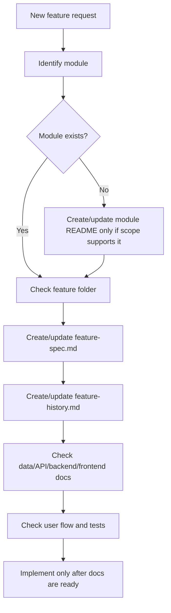

# New Feature Documentation Rules

## Purpose

This file defines what AI IDE tools must document before implementing a new feature in the Unified Commerce system.

A feature must not be implemented from a short prompt alone. It must be connected to the production scope, database design, architecture, API, backend, frontend, security, user flow, and testing docs.

## Core references

| Area | Required document |
|---|---|
| Project entry | [[00-start-here/README]] |
| Documentation rules | [[00-start-here/documentation-rules]] |
| Product scope | [[01-product/project-scope]] |
| Product modules | [[01-product/production-module-catalog]] |
| System overview | [[02-architecture/system-overview]] |
| Architecture principles | [[02-architecture/architecture-principles]] |
| Data model | [[03-data/database-overview]] |
| Entity relationships | [[03-data/entity-relationship-map]] |
| API rules | [[04-api/README]] |
| Backend rules | [[05-backend/README]] |
| Frontend rules | [[06-frontend/README]] |
| Security rules | [[09-security-and-compliance/README]] |
| Templates | [[12-templates/README]] |

## Feature documentation gate

Before coding, AI IDE must confirm:

| Question | Required answer |
|---|---|
| Which production module owns the feature? | Use [[01-product/production-module-catalog]]. |
| Does the feature folder exist? | Check `07-modules/<module>/features/<feature>/`. |
| Does `feature-spec.md` exist? | If missing, create from [[12-templates/feature-spec-template]]. |
| Does `feature-history.md` exist? | If missing, create from [[12-templates/feature-history-template]]. |
| Which tables are involved? | Use [[03-data/database-overview]] and entity docs. |
| Which user flow is affected? | Use `08-user-flows` where available. |
| Which API/backend/frontend docs apply? | Use `04-api`, `05-backend`, `06-frontend`. |

## Required feature spec sections

A production feature spec must include:

1. Purpose.
2. Scope.
3. Out of scope.
4. Actors.
5. Preconditions.
6. Feature access rules.
7. Permissions.
8. Business rules.
9. Validation rules.
10. Status rules where applicable.
11. Entity/table impact.
12. API impact.
13. Backend impact.
14. Frontend impact.
15. Offline behavior.
16. Audit behavior.
17. Reporting impact.
18. User flow references.
19. QA checklist.
20. Open questions.

## New feature process

## When not to create a feature

Do not create a new feature folder if:

- The request is only a small bug fix inside an existing feature.
- The feature is not in the production scope and user did not approve scope expansion.
- Required entities do not exist and no schema update was approved.
- The same feature already exists under another module.
- The feature is a frontend-only page state and should be documented inside an existing feature.

## Module ownership rules

| Feature type | Likely owner |
|---|---|
| Product/category/brand/supplier/attribute/image | `07-modules/catalog` |
| Tax class/rate | `07-modules/tax` |
| Price list/item | `07-modules/pricing` or catalog feature where current structure places it. |
| Stock movement/reservation/transfer/stocktake | `07-modules/inventory` |
| Till/session/cash movement/POS checkout | `07-modules/sales-pos` |
| Payment/refund/allocation | `07-modules/payments` |
| Discount/coupon/approval | `07-modules/discounts-promotions` |
| Return/exchange | `07-modules/returns-exchanges` |
| Cart/order/order item | `07-modules/ecommerce-orders` |
| Delivery/pickup/tracking | `07-modules/fulfillment-logistics` |
| Offline sync | `07-modules/offline-sync` |
| Receipt/template/print log | `07-modules/receipts` |
| Report/read model | `07-modules/reporting` |
| Tenant/role/feature setting | Tenant, platform, identity, settings modules. |

## Entity documentation rule

If a feature uses existing tables, link them from the feature spec.

If a feature needs a table not present in the approved database design:

1. Do not invent it silently.
2. Add a schema gap note if documentation task allows it.
3. Ask for approval before schema/code implementation.
4. Update data docs before code.

## API documentation rule

Feature specs may describe API needs as patterns only unless a final API contract already exists.

Use `/api/v1` versioning when documenting API design.

Do not invent final endpoint paths when the existing 2nd Brain has not defined them. Use module-level API pattern references from [[04-api/endpoint-design]].

## Backend documentation rule

Feature spec backend sections must respect:

- Clean Architecture.
- Service Pattern.
- Repository Pattern.
- Unit of Work for multi-table operations.
- No CQRS.
- No Mediator guidance.

## Frontend documentation rule

Feature spec frontend sections must respect:

- React + TypeScript.
- Tailwind CSS.
- TanStack Query for server state.
- Zustand for local workflow state.
- POS screens must be touchscreen-first and cashier-speed focused.
- Backend remains final authority.

## Required final check

- [ ] Feature exists in scope or user explicitly approved it.
- [ ] Feature folder is in correct module.
- [ ] `feature-spec.md` is complete.
- [ ] `feature-history.md` exists.
- [ ] Entity/API/backend/frontend/security/test references are linked.
- [ ] User flow is linked or gap is recorded.
- [ ] No fake entities, endpoints, screens, or permissions are invented.
