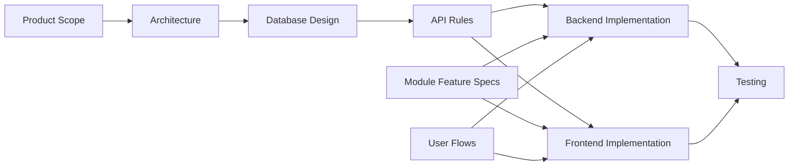

# AI IDE Project Understanding Rule

## Purpose

This file tells AI IDE tools how to understand the Unified Commerce system before writing or changing anything.

The system is a production-ready multi-tenant Unified Commerce SaaS platform. It combines E-POS and E-Commerce using shared catalog, inventory, customer, payment, refund, return, exchange, fulfillment, receipt, configuration, reporting, audit, offline sync, backend, frontend, and security foundations.

AI IDE tools must treat the 2nd Brain as the source of project context. The uploaded scope, database design, backend architecture, and frontend architecture are reflected in the current documentation structure.


## Core references

| Area | Required document |
|---|---|
| Project entry | [[00-start-here/README]] |
| Documentation rules | [[00-start-here/documentation-rules]] |
| Product scope | [[01-product/project-scope]] |
| Product modules | [[01-product/production-module-catalog]] |
| System overview | [[02-architecture/system-overview]] |
| Architecture principles | [[02-architecture/architecture-principles]] |
| Data model | [[03-data/database-overview]] |
| Entity relationships | [[03-data/entity-relationship-map]] |
| API rules | [[04-api/README]] |
| Backend rules | [[05-backend/README]] |
| Frontend rules | [[06-frontend/README]] |
| Security rules | [[09-security-and-compliance/README]] |
| Templates | [[12-templates/README]] |


## System identity

| Item | Project meaning |
|---|---|
| Product type | Multi-tenant Unified Commerce SaaS. |
| Channels | E-POS and E-Commerce. |
| POS model | Touchscreen-first, barcode-first, cashier-speed workflow. |
| E-Commerce model | Storefront, cart, checkout, orders, fulfillment, customer account. |
| Data model | Tenant-scoped production schema with auditable transaction records. |
| Backend | .NET Web API using Clean Architecture, Service Pattern, Repository Pattern. |
| Frontend | React + TypeScript + Tailwind + TanStack Query + Zustand. |
| Offline | POS local cache and sync queue, with server validation and conflict handling. |

## First documents AI IDE must read

Read in this order before any non-trivial work:

1. [[00-start-here/README]]
2. [[00-start-here/source-document-alignment]]
3. [[01-product/project-scope]]
4. [[01-product/production-module-catalog]]
5. [[02-architecture/system-overview]]
6. [[02-architecture/architecture-principles]]
7. [[03-data/database-overview]]
8. [[09-security-and-compliance/README]]
9. The relevant API/backend/frontend/module/user-flow docs for the task.

## Production modules to recognize

| Module area | AI IDE understanding |
|---|---|
| Tenant management | Tenants, outlets, outlet addresses, document sequences. |
| Platform administration | Platform users and tenant feature entitlement control. |
| Identity access | Staff users, roles, permissions, tenant roles, outlet roles, feature assignments. |
| Settings configuration | Tenant settings, feature flags, UI themes. |
| Catalog | Products, variants, categories, brands, suppliers, attributes, images, return policies. |
| Tax and pricing | Tax classes/rates and price lists/items. |
| Inventory | Balances, channel allocation, movements, reservations, transfers, adjustments, stocktakes. |
| POS devices | Tills, POS devices, device outlet/till context. |
| Sales POS | Till sessions, cash movements, sales, sale lines. |
| Payments | Methods, provider config, payments, payment transactions, allocations, refunds. |
| Discounts | Discount policies, requests, coupons, applications, redemptions. |
| Customers | Customers, auth accounts, identities, addresses, OTP, loyalty, wishlist, reviews. |
| Orders | Carts, cart items, orders, order items, addresses, status transitions/history. |
| Fulfillment | Delivery methods, zones, rates, deliveries, delivery items, tracking. |
| Returns/exchanges | Return documents, lines, refund allocations, exchange documents and allocations. |
| Receipts/audit/offline | Templates, receipts, print logs, audit logs, sync batches/items/conflicts/logs. |
| Reporting | Daily summary read models. |

## Architecture map



## Understanding rules

- Understand tenant scope before entity scope.
- Understand feature access before UI access.
- Understand database source of truth before adding frontend state.
- Understand cashier flow before changing POS screens.
- Understand order/payment/fulfillment statuses before changing e-commerce workflow.
- Understand stock ledger rules before changing inventory behavior.
- Understand payment/refund allocation before changing returns or exchanges.
- Understand offline sync staging before changing IndexedDB or sync APIs.

## What counts as insufficient understanding

AI IDE is not ready to implement if it cannot answer:

| Question | Required answer source |
|---|---|
| Which module owns this behavior? | [[01-product/production-module-catalog]] and relevant `07-modules` file. |
| Which tables are touched? | [[03-data/database-overview]] and entity docs. |
| Which permission/feature check applies? | [[02-architecture/role-permission-capability-model]] and [[09-security-and-compliance/authorization-model]]. |
| Which API pattern applies? | [[04-api/endpoint-design]]. |
| Which backend layer owns the logic? | [[05-backend/clean-architecture-rules]]. |
| Which frontend state owns the workflow? | [[06-frontend/state-management-rules]]. |
| Which user flow is affected? | Relevant `08-user-flows` document. |

## Project-specific constraints

- Do not treat the POS screen like an e-commerce product grid.
- Do not allow POS billing without session/device/outlet context where session control applies.
- Do not bypass stock validation or payment validation.
- Do not mix POS sale and e-commerce order concepts into one unclear object.
- Do not merge customers across tenants.
- Do not change financial records without preserving auditability.
- Do not change status values without checking the database design and order workflow rules.

## Output expectation

When AI IDE starts a task, it should be able to state:

```text
Affected module:
Affected files:
Docs read:
Tables involved:
API area:
Backend layer:
Frontend state/screen:
Security checks:
User flow:
Test impact:
```

## Completion checklist

- [ ] Project is understood as production Unified Commerce SaaS.
- [ ] Scope and database design are both considered.
- [ ] Backend and frontend architectures are both considered.
- [ ] Tenant isolation and feature access are considered.
- [ ] Relevant module/user-flow documents are identified.
- [ ] No unapproved entity, workflow, endpoint, or architecture is invented.
