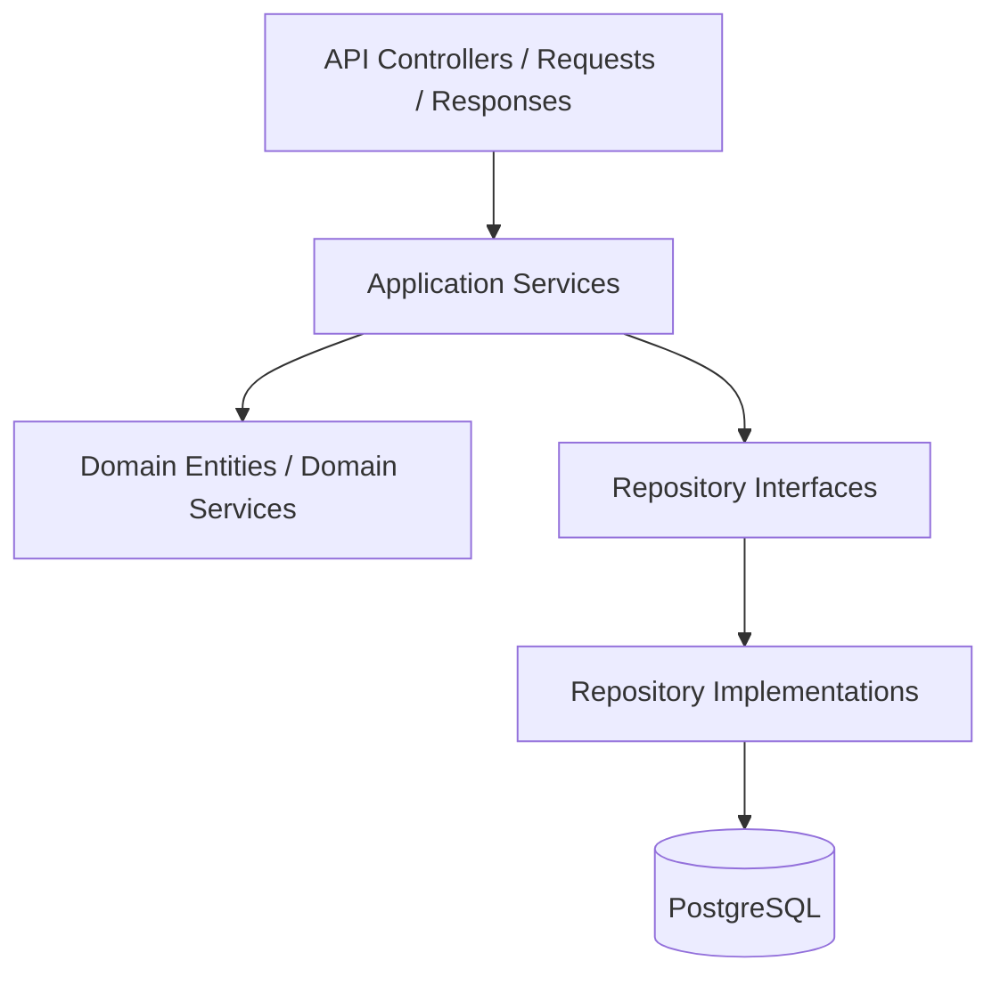

# Backend Implementation Documentation Gate Rule

## Purpose

This rule blocks backend implementation until AI IDE has read the required production documentation.

Backend work must follow the uploaded backend architecture: .NET Web API, Clean Architecture, Application services, Domain models/services where needed, Infrastructure repositories, persistence, external integration services, and Unit of Work. The backend must use Service Pattern and Repository Pattern only. Do not use CQRS or Mediator-based implementation guidance.

## Core references

| Area | Required document |
|---|---|
| Project entry | [[00-start-here/README]] |
| Documentation rules | [[00-start-here/documentation-rules]] |
| Product scope | [[01-product/project-scope]] |
| Product modules | [[01-product/production-module-catalog]] |
| System overview | [[02-architecture/system-overview]] |
| Architecture principles | [[02-architecture/architecture-principles]] |
| Data model | [[03-data/database-overview]] |
| Entity relationships | [[03-data/entity-relationship-map]] |
| API rules | [[04-api/README]] |
| Backend rules | [[05-backend/README]] |
| Frontend rules | [[06-frontend/README]] |
| Security rules | [[09-security-and-compliance/README]] |
| Templates | [[12-templates/README]] |

## Mandatory read order before backend code

1. [[01-product/project-scope]]
2. [[02-architecture/backend-architecture]]
3. [[02-architecture/role-permission-capability-model]]
4. [[03-data/database-overview]]
5. Relevant `03-data/entities/*` file.
6. [[04-api/README]]
7. [[04-api/tenant-context-api-rules]]
8. [[04-api/feature-access-api-rules]]
9. [[05-backend/README]]
10. [[05-backend/clean-architecture-rules]]
11. [[05-backend/backend-folder-structure]]
12. [[05-backend/service-layer-rules]]
13. [[05-backend/repository-layer-rules]]
14. Relevant `07-modules/<module>/features/<feature>/feature-spec`.
15. Relevant user flow under `08-user-flows` where applicable.

## Gate decision

| Condition | AI IDE action |
|---|---|
| Feature spec exists and is complete | Continue after reading all related docs. |
| Feature spec missing | Create/update feature spec before backend code. |
| Entity missing from database design | Stop or record schema gap; do not invent table. |
| API contract missing | Use API design rules and document contract before code. |
| Permission/feature rule unclear | Read security and role/capability docs before code. |
| Workflow crosses payment/stock/offline | Read specialized AI IDE rule before code. |

## Backend layer boundary

## Allowed backend pattern

| Layer | Allowed responsibility |
|---|---|
| API | HTTP endpoint, request model, response model, auth context forwarding. |
| Application | Use case orchestration, validation, transaction boundary, DTO mapping. |
| Domain | Business invariants that do not depend on DB/API/framework. |
| Infrastructure | EF Core, repositories, external providers, Unit of Work. |

## Not allowed

- Do not implement CQRS command/query handlers.
- Do not introduce Mediator pipeline or handler pattern.
- Do not put business workflow in controllers.
- Do not put business workflow in repositories.
- Do not expose EF entities directly as API responses.
- Do not bypass feature access middleware/service checks.
- Do not skip tenant context validation.

## Required backend checklist

- [ ] Module and feature docs read.
- [ ] PK/FK/entity docs read.
- [ ] API rules read.
- [ ] Tenant context validated.
- [ ] Feature access and permission checks identified.
- [ ] Service class owns workflow.
- [ ] Repository owns persistence only.
- [ ] Unit of Work used for multi-table operations.
- [ ] Validation implemented before persistence.
- [ ] Exceptions use documented error contract.
- [ ] Audit behavior included where sensitive.
- [ ] Feature history updated after behavior change.
