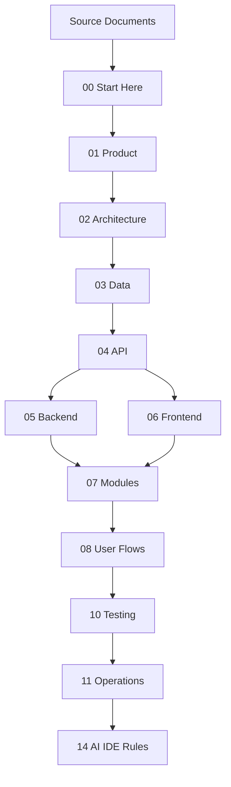

# Documentation Update Rules

## Purpose

This file tells AI IDE tools when and how to update the 2nd Brain after implementing, changing, or fixing system behavior.

The 2nd Brain is a production knowledge base. It must stay aligned with the uploaded scope, database design, backend architecture, frontend architecture, API rules, modules, user flows, testing, and operations.


## Core references

| Area | Required document |
|---|---|
| Project entry | [[00-start-here/README]] |
| Documentation rules | [[00-start-here/documentation-rules]] |
| Product scope | [[01-product/project-scope]] |
| Product modules | [[01-product/production-module-catalog]] |
| System overview | [[02-architecture/system-overview]] |
| Architecture principles | [[02-architecture/architecture-principles]] |
| Data model | [[03-data/database-overview]] |
| Entity relationships | [[03-data/entity-relationship-map]] |
| API rules | [[04-api/README]] |
| Backend rules | [[05-backend/README]] |
| Frontend rules | [[06-frontend/README]] |
| Security rules | [[09-security-and-compliance/README]] |
| Templates | [[12-templates/README]] |


## Update triggers

| Trigger | Documentation that must be checked |
|---|---|
| New feature | Product scope, module README, feature spec, API/backend/frontend docs, user flow, tests. |
| Bug fix | Feature history, bug report, affected workflow, regression checklist. |
| Schema change | Data docs, entity reference, migration notes, module feature spec. |
| API contract change | API docs, backend DTO docs, frontend API rules, affected feature spec. |
| Backend behavior change | Backend rules, feature spec, API docs, tests. |
| Frontend behavior change | Frontend rules, user flow, feature spec, UX checklist. |
| Payment/refund change | Payment/refund rule docs, security docs, test cases. |
| Offline sync change | Offline architecture, API rules, backend rules, frontend rules, test cases. |
| Security change | Security folder, API/backend/frontend access rules, audit docs. |

## Documentation hierarchy



## Update order

When a change affects more than one folder, update in this order:

1. `01-product` if scope or module boundary changes.
2. `02-architecture` if architecture or system flow changes.
3. `03-data` if entity/table/schema changes.
4. `09-security-and-compliance` if access/audit/data protection changes.
5. `04-api` if endpoint, request, response, or error contract changes.
6. `05-backend` if backend implementation rules change.
7. `06-frontend` if frontend implementation or UI behavior changes.
8. `07-modules` feature specs and histories.
9. `08-user-flows` affected workflows.
10. `10-testing-quality` affected test cases.
11. `11-delivery-and-operations` support/deployment/runbook changes.
12. `14-ai-ide-rules` if AI implementation process changes.

## Feature documentation update rules

Every feature spec must stay aligned with:

- Product module catalog.
- Related entity docs.
- Related API design docs.
- Backend service/repository/validation rules.
- Frontend feature/page/state rules.
- Security and feature access rules.
- User flow docs.
- Test cases.
- Feature history.

## Feature history rules

Update `feature-history.md` when:

- A bug is fixed.
- Business rules change.
- Validation rules change.
- API behavior changes.
- Data model relationship changes.
- UI behavior changes.
- Offline/payment/stock behavior changes.
- User flow changes.

Minimum feature history entry:

```text
Date:
Change type:
Summary:
Reason:
Affected files/docs:
Testing notes:
```

## Link rules

- Use Obsidian-style links for internal docs: `[[folder/file-name]]`.
- Do not link to non-existent files.
- Update incoming links after file rename or move.
- Do not leave old references such as `16-ai-ide` or `14-ai -ide-rules`.
- Prefer stable folder/file names over decorative names.

## What not to document

- Do not document invented requirements.
- Do not add fake endpoints that are not defined or approved.
- Do not add schema fields that are not in the database design unless marked as a gap or user-approved change.
- Do not write generic filler sections.
- Do not repeat the same rule across many files without purpose.
- Do not mark unfinished documentation as production-ready.

## Documentation quality checklist

| Check | Required standard |
|---|---|
| Practicality | A developer can act on the file. |
| Specificity | Tables, features, flows, and rules are named where applicable. |
| Alignment | Matches source docs and current 2nd Brain. |
| Traceability | Related docs are linked. |
| Safety | Does not instruct unsafe implementation. |
| AI usability | Tells AI what to read and what not to invent. |

## Documentation update examples

| Change | Required docs |
|---|---|
| Add return approval rule | Returns feature spec, return-flow, security sensitive actions, tests. |
| Change payment error response | API error contract, backend exception rules, frontend API handling, tests. |
| Add POS printer test status | POS devices module, frontend scanner/printer docs, API device/session rules. |
| Add stock reservation expiry behavior | Inventory module, data docs, backend rules, API docs, tests. |

## Completion checklist

- [ ] Related docs updated in dependency order.
- [ ] Feature history updated where behavior changed.
- [ ] User flow updated where actor steps changed.
- [ ] API/backend/frontend docs updated where implementation changed.
- [ ] Security/testing/operations docs updated where relevant.
- [ ] All new links point to existing files.
- [ ] No invented requirements were added.
