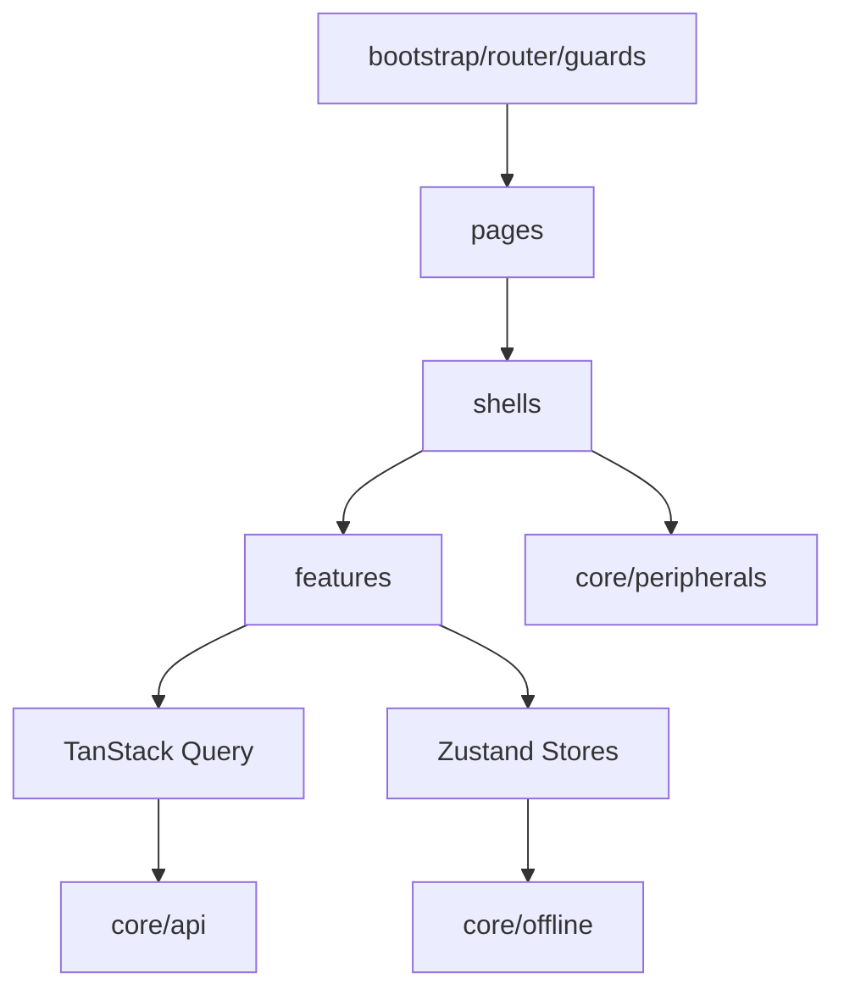

# Frontend Implementation Documentation Gate Rule

## Purpose

This rule blocks frontend implementation until AI IDE has read the required production documentation.

Frontend work must follow the uploaded frontend architecture: `bootstrap`, `core`, `features`, `shells`, `pages`, `state`, and `shared-kernel`. It must use React, TypeScript, Tailwind CSS, TanStack Query, Zustand, offline/core utilities, peripherals, and POS operational shells where applicable.

## Core references

| Area | Required document |
|---|---|
| Project entry | [[00-start-here/README]] |
| Documentation rules | [[00-start-here/documentation-rules]] |
| Product scope | [[01-product/project-scope]] |
| Product modules | [[01-product/production-module-catalog]] |
| System overview | [[02-architecture/system-overview]] |
| Architecture principles | [[02-architecture/architecture-principles]] |
| Data model | [[03-data/database-overview]] |
| Entity relationships | [[03-data/entity-relationship-map]] |
| API rules | [[04-api/README]] |
| Backend rules | [[05-backend/README]] |
| Frontend rules | [[06-frontend/README]] |
| Security rules | [[09-security-and-compliance/README]] |
| Templates | [[12-templates/README]] |

## Mandatory read order before frontend code

1. [[01-product/project-scope]]
2. [[02-architecture/frontend-architecture]]
3. [[04-api/README]]
4. [[04-api/request-response-standard]]
5. [[04-api/error-contract]]
6. [[04-api/auth-and-authorization]]
7. [[06-frontend/README]]
8. [[06-frontend/frontend-folder-structure]]
9. [[06-frontend/react-typescript-rules]]
10. [[06-frontend/api-client-and-query-rules]]
11. [[06-frontend/state-management-rules]]
12. Relevant module feature spec.
13. Relevant user flow.
14. [[09-security-and-compliance/authorization-model]] when access is involved.

## Frontend architecture map

## Gate decision

| Condition | AI IDE action |
|---|---|
| API contract exists | Use typed client and TanStack Query. |
| API contract unclear | Update/check API docs before UI code. |
| POS workflow affected | Read cashier user flow and POS UI rules. |
| Offline behavior affected | Read offline frontend and offline POS AI IDE rules. |
| Feature access affected | Read frontend feature access and security docs. |
| Payment/stock/tax total displayed | Treat frontend result as preview; backend final authority. |

## Frontend implementation boundaries

| Area | Rule |
|---|---|
| Server data | TanStack Query. |
| Local workflow state | Zustand. |
| POS cart/session/offline state | Use documented state stores/orchestrator boundaries. |
| Styling | Tailwind CSS with operational UI rules. |
| Routing | Guards for auth, role, till session where applicable. |
| API errors | Use documented API error contract. |
| Feature access | Hide/disable UI only as UX; backend still validates. |
| Peripheral state | Use core peripherals abstractions. |

## POS UI rule

POS UI must remain:

- Touchscreen-first.
- Cashier-speed focused.
- Barcode-first.
- Low typing.
- Always visible totals.
- Operational, not marketing/catalog style.
- Clear about online/offline/device/session/payment state.

## Not allowed

- Do not build a POS screen like an e-commerce storefront.
- Do not store server truth only in Zustand.
- Do not bypass API validation because frontend validated input.
- Do not invent endpoint paths or response shapes.
- Do not hard-code role names as security logic.
- Do not calculate final payable amount independently of backend authority.
- Do not make offline queue acceptance decisions in the frontend.

## Required frontend checklist

- [ ] API contract or rule read.
- [ ] Feature spec read.
- [ ] User flow read for workflow screens.
- [ ] Route/guard impact checked.
- [ ] Query/state ownership decided.
- [ ] Error state defined from API error contract.
- [ ] Feature access UI behavior defined.
- [ ] Offline/peripheral impact checked.
- [ ] QA checklist updated.
- [ ] Feature history updated if behavior changed.
