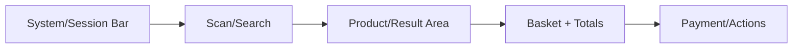

# Frontend Page UI UX Gate Rule

## Purpose

This rule tells AI IDE tools how to evaluate a frontend page before implementing or changing it.

The POS UI must feel like a real retail terminal, not a normal marketing website or e-commerce catalog page.

## Core references

| Area | Required document |
|---|---|
| Project entry | [[00-start-here/README]] |
| Documentation rules | [[00-start-here/documentation-rules]] |
| Product scope | [[01-product/project-scope]] |
| Product modules | [[01-product/production-module-catalog]] |
| System overview | [[02-architecture/system-overview]] |
| Architecture principles | [[02-architecture/architecture-principles]] |
| Data model | [[03-data/database-overview]] |
| Entity relationships | [[03-data/entity-relationship-map]] |
| API rules | [[04-api/README]] |
| Backend rules | [[05-backend/README]] |
| Frontend rules | [[06-frontend/README]] |
| Security rules | [[09-security-and-compliance/README]] |
| Templates | [[12-templates/README]] |

## Required frontend references

Read before UI work:

1. [[06-frontend/README]]
2. [[06-frontend/frontend-architecture]]
3. [[06-frontend/frontend-folder-structure]]
4. [[06-frontend/pos-ui-rules]]
5. [[06-frontend/component-rules]]
6. [[06-frontend/theme-and-configuration-rules]]
7. Relevant user flow.
8. Relevant module feature spec.

## POS page principles

| Principle | Meaning |
|---|---|
| Fast | Cashier can complete common actions quickly. |
| Touchscreen-first | Buttons and tap targets are large enough. |
| Barcode-first | Scan/search input is primary. |
| Always visible total | Basket/payment amount stays visible. |
| Low typing | Use buttons, presets, scan, lookup. |
| Operational state | Session, offline, printer, device, and payment state visible where relevant. |
| Minimal decoration | Avoid marketing UI and oversized product cards. |

## Page gate checklist

| Check | Required result |
|---|---|
| Actor | Page matches cashier/admin/customer/operator role. |
| Workflow | Page supports documented user flow. |
| API | Page uses documented API behavior. |
| State | Server/local state ownership is correct. |
| Permission | Unauthorized actions hidden/disabled as UX only. |
| Error | Validation and API errors visible. |
| Loading | Long operations show status. |
| Empty | Empty states are actionable. |
| Offline | Offline behavior shown where needed. |
| Device | Printer/scanner/till state shown where needed. |

## POS screen composition

## UI state requirements

For production pages, AI IDE must consider:

- Loading.
- Empty.
- Error.
- Unauthorized.
- Feature disabled.
- Offline.
- Sync pending.
- Validation failed.
- Confirm destructive action.
- Success/receipt generated.

## POS-specific states

- Till/session not open.
- Device not assigned.
- Printer unavailable.
- Scanner input detected.
- Offline mode active.
- Payment pending/failed.
- Discount approval pending.
- Return/exchange policy exception.
- Held sale recalled.

## Do not do

- Do not create large decorative product cards for cashier POS.
- Do not bury payment action below scroll.
- Do not hide total amount during checkout.
- Do not create tiny icon-only critical actions.
- Do not rely on color alone for errors/status.
- Do not make cashier type product details manually when scan/search flow exists.
- Do not add UI behavior not backed by module/user-flow docs.

## Completion checklist

- [ ] Page matches documented workflow.
- [ ] POS UI stays operational and fast.
- [ ] API/backend final authority preserved.
- [ ] Permission/feature/offline/error states included.
- [ ] No invented screen or workflow.
- [ ] Related user flow and feature spec updated if behavior changed.
