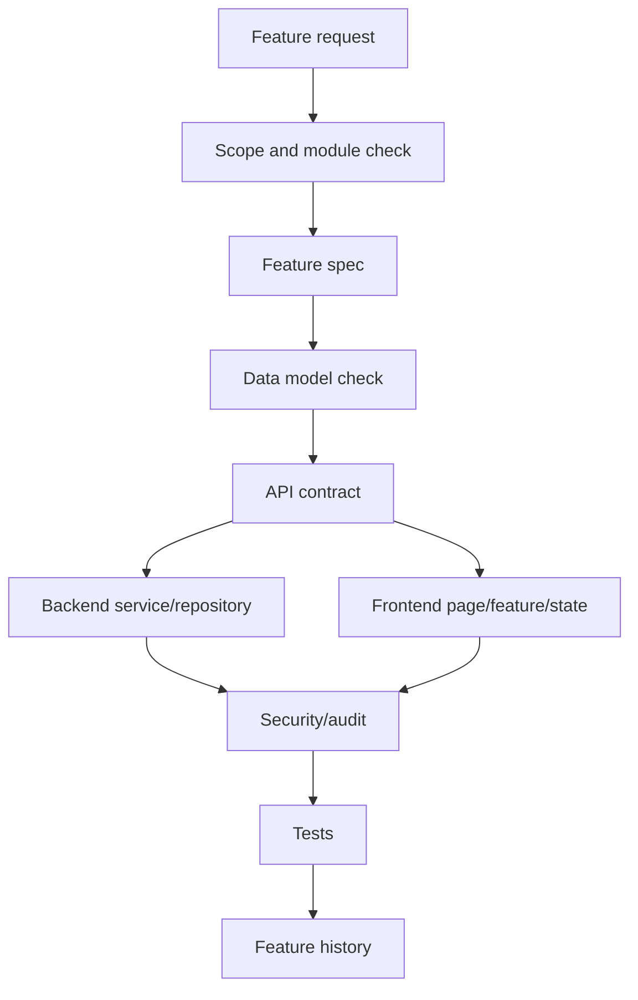

# Fullstack Feature Implementation Rule

## Purpose

This rule defines how AI IDE tools must implement a feature that touches API, backend, frontend, database, security, user flows, and tests.

A fullstack feature must be implemented as a coordinated production change, not as isolated frontend or backend code.

## Core references

| Area | Required document |
|---|---|
| Project entry | [[00-start-here/README]] |
| Documentation rules | [[00-start-here/documentation-rules]] |
| Product scope | [[01-product/project-scope]] |
| Product modules | [[01-product/production-module-catalog]] |
| System overview | [[02-architecture/system-overview]] |
| Architecture principles | [[02-architecture/architecture-principles]] |
| Data model | [[03-data/database-overview]] |
| Entity relationships | [[03-data/entity-relationship-map]] |
| API rules | [[04-api/README]] |
| Backend rules | [[05-backend/README]] |
| Frontend rules | [[06-frontend/README]] |
| Security rules | [[09-security-and-compliance/README]] |
| Templates | [[12-templates/README]] |

## Required read path

1. [[14-ai-ide-rules/ai-ide-project-understanding]]
2. [[14-ai-ide-rules/production-scope-alignment-rule]]
3. [[14-ai-ide-rules/database-alignment-rule]]
4. [[14-ai-ide-rules/ai-ide-new-feature-documentation-rules]]
5. Relevant feature spec and user flow.
6. [[04-api/README]]
7. [[05-backend/README]]
8. [[06-frontend/README]]
9. [[09-security-and-compliance/README]]
10. Relevant testing docs.

## Fullstack flow

## Implementation order

| Step | Action |
|---:|---|
| 1 | Confirm feature exists in production scope. |
| 2 | Confirm feature folder and feature spec. |
| 3 | Confirm entities/tables exist or record schema gap. |
| 4 | Define or update API contract using `/api/v1` rules. |
| 5 | Implement backend service, validation, repository, transaction. |
| 6 | Implement frontend API client, query/state, UI, error states. |
| 7 | Add/adjust tests. |
| 8 | Update feature history and related docs. |

## Cross-cutting checks

| Area | Required check |
|---|---|
| Tenant | Tenant context exists and cannot be bypassed. |
| Outlet | Outlet/device/session context is enforced when needed. |
| Feature access | Tenant entitlement + feature flag + role/permission rules checked. |
| Data | PK/FK and same-tenant relationships preserved. |
| API | Versioned under `/api/v1`. |
| Backend | Clean Architecture, Service Pattern, Repository Pattern. |
| Frontend | React + TS + Tailwind + TanStack Query + Zustand. |
| Offline | Queues and conflict behavior respected. |
| Payment/stock | Financial and inventory source of truth preserved. |
| Audit | Sensitive actions recorded. |

## Do not implement fullstack feature if

- Feature spec is missing and the task is not to create it.
- Required table is missing and schema change is not approved.
- API behavior is unclear and no API doc update is allowed.
- Permission/feature access rules are unclear.
- User flow is required but missing for a workflow-heavy feature.
- The feature conflicts with production scope.

## Fullstack output checklist

- [ ] Feature spec updated.
- [ ] API docs updated.
- [ ] Backend docs or code aligned.
- [ ] Frontend docs or code aligned.
- [ ] Security rules checked.
- [ ] Data relationships checked.
- [ ] User flow updated where needed.
- [ ] Tests added/updated.
- [ ] Feature history updated.
