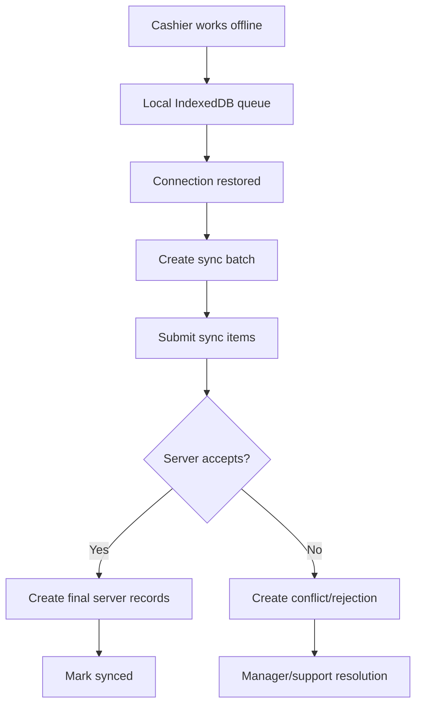

# Offline POS Implementation Rule

## Purpose

This rule tells AI IDE tools how to work on offline POS behavior without corrupting sales, payments, stock, receipts, or sync state.

Offline POS is part of the production scope. It must not be treated as a simple local save feature.

## Core references

| Area | Required document |
|---|---|
| Project entry | [[00-start-here/README]] |
| Documentation rules | [[00-start-here/documentation-rules]] |
| Product scope | [[01-product/project-scope]] |
| Product modules | [[01-product/production-module-catalog]] |
| System overview | [[02-architecture/system-overview]] |
| Architecture principles | [[02-architecture/architecture-principles]] |
| Data model | [[03-data/database-overview]] |
| Entity relationships | [[03-data/entity-relationship-map]] |
| API rules | [[04-api/README]] |
| Backend rules | [[05-backend/README]] |
| Frontend rules | [[06-frontend/README]] |
| Security rules | [[09-security-and-compliance/README]] |
| Templates | [[12-templates/README]] |

## Required references

Read before offline POS work:

1. [[02-architecture/offline-first-architecture]]
2. [[03-data/offline-sync-data-model]]
3. [[04-api/offline-sync-api-rules]]
4. [[05-backend/offline-sync-backend-rules]]
5. [[06-frontend/offline-frontend-rules]]
6. [[08-user-flows/cashier/scan-add-pay]]
7. [[08-user-flows/cashier/cash-payment]]
8. Relevant POS feature spec.

## Offline database objects

| Table | Role |
|---|---|
| `offline_sync_batches` | One reconnect/sync attempt from a POS device. |
| `offline_sync_items` | Generic sync item queue from offline-created records. |
| `offline_sale_sync_queue` | Typed staging for offline sale payload. |
| `offline_payment_sync_queue` | Typed staging for offline payment payload. |
| `offline_sync_conflicts` | Conflict records needing explicit resolution. |
| `offline_sync_audit_logs` | Technical sync lifecycle events. |

## Source-of-truth rule

Offline queue tables are staging and diagnostics.

Accepted business records must be written into final source-of-truth tables such as:

- `sales`
- `sale_lines`
- `payments`
- payment allocation tables
- `stock_movements`
- `receipts`
- `audit_logs`

## Offline workflow

## Frontend offline rules

- Show visible offline state.
- Use cached products/pricing/tax only where safe.
- Store local transaction IDs for dedupe.
- Queue sales/payments/receipts locally.
- Do not mark server sync as complete until backend confirms.
- Show pending sync and failed sync states.

## Backend offline rules

- Validate tenant, outlet, device, till session context.
- Validate payload schema and business rules.
- Enforce dedupe by device/client IDs.
- Create conflicts instead of silently accepting invalid data.
- Write sync audit logs.
- Preserve final source-of-truth writes in transactions.

## Conflict types

Use documented conflict concepts such as:

- Duplicate transaction.
- Stock mismatch.
- Price changed.
- Closed session.
- Validation failed.

## Payment offline note

Offline cash payment can be recorded locally. Card/QR offline behavior must follow documented policy and external terminal confirmation rules where applicable. Do not invent gateway behavior.

## Do not do

- Do not accept offline sale without server validation.
- Do not use offline queue as final sales table.
- Do not silently adjust stock to make conflict disappear.
- Do not duplicate a transaction when client IDs already exist.
- Do not ignore payment allocation during sync acceptance.
- Do not omit audit for sensitive sync outcomes.

## Completion checklist

- [ ] Offline docs read.
- [ ] Client IDs/dedupe handled.
- [ ] Sync batch/item lifecycle handled.
- [ ] Final source-of-truth writes are transactional.
- [ ] Conflict path exists.
- [ ] Frontend pending/failed/conflict states exist.
- [ ] Sync audit and business audit considered.
