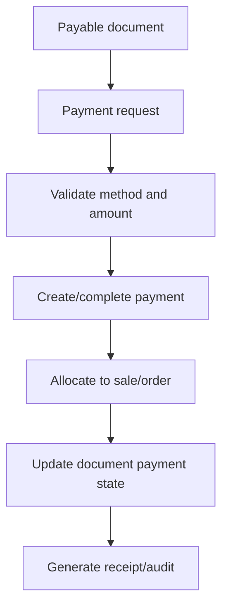
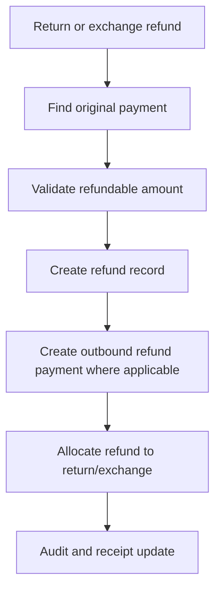

# Payment and Refund Implementation Rule

## Purpose

This rule tells AI IDE tools how to implement payment and refund behavior without breaking financial traceability.

Payments, refunds, allocations, returns, exchanges, receipts, and audit behavior are production-critical.

## Core references

| Area | Required document |
|---|---|
| Project entry | [[00-start-here/README]] |
| Documentation rules | [[00-start-here/documentation-rules]] |
| Product scope | [[01-product/project-scope]] |
| Product modules | [[01-product/production-module-catalog]] |
| System overview | [[02-architecture/system-overview]] |
| Architecture principles | [[02-architecture/architecture-principles]] |
| Data model | [[03-data/database-overview]] |
| Entity relationships | [[03-data/entity-relationship-map]] |
| API rules | [[04-api/README]] |
| Backend rules | [[05-backend/README]] |
| Frontend rules | [[06-frontend/README]] |
| Security rules | [[09-security-and-compliance/README]] |
| Templates | [[12-templates/README]] |

## Required references

Read before payment/refund work:

1. [[04-api/payment-refund-api-rules]]
2. [[05-backend/payment-gateway-integration-rules]]
3. [[09-security-and-compliance/payment-security-rules]]
4. [[03-data/entities/payments-entities]]
5. Relevant payments feature spec.
6. Relevant cashier or e-commerce user flow.
7. [[08-user-flows/cashier/cash-payment]]
8. [[08-user-flows/cashier/non-cash-payment]]
9. [[08-user-flows/cashier/split-payment]]
10. [[08-user-flows/cashier/return-flow]]
11. [[08-user-flows/cashier/exchange-flow]]

## Payment data model

| Table | Purpose |
|---|---|
| `payment_method_types` | Global payment method reference values. |
| `tenant_payment_methods` | Tenant-enabled payment methods and method config. |
| `payment_provider_configs` | Provider config with secret references. |
| `payments` | Unified payment/payout record. |
| `payment_transactions` | Provider/gateway event log. |
| `sale_payment_allocations` | Payment allocation to POS sale. |
| `order_payment_allocations` | Payment allocation to e-commerce order. |
| `refunds` | Business refund record linked to original payment. |

## Payment principles

- Payment recording and gateway processing must be clearly separated.
- Payment rows must keep frozen method/provider information.
- Allocations connect payments to sales/orders.
- Refunds reference original captured payments.
- Refund method rules must follow documented payment/refund behavior.
- Idempotency keys are required where duplicate requests are possible.

## Payment flow

## Refund flow

## Backend rules

- Validate amount, status, payment direction, payment purpose, and captured amount.
- Do not allow refund total to exceed original captured amount.
- Use transaction boundaries for payment + allocation + document status.
- Store provider events in `payment_transactions`.
- Do not store payment secrets or card data directly.

## Frontend rules

- Show payment status clearly.
- Show split payment lines clearly.
- Use backend response as final authority.
- Do not final-complete sale/order until backend confirms payment rule.
- Show retry/error state for failed payment.
- Do not create fake successful payment state.

## Do not do

- Do not store card data or gateway private keys.
- Do not refund without original payment reference.
- Do not edit original payment records to represent refund.
- Do not skip allocation tables.
- Do not allow frontend-only payment completion.
- Do not hide failed payment state.

## Completion checklist

- [ ] Payment/refund docs read.
- [ ] Idempotency considered.
- [ ] Allocation table used.
- [ ] Original captured payment protected.
- [ ] Refund limits validated.
- [ ] Receipt/audit behavior included.
- [ ] Frontend states reflect backend authority.
