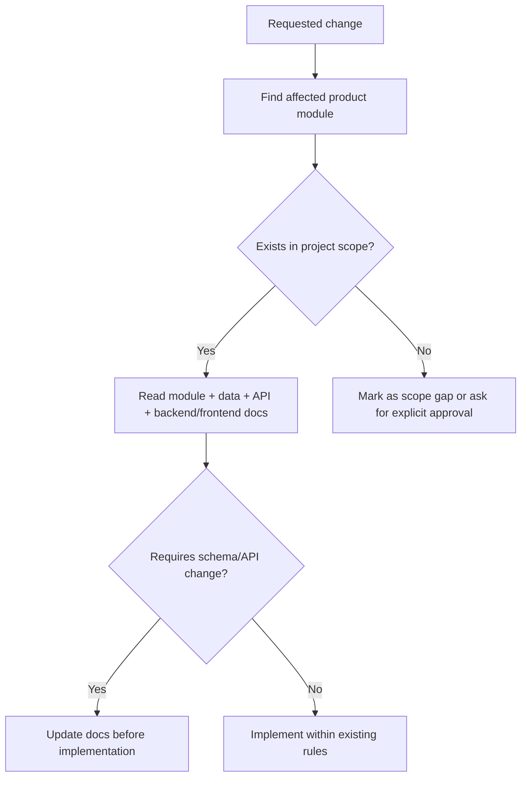

# Production Scope Alignment Rule

## Purpose

This rule prevents AI IDE tools from reducing, expanding, or distorting the approved production scope of the Unified Commerce system.

The project must be treated as a production-ready Unified Commerce SaaS system, not as a basic POS, not as a prototype, and not as an MVP-only system.

## Core references

| Area | Required document |
|---|---|
| Project entry | [[00-start-here/README]] |
| Documentation rules | [[00-start-here/documentation-rules]] |
| Product scope | [[01-product/project-scope]] |
| Product modules | [[01-product/production-module-catalog]] |
| System overview | [[02-architecture/system-overview]] |
| Architecture principles | [[02-architecture/architecture-principles]] |
| Data model | [[03-data/database-overview]] |
| Entity relationships | [[03-data/entity-relationship-map]] |
| API rules | [[04-api/README]] |
| Backend rules | [[05-backend/README]] |
| Frontend rules | [[06-frontend/README]] |
| Security rules | [[09-security-and-compliance/README]] |
| Templates | [[12-templates/README]] |

## Approved production scope areas

| Scope area | Required understanding |
|---|---|
| Multi-tenant platform | Tenants, outlets, tenant settings, feature entitlement, data isolation. |
| Staff identity and RBAC | Users, roles, permissions, tenant roles, outlet roles, feature assignments. |
| Catalog | Product, variants, categories, brands, suppliers, attributes, images, return policies. |
| Pricing and tax | Price lists, price list items, tax classes, rates, class-rate mapping. |
| Inventory | Outlet-wise stock, movements, reservations, transfers, adjustments, stocktake. |
| POS devices and sessions | Tills, POS devices, till sessions, cash movements. |
| POS checkout | Scan/add/pay, hold/recall, void/cancel, receipt, payments. |
| Payments/refunds | Payment methods, provider configs, transactions, allocations, refunds. |
| Discounts/coupons | Policies, requests, coupons, applications, redemptions. |
| Returns/exchanges | Source sale/order lookup, return lines, refunds, exchange difference. |
| E-Commerce | Storefront, cart, checkout, orders, customer account, order history. |
| Order workflow | Order/payment/fulfillment status transition and history. |
| Fulfillment | Pickup, delivery, zones, rates, delivery tracking readiness. |
| Customer management | Tenant-scoped customers, auth, identities, addresses, OTP, loyalty, wishlist/reviews. |
| Offline POS | IndexedDB/local queue concept, sync batches/items, conflict records. |
| Reporting and audit | Daily summaries, audit logs, print logs, sync logs. |
| Configuration/themes | Feature flags, tenant settings, UI themes. |
| Security controls | Authentication, authorization, tenant isolation, audit, data protection. |

## Scope classification rules

| User wording | AI IDE action |
|---|---|
| "production ready" | Include all documented production modules and constraints. |
| "basic" without clarification | Do not downgrade existing production docs; ask only if truly required. |
| "MVP" | Treat as a separate delivery slice only if user explicitly asks. |
| "add new feature" | Check whether feature exists in scope/database/module docs before implementation. |
| "fix issue" | Fix within current production scope; do not redesign unrelated modules. |
| "change schema" | Require database alignment review and data documentation update. |

## Scope alignment workflow

## What AI IDE must not do

- Do not remove offline POS because it makes implementation easier.
- Do not remove payment/refund auditability.
- Do not collapse POS sales and e-commerce orders into one generic table/model.
- Do not remove return/exchange documents and replace them with simple negative sales.
- Do not ignore tenant feature entitlement or role feature assignments.
- Do not assume loyalty, wishlist, reviews, or OTP are absent when database design includes them.
- Do not treat advanced production scope as optional unless the user explicitly asks for release slicing.

## Change classification table

| Change type | Required documentation action |
|---|---|
| Existing feature implementation | Read feature spec, user flow, data docs, API/backend/frontend rules. |
| Existing feature bug fix | Read bug workflow, feature history, affected docs. |
| New feature in existing module | Create/update feature spec before code. |
| New module | Update product module catalog and folder guide before code. |
| New table/entity | Update data docs and schema gap register before code. |
| API contract change | Update API docs and backend/frontend docs before code. |
| Frontend screen behavior change | Update user flow and frontend UX rules. |

## Required scope cross-checks

Before implementation, confirm:

- [ ] The behavior belongs to a documented production module.
- [ ] The module has a README or feature spec.
- [ ] The required entities exist in the approved database design.
- [ ] The feature respects tenant/outlet/channel context.
- [ ] The feature uses documented backend/frontend architecture.
- [ ] The feature has security, audit, and validation coverage where required.
- [ ] The feature does not invent unapproved payment, stock, or order behavior.

## Scope conflict handling

When documents conflict:

1. Do not guess silently.
2. Prefer the latest production scope and database design reflected in the 2nd Brain.
3. If entity design is missing for a scope item, mark it as a schema gap.
4. If user explicitly requests the change, update the relevant docs first.
5. Keep the change local to the affected module.

## Examples

| Request | Correct AI IDE behavior |
|---|---|
| Add POS payment UI | Read cashier flows, payments docs, frontend POS rules, API payment rules. |
| Add return screen | Read returns/exchanges module, return-flow, payment/refund rules, stock rules. |
| Add printer settings | Read POS devices/hardware docs and frontend scanner/printer integration rules. |
| Add order status | Check database status columns and order status transition docs first. |
| Add new import AI table | Mark schema gap unless approved by user and reflected in data docs. |

## Completion checklist

- [ ] Production scope preserved.
- [ ] No basic/MVP downgrade.
- [ ] No unapproved module added.
- [ ] No unapproved entity or endpoint invented.
- [ ] Affected docs identified.
- [ ] Scope gaps are explicit.
