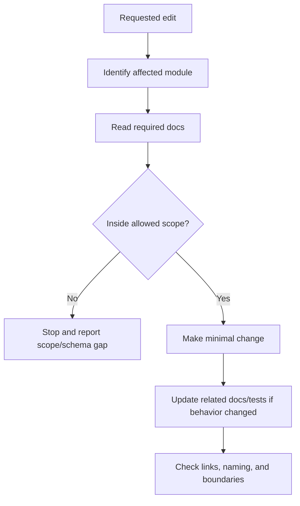

# Safe Edit Boundaries

## Purpose

This file defines what AI IDE tools may edit, what they must read before editing, and what they must not change without explicit user approval.

Safe edit boundaries prevent accidental architecture drift, schema corruption, tenant isolation bugs, payment bugs, offline sync corruption, and broken documentation links.


## Core references

| Area | Required document |
|---|---|
| Project entry | [[00-start-here/README]] |
| Documentation rules | [[00-start-here/documentation-rules]] |
| Product scope | [[01-product/project-scope]] |
| Product modules | [[01-product/production-module-catalog]] |
| System overview | [[02-architecture/system-overview]] |
| Architecture principles | [[02-architecture/architecture-principles]] |
| Data model | [[03-data/database-overview]] |
| Entity relationships | [[03-data/entity-relationship-map]] |
| API rules | [[04-api/README]] |
| Backend rules | [[05-backend/README]] |
| Frontend rules | [[06-frontend/README]] |
| Security rules | [[09-security-and-compliance/README]] |
| Templates | [[12-templates/README]] |


## General safe edit principles

| Principle | Rule |
|---|---|
| Smallest safe change | Change only files needed for the requested task. |
| Read before edit | Read relevant product, data, API, backend/frontend, module, and user-flow docs first. |
| No silent scope expansion | Do not add unrequested modules, entities, or workflows. |
| No unrelated refactor | Do not reorganize unrelated folders or code. |
| Preserve source of truth | Keep database, backend, frontend, and docs aligned. |
| Preserve links | Update internal wiki links when renaming or moving docs. |
| Preserve auditability | Do not remove audit, validation, idempotency, or security checks. |

## Documentation safe edits

| Edit type | Allowed? | Condition |
|---|---:|---|
| Fix typo | Yes | No meaning change. |
| Fix broken link | Yes | Target must exist. |
| Add missing section to existing doc | Yes | Must be supported by uploaded/current docs. |
| Rewrite placeholder feature spec | Yes | Must use approved scope/database/module context. |
| Add new feature doc | Yes | Only if feature exists in scope or user explicitly asks. |
| Delete document | No | Unless duplicate/incorrect and user asked or doc clearly archived. |
| Rename folder | Careful | Must update all links. |
| Add new module | Careful | Must be in scope or explicitly approved. |

## Code safe edits

| Area | Safe edit rule |
|---|---|
| API controllers | Change only affected module controller/request/response files. |
| Application services | Keep orchestration in service classes; do not put business logic in controllers. |
| Domain entities | Change only when approved data/domain docs require it. |
| Repositories | Keep persistence logic only; do not put business workflows in repositories. |
| EF mappings | Match data docs and migration rules. |
| Frontend features | Change only affected feature folder, pages, shells, state, and API client files. |
| Shared kernel | Change only with care; it affects many screens. |
| Offline queue | Do not alter sync semantics without offline docs. |
| Payment/refund | Do not change without payment/refund rule review. |

## Protected areas

AI IDE must not modify these casually:

- Database migrations that affect production tables.
- Tenant isolation middleware or filters.
- Authentication/session/token handling.
- Payment/refund allocation logic.
- Stock movement posting logic.
- Offline sync acceptance/conflict logic.
- Document sequence generation.
- Audit log writing.
- Receipt payload generation if financial output changes.
- API error contract if frontend already depends on it.

## Safe edit workflow



## Cross-folder edit boundaries

| Task type | Usually allowed folders |
|---|---|
| Backend feature | `05-backend`, `04-api`, relevant `07-modules`, relevant `03-data`, tests. |
| Frontend feature | `06-frontend`, relevant `07-modules`, relevant `08-user-flows`, API docs if contract changes. |
| Fullstack feature | Product/module/data/API/backend/frontend/user-flow/test docs. |
| Bug fix | Feature history, affected implementation files, affected tests, only affected docs. |
| User flow docs | `08-user-flows` and relevant module references only. |
| Entity docs | `03-data` and relevant module docs only. |

## Do-not-cross rules

- Do not edit multiple module folders unless the task explicitly affects them.
- Do not change catalog, pricing, tax, and inventory together unless the task requires cross-module behavior.
- Do not change payment and refund behavior while fixing UI formatting.
- Do not change tenant/security logic while adding a non-sensitive UI component.
- Do not edit generated zip/export artifacts manually; update source folder and repackage.

## AI IDE response expectation

Before making changes, AI IDE should identify:

```text
Affected module:
Affected docs:
Affected code folders:
Protected files touched? yes/no
Schema change? yes/no
API contract change? yes/no
Security impact? yes/no
Offline impact? yes/no
Payment/stock impact? yes/no
```

## Completion checklist

- [ ] Only requested folder/code area changed.
- [ ] Relevant docs were read.
- [ ] No unapproved schema/API/architecture change.
- [ ] Links are valid after changes.
- [ ] Feature history or changelog updated if behavior changed.
- [ ] Security, tenant isolation, payment, stock, offline, and audit rules preserved.
